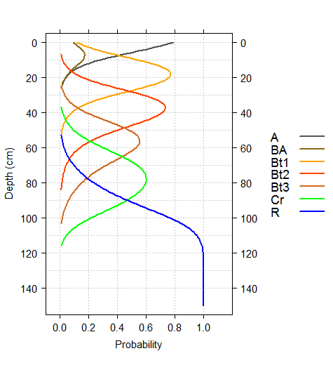

Estimation of Most-Likely Horizon Depths
===============================
D.E. Beaudette, J.M. Skovlin
<br>
2015-03-26
<br>
This document is based on `aqp` version 1.8-3 and `soilDB` version 1.5-3.


# Introduction

## Review
Consider this situation: you have a collection of pedons that have been correlated to a named soil series (or component) and would like to *objectively* compute a range in characteristics ("low-rv-high" values) and horizon depths. As with most collections of pedon data, there may be considerable variation in description style and horizons used, horizon depths, and number of horizons described:


In this scenario, there are several obvious &ldquo;micro-correlation&rdquo; decisions that need to be made before horizons can be grouped for aggregation. For example, what horizonation prototype scheme (e.g., A-Bt1-Bt2-Bt3-Cr-R) best conveys the concept of this soil series or soil component? Does it make sense to group [Bt3, Bt4, BCt, CBt] horizons for aggregation? Or what about grouping [Bt3, 2Bt3] horizons? Do [BA, AB] horizons occur frequently enough to be included in the horizonation prototype?

Based on your knowledge of the area, pedon 2 might be a good "typical" pedon to use in developing a horizonation prototype. After careful review of the data and consultation with your crew, a new set of labels are assigned to each horizon (<span style="color: red;">red labels in figure above</span>) that define groups over which soil properties will be aggregated. These new labels define *functionally similar* groups that may span multiple genetic horizons.

## Probabalistic Representation of Horizon Depths
Once you have assigned [generalized horizon labels](https://r-forge.r-project.org/scm/viewvc.php/*checkout*/docs/aqp/gen-hz-assignment.html?root=aqp) (GHL) to your pedons it is possible to generate a set of "most-likely" horizon depths for each GHL. An evaluation GHL probability along 1-cm depth slices results in a set of probability depth functions; the points at which these curves cross are good estimates of "most-likely" horizon depths. For example, in the figure below approximate horizon depths of 8, 28, 50, and 90cm can be readily estimated from the probability depth functions. It is also possible to visually determine when less common horizons (such as the BA horizon in the figure below) may not be common enough to include in a representative profile.

  


# Setup R Envionment
If you have never used the [aqp](https://r-forge.r-project.org/scm/viewvc.php/*checkout*/docs/aqp/aqp-intro.html?root=aqp) or [soildb](https://r-forge.r-project.org/scm/viewvc.php/*checkout*/docs/soilDB/soilDB-Intro.html?root=aqp) packages before, you will likely need to install them. This only needs to be done once. 

```r
# stable version from CRAN + dependencies
install.packages('aqp', dep=TRUE) 
install.packages('soilDB', dep=TRUE)
# latest versions from R-Forge:
install.packages('aqp', repos="http://R-Forge.R-project.org")
install.packages('soilDB', repos="http://R-Forge.R-project.org")
```

Once you have all of the R packages on which  this document depends, it is a good idea to load them. R packages must be **installed** anytime you change versions of R (e.g., after an upgrade) and **loaded** anytime you want to access functions from within those packages.


```r
library(aqp)
library(soilDB)
library(latticeExtra)
library(plyr)
library(rms)
```

# Sample Data
While the methods outlined in this document can be applied to any collection of pedons, it is convenient to work with a standardized set of data. You can follow along with the analysis by copying code from the following blocks and running it in your **R** session. The sample data used in this document is based on 15 soil profiles that have been correlated to the [Loafercreek](https://soilseries.sc.egov.usda.gov/OSD_Docs/L/LOAFERCREEK.html) soil series from the Sierra Nevada Foothill Region of California. Note that the internal structure of the `loafercreek` data is identical to the structure returned by [`fetchNASIS()` from the soilDB package](https://r-forge.r-project.org/scm/viewvc.php/*checkout*/docs/soilDB/soilDB-Intro.html?root=aqp). All horizon-level values are pulled from the pedon horizon table of the pedons being analyzed.


```r
# load sample data from the soilDB package
data(loafercreek, package = 'soilDB')
pedons <- loafercreek
# plot the first 15 profiles
par(mar=c(0,0,0,0))
plot(pedons[1:15, ], name='hzname', print.id=FALSE, cex.names=0.8, axis.line.offset=-4)
```

<p class="caption" style="font-size:85%; font-style: italic; font-weight: bold;">15 pedons correlated to the Loafercreek soil series.</p><hr>


## Optional: Follow Along with Your Data
The following code block demonstrates how to pull data in using the [`fetchNASIS()` function from the soilDB package](https://r-forge.r-project.org/scm/viewvc.php/*checkout*/docs/soilDB/soilDB-Intro.html?root=aqp).


```r
# first load the desired data set within NASIS into your NASIS selected set
# then load data from the NASIS selected set into R
pedons <- fetchNASIS()
# optionally subset the data by taxon name - enter your taxon name
pedons <- pedons[grep(pattern='ENTER_YOUR_TAXON_NAME', pedons$taxonname, ignore.case=TRUE), ]
```

# Methods


```r
# apply GHL rules
n <- c("A", "BA", "Bt1", "Bt2", "Bt3", "Cr", "R")
p <- c("^A$|Ad|Ap|^ABt$", "AB$|BA$|Bw", "Bt1$|^Bt$", "^Bt2$", "^Bt3|^Bt4|CBt$|BCt$|2Bt|2CB$|^C$", "Cr", "R")
pedons$genhz <- generalize.hz(pedons$hzname, n, p)

# remove non-matching generalized horizon names
pedons$genhz[pedons$genhz == "not-used"] <- NA
pedons$genhz <- factor(pedons$genhz)

# keep track of generalized horizon names for later
hz.names <- levels(pedons$genhz)

# slice GHL into 1cm intervals: no aggregation
max.depth <- 150
slice.resolution <- 1
slice.vect <- seq(from = 0, to = max.depth, by = slice.resolution)
s <- slice(pedons, slice.vect ~ genhz)

# convert GHL to factor
s$genhz <- factor(s$genhz, levels = hz.names)

# plot depth-ranges of generalized horizon slices
bwplot(hzdept ~ genhz, data = horizons(s), ylim = c(155, -5), ylab = "Generalized Horizon Depth (cm)", 
    scales = list(y = list(tick.number = 10)), asp = 1, panel = function(...) {
        panel.abline(h = seq(0, 140, by = 10), v = 1:length(hz.names), col = grey(0.8), lty = 3)
        panel.bwplot(...)
    })
```


## TODO: abstract most of this into a convenience function

```r
# proportional-odds logistics regression: fits well, ignore standard errors using sliced data
# properly weights observations... but creates optimistic SE rcs required when we include depths >
# 100 cm...  should we use penalized PO-LR? see pentrace()
dd <- datadist(horizons(s))
options(datadist = "dd")
(l.genhz <- orm(genhz ~ rcs(hzdept), data = horizons(s), x = TRUE, y = TRUE))
```

```
## 
## Logistic (Proportional Odds) Ordinal Regression Model
## 
## orm(formula = genhz ~ rcs(hzdept), data = horizons(s), x = TRUE, 
##     y = TRUE)
## 
## Frequencies of Responses
## 
##    A   BA  Bt1  Bt2  Bt3   Cr    R 
##  368  134 1005 1115  889  947 1515 
## 
## Frequencies of Missing Values Due to Each Variable
##  genhz hzdept 
##   2181      0 
## 
## 
##                         Model Likelihood               Discrimination    Rank Discrim.    
##                               Ratio Test                      Indexes          Indexes    
## Obs          5973    LR chi2    12046.63    R2                  0.892    rho     0.941    
## Unique Y        7    d.f.              4    g                   7.785                     
## Median Y        5    Pr(> chi2)  <0.0001    gr               2404.699                     
## max |deriv| 0.002    Score chi2 10553.58    |Pr(Y>=median)-0.5| 0.422                     
##                      Pr(> chi2)  <0.0001                                                  
## 
##           Coef     S.E.   Wald Z Pr(>|Z|)
## y>=BA      -1.3081 0.1002 -13.06 <0.0001 
## y>=Bt1     -2.0080 0.1044 -19.24 <0.0001 
## y>=Bt2     -6.1038 0.1906 -32.03 <0.0001 
## y>=Bt3     -9.8494 0.2398 -41.07 <0.0001 
## y>=Cr     -12.3512 0.2515 -49.10 <0.0001 
## y>=R      -15.1321 0.2652 -57.05 <0.0001 
## hzdept      0.2235 0.0072  30.88 <0.0001 
## hzdept'    -0.2359 0.0369  -6.39 <0.0001 
## hzdept''    0.3250 0.1238   2.63 0.0087  
## hzdept'''   0.7375 0.3210   2.30 0.0216
```

```r
# predict along same depths: columns are the class-wise probability fitted.ind --> return all
# probability estimates
p <- data.frame(predict(l.genhz, data.frame(hzdept = slice.vect), type = "fitted.ind"))

# re-name, rms model output give funky names
names(p) <- hz.names

# add depths
p$top <- slice.vect

p.ml <- get.ml.hz(p, hz.names)

p.ml
```

```
##    hz top bottom confidence pseudo.brier
## 1   A   0      8         55   0.23941909
## 2 Bt1   8     28         64   0.20275770
## 3 Bt2  28     49         63   0.23440353
## 4 Bt3  49     66         51   0.36994560
## 5  Cr  66     90         55   0.31719843
## 6   R  90    151         90   0.05508596
```


