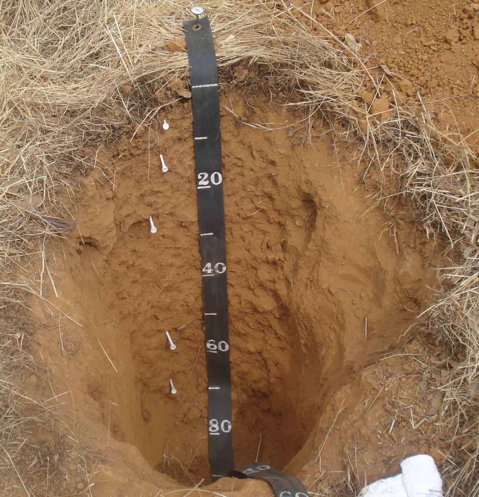
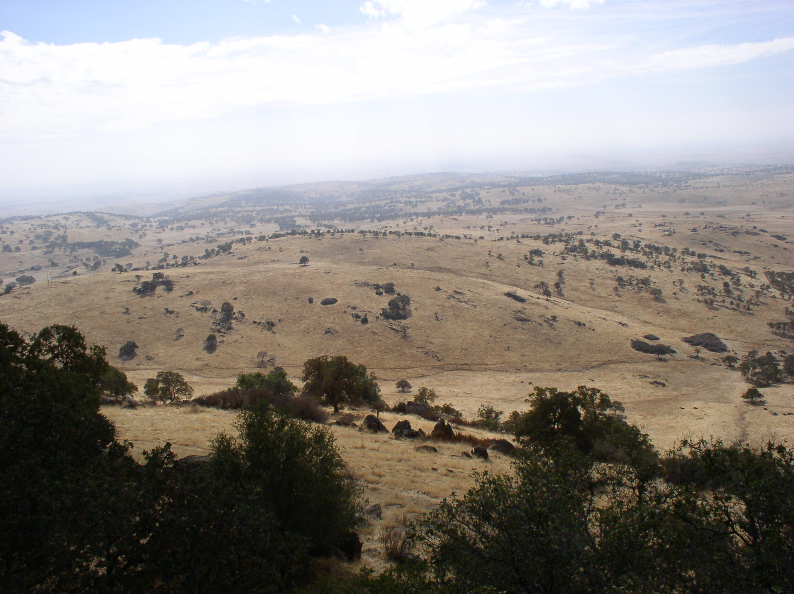

```{r setup, echo=F, warning=F, message=F}
library(knitr, quietly = TRUE)
opts_chunk$set(message = FALSE, 
               warning = FALSE, 
               background = '#F7F7F7', 
               dpi = 100, 
               fig.align = 'center', 
               dev = 'png', 
               dev.args = list(pointsize = 10, 
                             # type = 'cairo', 
                             antialias = 'subpixel'),
               cache = FALSE,
               tidy = FALSE)

options(width=100)
```

# _Loafercreek_ - Context

The [Loafercreek](https://casoilresource.lawr.ucdavis.edu/sde/?series=loafercreek) series (_fine-loamy, mixed, superactive, thermic Ultic Haploxeralfs_) is comprised of soils on foothills underlain by vertically-bedded metavolcanic rock. They are moderately deep (50 to 100cm) to a paralithic contact. 



The Loafercreek series was established in Butte county (_CA612_) and now is mapped in Calaveras and Tuolumne (_CA630_) as well as small portions of Mariposa and Stanislaus Counties (_CA630_ join with _CA649_ and _CA644_).

The metamorphic belt is comprised of Mesozoic and Paleozoic age metamorphic rocks. The metavolcanic rocks, dominantly what is called greenstone, are derived from metamorphosed intermediate to mafic igneous rocks (mostly basaltic in composition). These metamorphosed volcanics are closely associated with sedimentary rocks (Jurassic in age, and also of marine origin). 

The metavolcanic rocks in this area were recognized to form distinctive "tombstone"-like outcrops by miners during the California Gold Rush. You can see some examples of this in the image below.



Areas of soils _conceptually related_ to _Loafercreek_ have been mapped primarily as [Auburn](https://casoilresource.lawr.ucdavis.edu/sde/?series=auburn) in the Sierra Nevada Foothills. 

Many areas of Auburn soils, and related soils on similar landforms, are outside the range of the family (12th edition taxonomy) of the series. Auburn soils were historically mapped as _Ruptic-Lithic Xerochrepts_. Reading soil survey manuscript descriptions of map units modeled after the old series concepts shows that their definition spans, at a minimum, shallow to moderately deep depth classes, likely with deeper inclusions. 

The _Loafercreek_ series concept might fit the range in characteristics of the deeper (moderately deep) areas within Auburn mapunits. 

In this demo we will study some of the soils similar to Loafercreek to start to see how we can use R to summarize a _range in characteristics_ for a soil.

***

## Loafercreek's siblings

Loafercreek's siblings are the soils that geographically occupy the same landscapes and parent materials -- often they are components in the same mapunits. 

In some mapunits, if not named, sibling soils are explicitly part of a component range due to inclusion of "similar soils" to a named component. Alternately, they can be implied by "bracketing" of dissimilar components. 

Sometimes mapping associated with a particular soil name does not necessarily reflect modern series concepts for that same series name.

For instance, Auburn, by definition, does not have an argillic horizon and classifies with the Lithic Haploxerepts. But its taxonomy and the mapping conventions have changed over time (40-50 years) since much of the land in the Sierra Nevada foothills was initially mapped.

In CA630, the shallow metavolcanic soils _with argillic horizons_ (Ultic Haploxeralfs) are the [Bonanza](https://casoilresource.lawr.ucdavis.edu/sde/?series=bonanza) and [Dunstone](https://casoilresource.lawr.ucdavis.edu/sde/?series=dunstone) series. Fine particle size class (PSC) soils are similar to the [Argonaut](https://casoilresource.lawr.ucdavis.edu/sde/?series=argonaut) concept. Skeletal PSC soils are [Jasperpeak](https://casoilresource.lawr.ucdavis.edu/sde/?series=jasperpeak) (shallow, Lithic Haploxeralfs) and [Gopheridge](https://casoilresource.lawr.ucdavis.edu/sde/?series=gopheridge) (moderately deep, Ultic Haploxeralfs). Soils with a _deep_ bedrock restriction are called [Motherlode](https://casoilresource.lawr.ucdavis.edu/sde/?series=motherlode) (fine-loamy) or [Gardellones](https://casoilresource.lawr.ucdavis.edu/sde/?series=gardellones) (loamy-skeletal).


```{r echo=FALSE, results='hide', fig.width=10, fig.height=6}
library(soilDB)
x <- fetchOSD(c("Argonaut", "Auburn", "Bonanza", "Dunstone", 
                  "Exchequer", "Gardellones", "Gopheridge", 
                  "Jasperpeak", "Loafercreek", "Motherlode", 
                  "Sobrante"))

sharpshootR::SoilTaxonomyDendrogram(x, y.offset = 0.35, cex.taxon.labels = 0.9)
```

## This demo

In this series of demos, we are going to use R-based pedon summaries to explore properties of the _Loafercreek_ soils found during the soil survey inventory in _CA630_. 

This demo has three worked "examples" involving the use of `profileApply()` for summarizing pedon data.

*You can use this [R script](loafercreek_nodoc.R) version of the demo document to avoid having to copy and paste all the code. This will allow you to focus on interpreting the output. [This](loafercreek.R) version has all of the text as comments.*

Readers are encouraged to run all of the code in their own IDE/text editor/console. Also, you are encouraged to use `?function.name` to view R manual pages whenever you encounter a `function()` you do not recognize.

You can get the latest development versions of *aqp*, *soilDB* and *sharpshootR* using *remotes* package:

```{r eval=FALSE}
# install remotes if needed
# install.packages("remotes")
remotes::install_github('ncss-tech/aqp', dependencies = FALSE, build = FALSE)
remotes::install_github('ncss-tech/soilDB', dependencies = FALSE, build = FALSE)
remotes::install_github('ncss-tech/sharpshootR', dependencies = FALSE, build = FALSE)
```

## For reference

 * [Algorithms for Quantitative Pedology (aqp) home page](http://ncss-tech.github.io/AQP/)
 
 * [aqp - manual](http://ncss-tech.github.io/aqp/docs/)
 
 * [soilDB - soil database access](http://ncss-tech.github.io/soilDB/)
 
 * [soilDB - manual](http://ncss-tech.github.io/soilDB/docs/)

_NCSS-Tech Stats for Soil Survey_ - Chapter 2 - Lessons on Data Types and Tabular Soil Data

 * [R Objects and Data Types](http://ncss-tech.github.io/stats_for_soil_survey/chapters/2_data/2a_appendix_data_types.html)
 
 * [Tabular Soil Data](http://ncss-tech.github.io/stats_for_soil_survey/chapters/2_data/2a_tabular_data.html)

# _SoilProfileCollection_

## Loading `loafercreek`

To get soil data out of the database, and into an R object, we typically will use the library _soilDB_. 

When loading _soilDB_ we also load the dependency _aqp_. 

_aqp_ gives us the basic data structure we use to hold pedon data: the _SoilProfileCollection_ object.

One of the built-in datasets provided by _soilDB_ is `loafercreek`. 

The _sharpshootR_ library has some great functions for summarizing pedon data. We will load that too so we can use it later.

Let's load `loafercreek` which is a _SoilProfileCollection_ (SPC) object from soilDB. 

```{r, message=FALSE, warning=FALSE}
library(soilDB)
library(sharpshootR)

data("loafercreek")
```

## _SoilProfileCollection_

A _SoilProfileCollection_ (SPC) is an S4 object contains site (`spc@site`) and horizon (`spc@horizon`) slots, which are each comprised of a single _data.frame_. These are the two most important slots, with others containing important information about spatial reference, and internal organization of the profile collection object.

 * [Introduction to SoilProfileCollection Objects](http://ncss-tech.github.io/AQP/aqp/aqp-intro.html)
 
The contents (slots) of a SPC should be accessed by using `horizons(spc)`,  `site(spc)`, `coordinates(spc)`, etc. 

For instance:

```{r, eval=FALSE}
# access the clay attribute from the horizons data frame
horizons(spc)$clay

#add new site data by LEFT JOIN on UNIQUE site ID (assumed to be present in both spc and new.site.data)
site(spc) <- new.site.data
```

SPC data (sites, horizons) can also be accessed in ways similar to a base R _data.frame_ via square bracket notation: `spc[your.site.index, your.horizon.index]`. 

In practice, you are usually indexing either a site-level OR a horizon-level attribute. You want to be aware of the length of any index you are using, and ensure you are getting what you expect, due to the flexibility built into the SPC data access methods. 

We use the _data.frame_-like bracket notation to get a few profiles (by specifying a site-index) and plot them.

```{r}
# get profiles #4, 5, 6, 7
my.sub.set <- loafercreek[4:7, ]

# number of rows (sites or profiles)
length(my.sub.set)
```

Make a plot of just our subset. 

Put user pedon ID labels on each profile (along left-hand side) and make the label text larger (than default: `cex.id = 0.5`). Note that we start the process by adjusting figure margins with `par()`.

```{r}
# adjust margins, units are inches, bottom, left, top, right
# you may have to tinker with these depending on the number of profiles and figure geometry
par(mar=c(0, 0, 0, 1))

# make sketches
plotSPC(my.sub.set, label = 'pedon_id', 
        id.style = "side", cex.id = 0.65,
        x.idx.offset = 0.1)
```

Setting the `x.idx.offset` (e.g. `x.idx.offset = 0.1`) can sometimes help with displaying plots with small numbers of profiles. This is a byproduct of some of the limitations of the base R graphics system.

To get these SPC plots to look "nice" there are many other options for adjusting offsets for plots and axis positions, as well as labels, colors, legends, etc. that can be found under `?plotSPC()`.

Now, we will take a look at the main parts of the `loafercreek` SPC.

__Number of sites in `loafercreek` site _data.frame___
```{r}
length(loafercreek)
```

__Number of horizons in `loafercreek` horizons _data.frame___
```{r}
nrow(loafercreek)
```

__Maximum clay content observed out of _all_ profiles__
```{r}
max(horizons(loafercreek)$clay, na.rm = TRUE)
```

You can see from the ratio of rows in `loafercreek@horizons` to rows in `loafercreek@site`, there is a _many:one_ relationship. _Many:one_ is the rule, not the exception, for many properties we describe in soil survey (geomorphology, color, structure, rock fragments etc) and encode in soil data structures. 

#### Tip: Using logical vectors to index SPCs

Logical vectors are handy as indexes of `SoilProfileCollections` and various other R objects. A _logical expression_ is a piece of code that results in a _logical vector_.

In particular, _logical vectors_ are nice since you can return `TRUE` or `FALSE` after evaluating an _expression_ on __EACH PROFILE__ in a SPC. That is, you have a vector of equal length to the number of sites in the SPC. This is an important "sanity check" for your analyses.

_When using logical vectors as index variables it is less likely one of your profiles will accidentally "fall through the cracks" during analysis. You also are less likely to introduce unintended "offsets" causing the "wrong" profiles to be selected when you index. Also, if you try to use a logical vector containing `NA` to index an SPC, you will (rightly) get an error._

You can also index using just the "positions" you want (e.g. `spc[c(2, 3, 10), ]` to get the second, third and tenth profile in an SPC). 

You can convert a logical vector to a vector of _positions where the logical vector is `TRUE`_ using the function `which()`.

For instance:

```{r}
a <- c(TRUE, FALSE, FALSE, TRUE)

a # compare this

which(a) # to this
```

You can _invert_ logicals (take the opposite; `TRUE` to `FALSE` & `FALSE` to `TRUE`) using the exclamation mark `!` (_NOT_) operator. 

_logical_ comparison (_equals_: `==`; _does not equal_: `!=`) is done between the values in the _same index position_ of two vectors being compared. That means that when making _logical expressions_, vectors should either be the _same_ length, or one of _n_-length and the other of length 1.

You can also evaluate a logical expression using `&` (_AND_) and `|` (_OR_) operators. 

 * In order for an expression to return `TRUE`, _AND_ requires __both__ sides of the expression to be `TRUE`.
 
 * Whereas _OR_ returns `TRUE` with __either__ or __both__ sides of the expression being `TRUE`.

<details>
<summary>
_Test your understanding [CLICK HERE]:_ 
</summary>

Estimate the result of the following logical expressions; check answers in your R console.

```{r eval=FALSE}
a <- c(TRUE, FALSE, TRUE)
b <- c(FALSE, TRUE, FALSE)

a & b
a | b

a == b
a != b
a == !b

sum(a)
sum(b)

all(a)
any(b)

is.na(a)
is.na(a & NA)
is.na(a | NA)

(TRUE & NA) != (FALSE & NA)
(FALSE | NA) | (TRUE | NA)
(TRUE | NA) & (FALSE & NA)
```
</details>

***

## Create a SPC using `fetchOSD()`

Here is an example showing a _SoilProfileCollection_ created using _soilDB_ function `fetchOSD()`. 

A list of soil series (`series.names`) that are geographically or conceptually associated with metavolcanic rocks in the Sierra Nevada Foothills is supplied.

The `extended` argument is set to `TRUE` to return a _SoilProfileCollection_ of type location descriptions parsed from the _Official Series Description_ (OSD).

```{r, message=FALSE, warning=FALSE}
library(soilDB)
series.names <- c("Argonaut", "Auburn", "Bonanza", "Dunstone", 
                  "Exchequer", "Gardellones", "Gopheridge", 
                  "Jasperpeak", "Loafercreek", "Motherlode", 
                  "Sobrante")

osds <- fetchOSD(soils = series.names, extended = TRUE)

# adjust margins, units are inches, bottom, left, top, right
# you may have to tinker with these depending on the number of profiles and figure geometry
par(mar=c(0, 0, 0, 1))
plotSPC(osds$SPC)
```

## Create a SPC using `fetchKSSL()`

Deeper soils on metavolcanic Sierra Nevada foothills (_thermic_, _typic xeric_) commonly have a pedogenic clay increase (_argillic horizon_). Due to the quantity of mafic minerals in the parent rock, the soils can weather to be quite red. 

```{r, message=FALSE, echo=FALSE}
k <- fetchKSSL("loafercreek")
hz.match <- '' # match all horizons
```

KSSL data show a substantial amount of dithionite-citrate extractable (pedogenic) iron for _Loafercreek_ [all taxon kinds; n=`r length(k)` profiles, h=`r sum(!is.na(k$fe_dith))` horizons with non-NA Fe-d]. The median Fe-d for _Loafercreek_ KSSL data is `r round(median(k$fe_dith[grepl(k$hzn_desgn, pattern = hz.match)], na.rm = T), 2)`%, with a minimum of `r round(min(k$fe_dith[grepl(k$hzn_desgn, pattern = hz.match)], na.rm = T), 2)`% and maximum of `r round(max(k$fe_dith[grepl(k$hzn_desgn, pattern = hz.match)], na.rm = T), 2)`%, by mass. These are somewhat crude statistics, as summarizing across all horizons in the SPC obscures between-pedon variation and/or covariance with depth. Regardless, these values are relatively high.

Check for yourself. Use `soilDB::fetchKSSL()` to make a SPC of the lab pedons correlated to _Loafercreek_. Or, you can get KSSL pedons for any other taxonname, MLRA or rectangular bounding box. What other attributes are available from KSSL?

```{r, eval=FALSE}
# use the `series` argument to specify taxonname. or use `mlra` or `bbox`
# ?fetchKSSL for details
k <- fetchKSSL(series = "loafercreek")

# count the number of rows (records) in the `loafercreek@site` data.frame
n.pedons <- length(k)

# here you would inspect the data 

# calculate some basic univariate summary statistics 
# on _all_ horizons in the SPC
median(k$fe_dith, na.rm = TRUE)
min(k$fe_dith, na.rm = TRUE)
max(k$fe_dith, na.rm = TRUE)
```

## Setting up SPC spatial reference

A SPC can be promoted to have an object of type _SpatialPoints_. This is the same as promoting an object like a _data.frame_ to _SpatialPointsDataFrame_.

The spatial slot (`spc@sp`) will contain the information. 

`loafercreek` contains NCSS standard (WGS84 decimal degrees) latitude (`y_std`) and longitude (`x_std`) in `loafercreek@site` table. Lets make it _Spatial_!

```{r}
# set spatial coordinates to create a Spatial object
coordinates(loafercreek) <- ~ x_std + y_std
```

Inspect the spatial slot.

```{r}
slot(loafercreek, 'sp')
```

Ok, so the spatial points are _in there_... but the coordinate reference system (CRS) is `NA`. 

We know what the CRS is. The data originate from NASIS, where it is standard to use WGS84 decimal degrees. Decimal degrees are the values contained in `x_std` and `y_std` when we `fetchNASIS()`. So, let's set the CRS for `loafercreek`.

```{r}
# when you set the proj4string, be sure it matches the formula 
# and the system/format of the data you sent to coordinates() above
proj4string(loafercreek) <- '+proj=longlat +datum=WGS84'
```

```{r}
slot(loafercreek, 'sp')
```

Looks good. These `SpatialPoints` are safe to `spTransform()` (e.g. to UTM).

#### Tip: Safe interaction with S4 objects

Note that it is _not_ good practice to use the `@` (slots) to _edit_ data. But they are available for inspection. Generally slots are for internal use only by S4 objects. They have special functions (like `coordinates()` and `proj4string()`) designed to access/alter them.

You can get a separate _SpatialPointsDataFrame_ (with just the site-level data) from an SPC using the below code. We "coerce" the `loafercreek` _SoilProfileCollection_ to _SpatialPointsDataFrame_ using a custom S4 method that is part of the internal definition of the SPC. 


```{r}
class(loafercreek)

loafercreek.spdf <- as(loafercreek, 'SpatialPointsDataFrame')

class(loafercreek.spdf)
```

Note that in the coercion call `as()` you should NOT use `site(loafercreek)` as that would return the ordinary _data.frame_ `loafercreek@site` (without the _SpatialPoints_ slot found in `loafercreek@sp`).

__Obligatory spatial plot__ 

```{r}
# plot pedon locations as points
plot(loafercreek.spdf, main = "Loafercreek Pedon Locations", pch = 19, cex = 0.5)

# "add" county level maps from maps package
maps::map(database = 'county', regions = 'CA', add = TRUE)

# add a neatline
box()
```

Note that two pedons from _CA612_ are included (one is the type location), but clearly most of the pedons are clustered further south (in _CA630_).

## Ways to create SPCs

You can build-your-own _SoilProfileCollection_ by reading site/horizon data from flat files (e.g. `read.csv`). Here we construct some fake site and horizon data for demonstration. You should mimic the format of the `your.site.data` and `your.horizon.data` files if you go the flat file route.

Horizon data is related to site data via site ID column (`id`). For most applications it is expected each unique site ID has a set of non-overlapping top and bottom depths: `top` and `bottom` in this case. Site and horizon IDs can be accessed from an SPC using `profile_id()` and `hzID()`. The column names used for storing those IDs are accessible with `idname()` and `hzidname()`.

```{r}
## make 10 site ids `id` each witin site-level attributes `di` and `mlra`
new.site.data <- data.frame(id = 1:10, di = 10 - 0:9, mlra = "18") 
head(new.site.data)

## or read your data from file
# your.site.data <- read.csv("your.site.data.csv")

## make 10 random horizon datasets, with site id, top and bottom 
## horizon designation and 5 random horizon level attributes (p1, p2...)
your.spc <- do.call('rbind', lapply(new.site.data[['id']], random_profile)) 
head(your.spc)

## or read your data from file. 
# your.spc <- read.csv("your.horizon.data.csv")

#promote horizon data frame (in this case 10 random profiles) to SPC
depths(your.spc) <- id ~ top + bottom

# merge site data into the site slot of the SPC based on common site id `id`
site(your.spc) <- new.site.data

# merge horizon data into the horizon slot of the SPC based on common site id `hzHZ`
# makes some new fake horizon data, take the autogenerated unique horizon ID from the SPC 
new.horizon.data <- data.frame(hzID=your.spc$hzID, newvalue=2)
horizons(your.spc) <- merge(horizons(your.spc), new.horizon.data, by="hzID", all.x = TRUE)

# check to see if the horizon data merge worked
head(your.spc$newvalue)

# attribute names storing critical SPC information
idname(your.spc)
hzidname(your.spc)
horizonDepths(your.spc)

head(profile_id(your.spc)) #unique site/profile ids
head(hzID(your.spc)) #unique horizon ids (assigned at time of SPC creation)
```

_soilDB_ provides a variety of ways to import soil data into SPCs.

 * [`fetchOSD()`](http://ncss-tech.github.io/AQP/soilDB/soil-series-query-functions.html) for getting profile information from series type locations.
 
 * [`fetchKSSL()`](http://ncss-tech.github.io/AQP/soilDB/KSSL-demo.html) for querying data from a snapshot of the Kellogg Soil Survey Laboratory database. 
 
 * [`fetchNASIS()`](http://ncss-tech.github.io/AQP/soilDB/fetchNASIS-mini-tutorial.html) for accessing NASIS pedons and components via ODBC connection
 
 * [`fetchSDA_component()`](http://ncss-tech.github.io/AQP/soilDB/NASIS-component-data.html) & [`SDA_query()`](http://ncss-tech.github.io/AQP/soilDB/SDA-tutorial.html)  for SSURGO tabular [_or spatial_](http://ncss-tech.github.io/AQP/soilDB/SDA-tutorial-2.html) data via Soil Data Access (SDA).
 
Watch out for future NASIS, SDA and flat file specific modules. 

The packages [_aqp_](http://ncss-tech.github.io/aqp/docs/) and [_sharpshootR_](http://ncss-tech.github.io/sharpshootR/docs/) provide functions for interacting with and summarizing the contents of SPCs.


# Using `profileApply()`

## `profileApply()`

The _aqp_ function `profileApply()` allows us to evaluate a function on each profile in a SPC. 

It emulates the base R `*apply` functionality (`apply`, `lapply`, `mapply` etc.); but instead of an array, list, or matrix, iterating over profiles within a SPC.

_The number of results returned is equal to the number of profiles in the SPC._ 

___`profileApply()` - method in aqp for SoilProfileCollection objects___
```{r, eval=FALSE}
profileApply(object, FUN, simplify=TRUE, ...)
```
__Arguments__

 * `object`	- a _SoilProfileCollection_
 
 * `FUN` - a function to be applied to each profile within the collection
 
 * `simplify` - _logical_, should the result _list_ be simplified to a _vector_? 
 
 * `...` - further arguments passsed to `FUN`


## Example: estimateSoilDepth()

Here, we use an _aqp_ function `estimateSoilDepth()` to demonstrate how `profileApply()` works.

`estimateSoilDepth()` uses a REGular EXpression (regex pattern) to match horizon designations of a certain pattern, and returns the top depth of the first horizon matching a given pattern. 

The default settings are designed for bedrock restrictions, so the pattern matches horizon designations Cr, R or Cd. 

Create a numeric vector `depth.to.contact` in the local R environment to hold the result of calling `estimateSoilDepth()` on each profile in `loafercreek`.

```{r}
depth.to.contact <- profileApply(loafercreek, estimateSoilDepth)
```

### Quantile estimation for soil depth

Lets see how our `depth.to.contact` data look using a density plot.

`density()` provides an empirical estimate of the _probability density function_; or _pdf_ for a single variable. Probablity mass densities are estimated from sample data using a specific kernel and smoothing window. The default kernel is "gaussian" or _normal_ distribution. See `?density`.

```{r}
#look at a density (continuous frequency) plot; depth on x axis
plot(density(depth.to.contact, na.rm = TRUE))
```

The median (`r median(depth.to.contact)` cm) is the 0.50 quantile of `depth.to.contact`. 

 * _Half of the data are greater_ and _half the data are less_ than the _median_. 

_Quantiles_ are values occuring within the range [_min_=`r min(depth.to.contact, na.rm=T)`, _max_=`r max(depth.to.contact, na.rm=T)`] of a "sample" (in this case the sample is `r sum(!is.na(depth.to.contact))` depths to contact). 

Let's summarize `depth.to.contact` using _quantiles_.

```{r}
quantile(depth.to.contact, 
         probs = c(0,0.01,0.05,0.25,0.5,0.75,0.95,0.99,1), 
         na.rm = TRUE)
```

A sample quantile "splits" your data at a particular level (specified with `probs`) based on the estimated probability mass density distribution along the range [min, max] of your data (`depth.to.contact`). 

The minimum and maximum of your sample data correspond to the quantiles at probability levels 0 and 1, respectively. When the nominal probability level is expressed as a percentage, quantiles are called _percentiles_.

So, when you say a range is the "5th to 95th percentiles," you are excluding 10 percent of the observed data and describing the range of the "central" 90%. 

_Where is the 5th to 95th percentile range on the graph above? Does it describe the central tendency of the data well?_

 * About 5% of new, random observations might be expected to be greater than the 95th percentile. Likewise for observations _less than_ the 5th. 

You can estimate quantiles at different probability levels by changing the argument `probs`. `probs` takes a numeric vector of probabilies [0, 1] you would like quantiles for. 

There are several methods for calculating quantiles depending on the variable/analysis of interest (see `?quantile` `type` argument) 

[More about quantiles/percentiles](https://ncss-tech.github.io/soil-range-in-characteristics/why-percentiles.html).

### Outliers & oddballs

There is one deep "Loafercreek" in `loafercreek` with bedrock contact at 148 cm. Say, for example, you didn't expect any pedons in your dataset that far outside the "Loafercreek series" depth class. 

We use the `%in%` operator, with a site-level attribute/index specified first, in order to produce a _logical_ vector. We will then index `loafercreek` with that vector to make SPCs based on the "bad" pedon.

```{r}
bad.peiid <- c("542129") 

#SPC with just the "bad" pedon (this one isn't that bad)
deep.one <- loafercreek[site(loafercreek)$peiid %in% bad.peiid, ]
length(deep.one)

#the inverse, loafercreek without the "bad" one
loafernew <-loafercreek[!(site(loafercreek)$peiid %in% bad.peiid), ]
length(loafernew)
```

You can clearly see the "deep" observation in the `loafercreek$bedrckdepth` `density()` plots above. You also may have noticed `148` was the sole value above the 99th percentile when we looked at quantiles. 

The `loafercreek` dataset deliberately includes some extragrades from the concept. In this case the deep pedon is correlated to _Motherlode_ (see `loafercreek$taxonname`) and might have rightly been excluded if we were being specific about this analysis being for the "Loafercreek series" at the beginning. 

If you keep the default `estimateSoilDepth()` settings, the depth returned for the deep pedon is `148`. But we could have excluded it. 

If we tweak the `no.contact.*` settings to return `NA` if the contact isn't found within `100` cm (moderately deep), the depth returned is `NA`. Had we used this setting, all deep observations (just one) would be excluded (return `NA`).

```{r}
estimateSoilDepth(deep.one)

estimateSoilDepth(deep.one, no.contact.depth = 100, no.contact.assigned = NA)
```

Perhaps we need to make a `motherlode` dataset to go along with `gopheridge` and `loafercreek` in _soilDB_. Or better yet a `mvosnf` dataset for all metavolcanic soils in the Sierra Nevada Foothills :)

### Modifying default arguments for new analyses

Simple additions to the `estimateSoilDepth()` default pattern would be duripan `p = 'qm'` or carbonates`p = 'k'`. However, the 'soil depth' we are calculating doesn't have to be a 'root-restriction' depth or even part of a horizon designation. 

By changing the default settings of `estimateSoilDepth()` you can calculate many types of "depth-to-_X_ feature". In particular, `estimateSoilDepth()` works using text-based matching for any horizon-level _character_ or _categorical_ variable data (for example: horizon designation, structure group, cementation class).

The likelihood of observing _X_ soil property varies as a function of depth for different groups of soils (e.g. a series or other mapping/taxonomic unit). Say _X_ is a gypsic horizon, or the top of a spodic horizon, or the depth to an abrupt textural change. 

When you calculate the depth to a particular property for a set of soil observations, you are approximate the depth-distribution of probability of observing _X_ across depth. With sufficient data, `density()` plots are a rapid way of inspecting these sample distributions.

More "similar" sets of soils might be expected to have less variation in the depth to an "important" characteristic. When evaluating taxonomic placement and correlation decisions, as well as for novel interpretive uses, it may be useful to know something about the variation in "depth-to-X" within a group of of soils.

Your analysis should always consider that for individual profiles you have the possibility of _X_ event not occuring at any depth. Also, you may have insufficient data to determine whether _X_ event occured.

Here are some other examples that aren't applicable to `loafercreek`:

  + depth to carbonates - match horizon with _k_ or _kk_ subscript - `estimateSoilDepth(pedon, p = 'k?k')`

  + depth to gley (reduced; ~2 chroma dominant color) - `estimateSoilDepth(pedon, p = 'g')`
  
  + and so many more that are possible!

[More about regex patterns](https://www.regular-expressions.info/)

### Checking "stored" versus "calculated"

Using R to encode logical constraints on data ("calculated") will help you to ensure the values populated in the database ("stored") are consistent with one another.

As an example of how you might do this, we will compare the calculated values for depth to contact (which are based on Pedon Horizon designation and depth) with the ones pre-loaded with `loafercreek` dataset (populated in Site Bedrock NASIS child table). 

If the stored and calculated match, they will plot on the 1:1 line. 

```{r}
#plot difference "stored v.s. calculated"
plot(loafercreek$bedrckdepth ~ depth.to.contact, xlim = c(0,200), ylim = c(0,200))

#add a 1:1 line with intercept 0 and slope 1
abline(0, 1)
```

Some plot off the 1:1 line, and we trust the calculation (_this time_). Of course, in practice, you need to be careful about things like cementation class of bedrock layers, and possibility of multiple horizons not meeting e.g. densic criteria.

Let's keep the calculated values, and update the site attribute, because we will use them later to check something else, and it will be good to know we can rely on those values being consistently determined.

### Creating and editing variables in a _SoilProfileCollection_

The `depth.to.contact` variable we created above is a _numeric_ vector of depths to a bedrock contact, calculated for each profile using `profileApply()` and `estimateSoilDepth()` on `loafercreek`. 

The `loafercreek` dataset already has a variable called `bedrckdepth` in the `loafercreek@site` table. We want to replace it with the new values. The code would be the same if `bedrckdepth` were new.

*Tip:* To _remove_ an attribute from a _data.frame_, set it to `NULL` using the assign arrow <- `NULL`.

Access `loafercreek` site attribute `bedrckdepth` using `$` and set the value to `depth.to.contact` with `<-`.

```{r}
loafercreek$bedrckdepth <- depth.to.contact
```

Since `length(depth.to.contact) == length(loafercreek)` the SPC is smart enough to know we are editing a `loafercreek@site` record. 

To resolve ambiguity about whether you are accessing `loafercreek@site` or `loafercreek@horizons` you need to specify a _site-_ or _horizon-index_ (length equal to number of rows) and/or use `site(loafercreek)` or `horizons(loafercreek)`. 

Unpredictable results or errors may arise if you do not at least implicitly specify (via variable length) which portion of the SPC you are indexing when you reference `loafercreek`. Furthermore, the _site-_ or _horizon-index_  you use should not contain `NA`

```{r}
# create new variable with clay proportion, calculated from %
loafercreek$new.hz.level.variable <- loafercreek$clay / 100 
```

Since `length(loafercreek$clay) == nrow(loafercreek)` the SPC is smart enough to know we are editing a horizon record called `new.hz.level.variable`. `new.hz.level.variable` does not exist in `loafercreek@horizons`, so it will be created.

## Example: Indicators of landscape stability

We will see if two common indicators of landscape stability and pedogenic development (clay content and "redness") are related within the soils of the `loafercreek` SPC. 

In terms of dry color these soils are 7.5YR to 5YR with some redder hues. Dry values of 4 to 6 are common. Dry chroma greater than 4 is not rare but not dominant. 

We showed at the beginning of this document that there can be quite a bit of pedogenic iron in _Loafercreek_, and the soils correlated to it. In areas with thicker colluvial material on the surface or due to variation within the parent rock, the colors may range duller (lower chroma) and yellower. Commonly, the weathered bedrock has 10YR or yellower hues.

As a surrogate for profile "redness" we will calculate the _depth to 5YR or 2.5YR dry hue_; with the expectation that finding soils that are shallow depth to these hues will capture our reddest soils. Possibly there are some morphologic differences in these soils?

This is just an exploratory example that will give many opportunities for instruction. In practice, we would look at more than what is considered here.

### Patterns in soil color?

Many series criteria historically have been based on attributes related to depth to "redness", or "redness" in general. We want to construct a pedon summary that reflects this. 

For simplicity in this demo, the summary will be based on a single attribute. The reader is challenged to change this attribute or explore the addition of others. 

Many pedon-level summaries exist involving multiple properties, and there is no reason why we need to be limited to just one attribute. However, weighting the influence and covariance of multiple properties is always an issue -- best left for another demo.

We will split the `loafercreek` dataset into decent size "groups" that we can summarize for this demo based on dry hue `loafercreek$d_hue`.

To begin we redefine the default `name` in the `estimateSoilDepth()` function to reference the dry hue (`d_hue`). The character string supplied for `p` is a regex pattern. 

The pattern `p` matches _character_ (strings) that __(start with '5YR') OR (start with '2.5YR')__. [For convenience I will call this "redness" though I acknowledge this is a simplistic way of dividing based on color.]

We use `d_hue` because it is an unusual attribute to plot on its own, and it has data type of _character_. Typically, `estimateSoilDepth()` is designed to operate on the horizon designation field `hzname`, which is also a _character_. This is an example of how you can alter common workflows for new analyses.
The depth of the _first_ horizon with dry hue matching the pattern is returned for each profile.

```{r}
loafercreek$depth.to.5YR <- profileApply(loafercreek, FUN = estimateSoilDepth, 
                                         name = 'd_hue', p = '^5YR|^2\\.5YR')

# kernel density estimate
dens <- density(loafercreek$depth.to.5YR, na.rm = TRUE, from = 0, to = 100)

# plot the result and modify title, y-axis text orientation
plot(dens, main = "Distribution of depth to 5YR or 2.5YR dry hue in Loafercreek", las=1)
```

Interesting. Typically, if you were summarizing a homogenous group, you would expect a unimodal distribution, even if not perfectly _normal_. This looks a bit bimodal... there might be two clusters here? 

Wait a minute.

```{r}
loafercreek$depth.to.5YR
```

There are values of `200` and _over_ From `estimateSoilDepth()`.

Turns out, setting the result to an arbitrarily large number `200` is default behavior for profiles that never match the pattern. Some are greater than `200` and if you check, they are the bottom depths from the last (bedrock) layer in those pedons. 

Before we go any further, we will set `depth.to.5YR` to `Inf` (infinity) for any depth that is greater than the bedrock depth that we estimated earlier, using the default pattern (for Cr, R, Cd). It actually has no effect on the above density plot, since we set the probability estimates to cut off at 100 cm using `density(..., to = 100)`, and `200 > 100` and `Inf > 100`.

```{r}
loafercreek$depth.to.5YR[loafercreek$depth.to.5YR >= loafercreek$bedrckdepth] <- Inf
```

`Inf` is a good flag for this situation, because we didnt find the color we were looking for at any depth, so to have any finite _positive_ depth is somewhat misleading, and negative depths will get caught up in any less-than (`<` `<=`) operations. We can check for infinite values later if we need to with `is.finite()`.

Note that `density()` plots numbers of observations are misleading, because `Inf` isn't omitted like an `NA`, but doesn't contribute like real data.

We will split `loafercreek` into two separate SPCs based on `depth.to.5YR` and make profile plots for each. 

***

##### __Exercise__ 
_Consider an alternate definition of "redness" using dry color: 6 chroma or higher, allowing 7.5YR hues, omitting 5YR -/4 chroma or less, and allowing all 2.5YR hues? What attributes in `loafercreek` would you need to incorporate? [you don't have to make a function to do it all right now]_

_Inspecting the data, how would you estimate using this definition would change the results (depths to "redness" estimated)?_

_What other definitions of "redness" can you come up with?_

***

We are going to make a cut at 40 cm provisionally, based on the two "peaks" in the density plot. Our hypothesis was that soils shallow to red hues would have a different morphology (we will look at clay content). This break coincides with the data and our working hypothesis. We could have just said 50 cm from the outset without looking to see if that was a relevant break for our data.

Subset `sub1` is created using _aqp_ function `subsetProfiles()`. It consists of soils where `depth.to.5YR` is less than or equal to 40 cm. `s` is an expression (character string) to evaluate for a variable in the `loafercreek@site` table. Another argument, `h`, not specified in this case, does the same thing but matches a horizon-level attribute in `loafercreek@horizons`.

```{r}
sub1 <- subsetProfiles(loafercreek, s = 'depth.to.5YR <= 40')
length(sub1)
```

The less than 40 cm group looks pretty good. Not too many gaps in the data, and our criteria are met. And we have `r length(sub1)` pedons in the group.

```{r}
# adjust margins, units are inches, bottom, left, top, right
# be sure to leave room for legend
par(mar=c(0, 0, 3, 2))

plotSPC(sub1, max.depth=100, print.id = FALSE, 
        axis.line.offset=-0.5, name = '', 
        width = 0.4, color = 'd_hue')
```


Lets fix those colors and the ordering to reflect "redness".
```{r}
# convert to a factor and set levels, yellow -> red
sub1$d_hue <- factor(sub1$d_hue, levels=c('10YR', '7.5YR', '5YR', '2.5YR'))

# new colors for each hue, roughly based on the each Munsell hue
colors <- parseMunsell(c('10YR 4/4', '7.5YR 5/5', '5YR 5/8', '2.5YR 3/10'))

# adjust margins, units are inches, bottom, left, top, right
# be sure to leave room for legend
par(mar=c(0, 0, 3, 2))

plotSPC(sub1, max.depth=100, print.id = FALSE, 
        axis.line.offset=-0.5, name = '', 
        width = 0.4, color = 'd_hue', 
        col.palette = colors, col.legend.cex=1.25, col.label='Dry Hue')
```


To make `sub2`, we use SPC square bracket notation, the `%in%` operator, and a logical vector for subsetting. 

Since `peiid` exists in `loafercreek@horizons` and `loafercreek@site` tables, we have to specify which one we want to use.

To do that, use a _site-level index_. A  site-level index has same length as number of sites/profiles in the SPC. 

By accessing `peiid` from `loafercreek@site` with `site()`, you specify which `peiid` you want. Furthermore, the `peiid` from `loafercreek` is used (not from `sub1`) on the left hand side of the `%in%` operator to yield a logical vector of length equal to the number of sites/profiles in the `loafercreek` SPC. We use that logical vector to index `loafercreek` to obtain the pedon record IDs (`peiid`) __NOT IN__ `sub1`. 

```{r}
# create a logical vector of `peiids` in `loafercreek` that are IN sub1, then invert it with NOT (!)
not.in.sub1 <- !(site(loafercreek)$peiid %in% site(sub1)$peiid)

# square bracket SPC subsetting
sub2 <- loafercreek[not.in.sub1,]

length(sub2)
```

Hmm...

```{r fig.width=10, fig.height=4.5}
# convert to a factor and set levels, yellow -> red
sub2$d_hue <- factor(sub2$d_hue, levels=c('2.5Y', '10YR', '7.5YR', '5YR', '7.5R'))

# new colors for each hue, roughly based on the each Munsell hue
colors <- parseMunsell(c('2.5Y 8/2', '10YR 4/4', '7.5YR 5/5', '5YR 4/8', '7.5R 3/8'))

# adjust margins, units are inches, bottom, left, top, right
# be sure to leave room for legend
par(mar=c(0, 0, 3, 2))

# make SPC plot cut off at 100, hide IDs and make it clear which have data
plotSPC(sub2, max.depth=100, print.id = FALSE, 
        axis.line.offset=-0.5, name = '', 
        width = 0.4, color = 'd_hue',
        col.palette = colors, col.legend.cex=1.25, col.label='Dry Hue')

length(sub2)
```

OK. So, in the last two profile plots we can visually see four cases. 

1. some pedons have 5YR or 2.5YR hues, within 40cm depth

2. some pedons have 5YR or 2.5YR hues at greater than 40cm depth

3. some pedons do not have 5YR/2.5YR hue at any depth

4. some pedons do not have dry color information in any horizon (`NA`)

Also, affecting the first three cases, is some pedons only have one or a few observations of `d_hue`, and the rest `NA`. i.e. incomplete data. 

Incomplete data can be particularly concerning for analyses based on small datasets... often the case with very "specific" soil data, like what comprises `loafercreek$d_hue`. 

Unusual estimates from incomplete cases can disproportionately affect the distribution of the group they are correlated to when treated as if they were "complete."

We will combine groups __#2__ and __#3__, with the caveat that it appears that __#3__ is the dominant case within the combined group.

### Site-level grouping based on horizons

Since we want to see if the provisional separation using the 40 cm depth separates distinct "morphologies," we want to make a new site-level attribute called `red.shallow` to portray pedon class membership with respect to this "redness" depth threshold. 

We do this using the typical `spc$variable.name <- new.value` assignment discussed above in the _SoilProfileCollection_ section. `new.value` is either of length `1` (assigned to all sites) or `length(spc)` for a _site_-level variable. 

```{r}
loafercreek$red.shallow <- (loafercreek$depth.to.5YR <= 40)
```

#### Dealing with `NA` values

We saw in the profile plots that the first group `sub1` pretty uniformly met the desired criteria. A few pedons had only a _little bit_ of dry hue data, but it _was_ 5YR within 40cm.

However, quite a few pedons in the "remainder" group `sub2` have some issues.
Notably, pedons with no dry hue data (all horizons `NA`)

But `r sum(is.na(loafercreek$depth.to.5YR))` out of `r length(loafercreek)` pedons returned `NA`. 

These "all `NA`" have infinite `Inf` `depth.to.5YR` (we set it to that), because their `depth.to.5YR` was greater than `bedrckdepth`, but it also was some of our "not red" pedons. 

`r sum(is.finite(loafercreek$depth.to.5YR))` pedons with finite `depth.to.5YR`.

```{r, eval=FALSE}
sum(is.na(loafercreek$depth.to.5YR))

length(loafercreek)
```

We remove `NA` when calculating most summary statistics. Often times that is fine because there is either good reason they are `NA` (e.g. bedrock) or we agree that their pattern of absence is "random" and not "systematic" and therefore won't hurt sample estimates _much_, as long as we have "enough" data.

 * It is feasible to programmatically exclude pedons with too much `NA` in the variable of interest. 
 
 * It is also feasible to impute missing data by making a model of the relationship for the data you have [stub, dealing with missing data demo?]

In this analysis, we want to treat the soils that _do not have red colors within 40 cm_ (event not observed) differently from those that _do not have color populated_ (event occurrence "unknowable"). 
We can easily check which pedons have all `NA` for dry color using `profileApply()` and which of these cases are met. Then we can assign them a new group, or put them in one of the existing goups.

To do the checking we define an [anonymous function](https://lukesingham.com/anonymous-functions-in-r-python/) that takes the _character_ vector of dry hues from a pedon. It calls `is.na()` which returns a _logical_ (TRUE/FALSE) vector the same length as the input vector, denoting whether the input element was `NA` or not. 

The function `all()` only returns `TRUE` if _all_ of the inputs are `TRUE`. `any()` is similarly useful.

```{r}
all.na  <- profileApply(loafercreek, 
                        function(p) {
                          return(all(is.na(p$d_hue))) 
                        } )

loafercreek$red.shallow[which(all.na)] <- NA
```

Now look at the groups we calculated.

```{r}
summary(loafercreek$red.shallow)
```

***

##### __Exercise__
_Here is a test of your logic._ 

_Why does this expression work as expected?_
```{r, eval=FALSE}
plot(loafercreek[!is.na(loafercreek$red.shallow) & !(loafercreek$red.shallow), ], color='d_hue')
```

_But this gives an error?_
```{r, eval=FALSE}
plot(loafercreek[!loafercreek$red.shallow, ], color = 'd_hue')
```

***

The `NA` values are a __problem__ for our grouping variables. 

We want to use as many of the pedon descriptions as we can in this (_hypothetical_) classification based on depth to "redness". 

SPCs and SPC-related functions (as do many other R functions) require no `NA` in grouping / index variables or will give warnings. This is a valid thing to do, as systematic exclusion of data is not a statistically sound practice. If there are large numbers of pedons we can't accomodate, it becomes highly questionable whether it is an appropriate analysis to attempt with the data we have. 

_Just because some grouping scheme you came up with describes the pedons you like, doesn't mean you can apply it to the ones it doesn't work for or that it will be broadly applicable to other sets of soil profiles._

***

##### __Exercise__ 
_Create a SPC that is the subset of pedons in `loafercreek` that have_ __one or more__ _`NA` for `clay` in their horizons._

***

The remaining `NA` values (and corresponding site/pedon data) need to be omitted when subsetting a SPC based on `red.shallow`. We will leave them in for now and filter them out as needed downstream. 

Inspection of the plot of pedons with our grouping variable equal to `NA` correctly shows only pedons that lack dry hue data at all depths.

```{r}
# adjust margins, units are inches, bottom, left, top, right
par(mar=c(0, 0, 0, 2))

plotSPC(loafercreek[which(is.na(loafercreek$red.shallow)),], 
     color = 'd_hue', max.depth=100, 
     print.id = FALSE, name = '', axis.line.offset=-0.5)
```

Looks good. And, likewise, here is the grouped profile plot showing our "redness" groups. They all have color data to back them up.

```{r fig.width=12, fig.height=5.5}
# convert to a factor and set levels, yellow -> red
loafercreek$d_hue <- factor(loafercreek$d_hue, levels=c('2.5Y', '10YR', '7.5YR', '5YR', '2.5YR', '7.5R'))

# new colors for each hue, roughly based on the each Munsell hue
colors <- parseMunsell(c('2.5Y 6/4', '10YR 4/4', '7.5YR 5/5', '5YR 4/8', '2.5YR 3/10', '7.5R 3/8'))

# adjust margins, units are inches, bottom, left, top, right
# be sure to leave room for legend
par(mar=c(0, 0, 3, 2))

groupedProfilePlot(loafercreek[!is.na(loafercreek$red.shallow)],
                   group.name.cex = 1.5,
                   groups = 'red.shallow', color = 'd_hue', max.depth=100, 
                   print.id = FALSE, name = '',
                   width = 0.4,
                   divide.hz=FALSE,
                   col.palette = colors, col.legend.cex=1.25, col.label='Dry Hue')
                   # NOTE: GPPs DO allow NA in the grouping variable; plots as '<missing>'
```

So we have three categories... not well suited to `red.shallow == TRUE | FALSE`. Lets make a new `factor` to handle these three subsets. 

The new labels are in parentheses:

 * "less than 40cm to 5YR/2.5YR" (LT40)
 
 * "more than 40cm OR no contact" (GT40)
 
 * all dry color `NA` (NODATA).

```{r}
# make some labels
#loafercreek$red.shallow :  TRUE  FALSE   NA
redness.classes <-       c("LT40","GT40","NODATA")

# copy the TRUE/FALSE/NA "classes" for modification
red.shallow.nax <- loafercreek$red.shallow

# set the NAs to 2; TRUE == 1 & FALSE == 0
red.shallow.nax[is.na(red.shallow.nax)] <- 2

# create a site-level grouping factor using our NA-transformed red.shallow.nax
loafercreek$redness.class <- factor(red.shallow.nax, 
                                    levels = c(1,0,2), 
                                    labels = redness.classes)
```

```{r fig.width=12, fig.height=5.5}
# adjust margins, units are inches, bottom, left, top, right
# be sure to leave room for legend
par(mar=c(0, 0, 3, 2))

groupedProfilePlot(loafercreek, max.depth=100, 
                   group.name.cex = 1.5,
                   groups = 'redness.class', color = 'd_hue', 
                   print.id = FALSE, name = '', axis.line.offset=-0.5, 
                   width = 0.4,
                   divide.hz=FALSE,
                   col.palette = colors, col.legend.cex=1.25, col.label='Dry Hue')
```


```{r fig.width=10, fig.height=6}
# adjust margins, units are inches, bottom, left, top, right
# be sure to leave room for legend
par(mar=c(4, 0, 3, 2))

idx <- which(loafercreek$redness.class == 'LT40')
sub <- loafercreek[idx, ]
new.order <- order(sub$depth.to.5YR)

plotSPC(sub,
                   plot.order=new.order, cex.depth.axis = 1.25,
                   max.depth=125, 
                   color = 'd_hue', 
                   print.id = FALSE, name = '', axis.line.offset=-2, 
                   width = 0.4,
                   col.palette = colors, col.legend.cex=1.25, col.label='Dry Hue')

axis(side = 1, at = 1:length(sub), labels = sub$depth.to.5YR[new.order], cex.axis=0.75)
mtext(text = 'Depth to 5YR (cm)', side = 1, line = 2.5)
```

### Defining your own functions

In R, you define your own functions using `function()` and the assignment operator `<-`. 

A function takes zero or more inputs and executes some code and produces some result or output. 

The curly braces `{ }` denote the body of a function. The input variables (specified in side the parentheses of `function(...)`) are only "in scope" inside the braces. Likewise, any local variables created inside the body of the function when it is executing are destroyed when the function returns.

 * [More about variable scope in R](https://www.datamentor.io/r-programming/environment-scope/)

If executing the logic in a function body brings the process to a `return()` statement, the result is returned back to a parent function or interface (e.g. console) from which the function was called.

A function typically returns a value with `return()`. It also may:

 * return the result of the last expression within the function body (no `return()`, not preferred)

 * perform various other operations with the data (e.g. make plots to a graphics device)

 * manipulate pre-existing objects

The basic format for defining an R function is:

```{r}
# your input `tempF` is a numeric vector in degrees fahrenheit
fahrenheit_to_celsius <- function(temp_F) {
  
  # perform the conversion from input to output
  temp_C <- ((temp_F - 32) * (5 / 9))
  
  # return output, a numeric vector in degrees C
  return(temp_C)
}
```

```{r}
# a numeric vector in degrees fahrenheit; e.g. Soil Temperature Regime breaks
temp.regime.F <- c(46.4, 59, 71.6)

# call the function we defined, and store the output
temp.regime.C <- fahrenheit_to_celsius(temp.regime.F)

temp.regime.C
```

Let's apply functions to soils. This function defined below calculates the profile maximum clay content. It is designed for use with `profileApply()`.

The argument `p` is an _individual pedon_. `profileApply()` iterates over the `loafercreek` profiles one-by-one, passing them to the function `profileMaxClay()` for evaluation.

`profileMaxClay()` applies the function `max` to the attribute `clay` in a profile `p`. 
```{r}
profileMaxClay <- function(p) {
    # access the numeric vector `clay` from the horizons data.frame
    d <- horizons(p)$clay
    
    # if all `d` are NA and na.rm = TRUE, max() makes a zero-length variable
    if(all(is.na(d))) 
      return(NA) # so if a pedon `p` has no clay data... return NA pre-emptively
    
    # calculate the maximum value in `d`, omitting NA
    return(max(d, na.rm = TRUE))
}
```

Let's apply `profileMaxClay()` to all profiles in `loafercreek` and look at the distribution of the results.

We find that our profile maximum clay contents span the  fine-loamy clay contents (18-35%), with quite a few of them being higher than that range (>35% clay).

```{r}
# calculate the max clay content in all profiles
loafercreek$maxclay <- profileApply(loafercreek, profileMaxClay)
plot(density(loafercreek$maxclay, na.rm=TRUE))
```

Another value that could be of interest is DEPTH to maximum clay content. 

Food for thought: How often does the maximum clay content occur in the particle size control section, or only in a small portion of it? See `aqp::estimatePSCS`.

***

##### __Exercise__

_Create a function called `profileMinimumKsat()` to identify potential soil mapunit component limitations due to low hydraulic conductivity._

_Use soilDB and _`fetchNASIS_components()` _or_ `fetchSDA_components()` _to create a SPC, or use your own data if you have Ksat information._

_Calculate the minimum Ksat for all components in your SPC (using `profileApply()`)._

***

### Comparing Density Distributions based on "Redness"

We will make a plot of `maxclay` probability density distribution for our different groups.

 * `loafercreek` (All pedons)
 
 * `LT40`
 
 * `GT40`
 
 * `NODATA`

What patterns do you see in the plot below?

```{r}
# compare groups versus full set. Empty plot.
plot(density(loafercreek$maxclay, na.rm = TRUE), 
     type="n", xlim = c(0, 60), ylim = c(0, 0.1), 
     main = "Comparison of probability density distribution\n of profile maxiumum clay content by \"redness\" class", 
     sub = "Loafercreek (full set) versus depth-to-\"redness\" (<= AND > 40 cm to 5YR/2.5YR ) + NODATA groups")

# set up plotting arguments
line.labelz <- c("ALL", levels(loafercreek$redness.class))
line.colorz <- c("BLACK","RED","BLUE","GREEN")
plot.lty <- c(3,1,1,1)

# CREATE DATA FRAME (NO FACTORS TO PRESERVE ORDERING)
plot.params <- data.frame(labels=line.labelz, 
                          line.color=line.colorz, 
                          lty=plot.lty, stringsAsFactors=FALSE)

# make a base plot with base R apply() :)
apply(plot.params, MARGIN=1, FUN=function(c) {
  idx <- loafercreek$redness.class %in% c[['labels']]
  
  if(all(!idx)) # handle 'ALL' which is not a factor level... it is all factor levels
    idx <- !idx
  
  lines(density(loafercreek$maxclay[idx], na.rm = TRUE, from=0, to=60),
                lty=as.numeric(c[['lty']]), col=c[['line.color']], lwd = 2)
})

legend(x = 45, y = 0.1025, cex = 0.9,
       legend = plot.params$labels, col = plot.params$line.color, 
       lwd = 2, lty = plot.params$lty)
```

I see similar core distributions for `ALL` `GT40` and `NODATA`. To a lesser extent you can imagine a smaller peak in that region of the x-axis for `LT40`, overlapping the peak in the upper-mid 30% clay range.

The `LT40` have more variation "broader peak" or two merged "peaks" with more probability density in the >35% region of the plot than the others. The `GT40` group also has some high clay contents, but they are an isolated peak and relatively infrequent (small).

You can imagine how the three (colored) groups we created combine to form the (black dotted) full `loafercreek` line. You know they must since they are density distributions that are made from subsets (biased samples?) of the full set. 

```{r}
summary(loafercreek$redness.class)
```

`loafercreek` is a biased sample of the "full set" of _CA630_ pedons that occur in these landscapes. And those (numerous) pedons are a (hopefully less and less) biased sample of the real world. But _that_ is a story for another day.

## Example: Predicting profile maximum clay

Let's make a linear regression model to predict the site-level attribute we made in the previous example (`loafercreek$maxclay`.

We want to predict profile `maxclay` from the clay content of the second mineral horizon. Maybe we don't like digging that much. Say what! Soil Scientists that don't like digging?! Or we are interested in what the typical clay increase is from transitional horizon/upper argillic to profile maximum.

### Linear Regression & Prediction

We will fit a simple linear regression model to `maxclay` and `second.horizon.clay`, and compare the model fit to the 1:1 line. 

```{r, echo=F}
# TODO: aqp bug that this creates SPDF intermediate? 
# final result is numeric vector of second horizon clay contents
second.horizon.clay <- loafercreek[,2]$clay 
```

```{r}
# Define a function to calculate the second mineral horizon clay content
# We could use the bracket notation for selecting horizons (`spc[,index]`) to get the second.
# But then we wouldnt be able to skip O horizons

second.horizon.clay <- profileApply(loafercreek, function(p) {
  # find all horizons without O in designation
  mineral.horizons <- !grepl(p$hzname, pattern="O")
  
  # take the cumulative sum of the logical vector, and find first index equal to 2
  idx <- which(cumsum(mineral.horizons) == 2)[1]
  
  return(p$clay[idx])
})

# fit a linear model with lm(); 
## (y) maxclay as a function of (x) second horizon clay
lin.model <- lm(loafercreek$maxclay ~ second.horizon.clay)
```

```{r}
# check assumptions
plot(lin.model) 
```

The stripes or lineations in the residuals come from common clay content percentages. 

You generally don't see banding of residuals in lab data due to higher precision and less textural triangle bias. In field clay contents, we will often see rounder numbers offset from major breaks and relatively less falling "on the line" or on a break such as 18, 27, 35, 40 percent clay. 

We can take a brief aside to investigate this phenomenon. We will convert clay contents into a categorical variable and tabulate what our most common values are.

```{r}
#turn numeric vector into factor
clay.factor <- factor(loafercreek$clay)

#aggregate length (#) in each factor group
clay.df <- aggregate(1:length(clay.factor), by=list(clay.factor), FUN=length)

#name the output
colnames(clay.df) <- c("field.clay.content","times.observed")

#sort in decreasing order of times observed (most common first)
clay.df <- clay.df[order(clay.df$times.observed, decreasing= TRUE),]

#print the first 6 (most common) field clay contents in loafercreek
head(clay.df)
```

At this point different transformations or additional/alternate variable selection might be warranted. There probably isn't much we can do to make this model great for prediction with just this predictor but perhaps we will get some insight.

Back to the residuals... there is more variance (a funnel shape) on the high end of clay distribution, and both tails deviate from normality on the Q-Q plot.

It is common for variance to increase with the mean. You want normality of residuals for simple linear regression.

```{r}
plot(density(resid(lin.model)))

shapiro.test(resid(lin.model))
```

The density plot of the model residuals is right-skewed (in the positive direction) and the Shapiro-Wilks test rejects the null hypothesis of normality. _"Not good."_ but a lot of soil data are more skewed than this. It "comes with the territory" of depth-dependence, multiple scales of observation and covariance of properties. 

Lets plot the observations that were labeled in the regression diagnostic plots. And some other "influential" observations.

```{r}
# calculate some linear model influence measures
lin.model.inf <- lm.influence(lin.model)
```

Now we plot top 5% influential observations based on quantiles of influence measures `sigma`.
Note that we are using `names()` -- for `lm.influence()` output of the `names` attribute contains the index in terms of input dataframe. We need to do this because there can be an offset in length of `lm.influence()` output and the number of rows of input due to `NA` observations. 

```{r}
influential.idx <- which(lin.model.inf$sigma < quantile(lin.model.inf$sigma, probs=0.05))
influential.idx.plotlm <- c(16,17,31,32,77) # for example these are IDs from the plot.lm output

# combine some ids we picked that we want to check, with the ones determined from lm.influence()
to.plot <- unique(c(names(influential.idx), influential.idx.plotlm))

plotSPC(loafercreek[to.plot], color='clay', print.id=F, axis.line.offset=0)
```

Note that several heavy textured pedons are described with lithologic disontinuities. There are also several pedons with low second horizon clay content (10-15%) and relatively heavier subsurface textures that result in a high _relative_ increase in clay. 

Perhaps this phenomenon (lithologic discontinuities) is under-recognized in Loafercreek? Or there is a different explanation? Let's see if the influential pedons have anything more mundane in common...

```{r}
# check who described them >:)
summary(factor(loafercreek[to.plot]$describer))
```

They are mostly described by the same person (Robert "Bob" Vobora AKA RJV). 

We know that Bob described more than just a few of the soils in this dataset, so we trust his judgement overall.

To be precise, he described `r sum(grepl(loafercreek$describer, pattern="Vobora|RJV"))` of `r length(loafercreek)` profiles in `loafercreek`. All of them are under describer name "Bob Vobora", but we use a regular expression to check for his last name OR initials to count his pedons, just in case.

```{r, eval = FALSE}
sum(grepl(loafercreek$describer, pattern="Vobora|RJV"))

length(loafercreek)
```

We will plot the data regardless of lack of normality, and with influential observations included.

```{r}
# somewhat promising?
summary(lin.model)
```

Note the position of the points and model fit line relative to the 1:1 line.

They are all above it. 

```{r}
# inspect
plot(loafercreek$maxclay ~ second.horizon.clay, 
     xlab = "Second Horizon Clay, %", ylab="Maximum Profile Clay Content, %",
     xlim = c(10,60), ylim = c(10,60),
     pch=19, cex=0.5)

# add 1:1 line for reference; helps when the plot is not square or different axes
abline(0, 1, lwd = 1, lty = 3)
```

This plot visually supports the idea that, for the `loafercreek` SPC, there is a relative clay increase between the second horizon and the horizon where maximum clay content occurs. 

A few points plot on the 1:1 line (i.e. their second horizon has the max. clay), but otherwise they all occur above (i.e. the max occurs in another [deeper] horizon).

Something you might expect of relatively stable landscapes and a bunch of _Ultic Haploxeralfs_...

### Confidence and Prediction Intervals

Let's add some confidence and prediction interval lines. 

We can do this because of the assumptions/structure that come along with the linear model. Other modeling frameworks may require different approaches for estimation of similar intervals. That said, `predict()`-based implementations (specifying a model object and some new data for prediction) is common in R regardless of modeling framework.

```{r}
# recreate above plot
plot(loafercreek$maxclay ~ second.horizon.clay, 
     xlab = "Second Horizon Clay, %", ylab="Maximum Profile Clay Content, %",
     xlim = c(10,60), ylim = c(10,60),
     pch=19, cex=0.5)

# plot prediction line and interval
clayrange <- 10:60
confidence <- predict(lin.model, 
                      newdata=data.frame(second.horizon.clay=clayrange), 
                      interval="confidence")
prediction <- predict(lin.model, 
                      newdata=data.frame(second.horizon.clay=clayrange), 
                      interval="prediction")

abline(lin.model) # model fit
lines(clayrange, confidence[,2], col="BLUE", lwd=2) #confidence interval, lbound
lines(clayrange, confidence[,3], col="BLUE", lwd=2) #confidence interval, ubound
lines(clayrange, prediction[,2], col="RED", lwd=2) #prediction interval, lbound
lines(clayrange, prediction[,3], col="RED", lwd=2) #prediction interval, ubound

# add 1:1 line for reference; helps when the plot is not square or different axes
abline(0, 1, lwd = 1, lty = 3)
```

Both plots suggest the model isn't terribly useful for _specific_ predictions. The former plot demonstrates what we already know about these soils in a graphical/semiquantiative manner. Adding the confidence and prediction interval clearly shows how this model would likely perform for prediction (relatively poorly).

Because we violated some assumptions required for a simple linear regression model, the confidence and prediction intervals are not trustworthy.

Despite that, conceptually, the confidence and prediction intervals tell you something.

The _confidence interval_ tells you where we think the mean maximum clay value is (for a particular second horizon clay content). The _prediction interval_ tells you where you expect future observations to fall. 

The places where those past two statements seem especially "bad" relative to the black dots (data) are major deviations from normality (an assumption that is part of the linear model).

The angle of the prediction lines relative to 1:1 (slope of 1) might suggest that the relative increase in clay decreases as your second horizon clay goes up, which makes sense. These aren't Fine PSC soils so second horizon clay contents above 35% will be rare, and it makes sense that there would be some natural limits on the maximum clay contents.

But also, there are several high `maxclay` observations that all had fairly high `second.horizon.clay` content that are apparently "ignored" by the model. Obviously the model didn't _choose_ to ignore them, but they deviate noticably from the estimated intervals and bulk of the data.

The fairly dramatic difference between the confidence and prediction intervals is reflective of the general scatter in the data, influential observations and the depth covariance of clay content. Note how narrow the _confidence_ interval is near the _center_ of the data cluster and how the _prediction_ interval is neccesarily large. The most extreme data are outside the prediction range. And MOST of the data is outside the confidence range.

Visually, the red lines appear wider than most of the data and it is hard to tell if the slope is anything other than 1:1. Non-conforming observations have the effect of broadening the prediction interval and exacerbating deviation from normality, but do not seem to affect the slope as much.

Using this graph, we can relatively precisely say where the center of the data cloud is depending on second horizon clay. But we can't be nearly as sure what a _specific_ unknown max clay content will be given the second horizon clay from that profile. This is because there is substantial variation in individual profile relationships between second horizon clay and profile maximum clay.

### Depth-covariance and auto-correlation

The depth covariance and auto-correlation of properties is an important issue in soils. Soil scientists know and appreciate that each soil observation is unique; but capturing that reality with quantitative data, an equation or a model is challenging.

The depth-specific variations of individual profiles are not captured with our predictor `second.horizon.clay`. It essentially is using `mineral.horizon.index == 2`. We know that profiles have unique horizon thicknesses and boundaries, and have numerous other challenging to quantify/scale-dependent attributes that can cause certain individuals to have, for example, heavier textures. 

Mixed models are a way of dealing with this sort of problem (allowing for independent intercepts and slopes for individuals or groups) but are outside the scope of this demo.

In practice, when developing a model for a soil property you may want to use:

 * more/better predictor(s) (ideally, even _easier_ to obtain than the second horizon clay content. Also, something that helps capture _individual_ variations/site properties that contribute to observed max clay)
 
 * robust regression methods
 
 * mixed models
 
 * careful review or different grouping(s) of the input data

### Model coefficients

The coefficient for the intercept term is `r round(coef(lin.model)[1], 2)`. So, this model says: for a hypothetical profile with `0`% clay in the second horizon, the maximum clay content would be about `r round(coef(lin.model)[1])`%. 

For each unit (1%) increase in `second.horizon.clay` it predicts an increase in `loafercreek$maxclay` of `r round(coef(lin.model)[2], 2)`, that is a,  `r round(coef(lin.model)[2])-100`% relative change. 

The relative change calculated from the slope coefficient `r round(coef(lin.model)[2], 2)`. 

But the _95% confidence interval_ for that coefficient is `r round(confint(lin.model,'second.horizon.clay'),3)`. So, that means the coefficient could be more or less sloping than a slope of 1 (1:1 line). 

```{r}
summary(lin.model)
```

Looking at the analysis of variance type output, the slope coefficient is highly statistically significant (p-value << 0.05), but that only tells you that the slope is non-zero. We know there should be some non-zero relationship between second horizon clay and max clay

How does that _wide_ confidence range for the mean slope coefficient translate into uncertainty in our linear model predictions? 

### "Typical" conditions and uncertainty

Lets make a maximum clay prediction for a more realistic level of our predictor: the median from the second mineral horizon of each profile in `loafercreek`: `r round(median(second.horizon.clay, na.rm=T),1)`%.

Use the below code to calculate the median second horizon clay content, then estimate confidence and prediction intervals  given `x = median(second.horizon.clay)`.

`fit` is the prediction for profile max clay (mean), `lwr` and `upr` are the lower and upper (95%) bounds for `prediction` and `confidence` interval of the mean, respectively. 

Here is how we calculate the confidence and prediction interval for maximum clay content, given the median second horizon clay content as a predictor.

```{r}
hz2median <- data.frame(second.horizon.clay = round(median(second.horizon.clay, na.rm = TRUE), 1))
res <- cbind(pred = as.data.frame(round(predict(lin.model,
                                              newdata = hz2median, 
                                              interval = c("prediction")),
                                      2)), 
        conf = as.data.frame(round(predict(lin.model, 
                                         newdata = hz2median, 
                                         interval = c("confidence")),
                                 2)))
res
```

Given the median second horizon clay content as our predictor (point on _x-axis_), and based on the model slope and intercept, we the expected value (mean) maximum clay content predicted is `r round(res[1])`% , with a confidence interval of `r round(res[5])` to `r round(res[6])`%. 

Again, the confidence interval is just the range for the _MEAN_ of the prediction.

We can expect random future maximum clay values, in general, to fall in the broader _prediction_ interval of `r round(res[2])` to `r round(res[3])`%. So, our model is _not_ very useful for prediction. 

The plot visually confirms what we already knew about these soils (they have a clay increase at some depth). 

The observed data suggest we should be suspiscious of the portion of the interval that would suggest maximum clay content less than the second horizon clay content, but the scatter in the data prevents our model from getting more specific.

### Stratification of input data

Another thing to consider in interpretation of these results is the possibility that there is not enough spread in clay contents in `loafercreek` (which contains mostly fine-loamy soils) to get a model that accurately reflects the conditions operating in finer-textured soils. 

That is: `loafercreek` is just a subset of the CA630 pedon data. Some of those high max. clays are one-off heavy textures that might be inherently hard to predict (especially with our single predictor that has some shortcomings) or even due to observer errors.

If you are trying to make predictions about the landscape, you should try to develop a model that can accomodate the natural variation of all or most soils within that landscape. Limiting analyses to subsets of observations may obscure important trends within the full data set. This can especially be the case if the subsets have little to do with the reality of arrangement of soils in the landscape and/or meaningful management differences.

### Influential observations

Omitting the most influential / unusually heavy textured soils would likely narrow prediction intervals and possibly bring deviations from normality more into line. However, that would be at the cost of further fragmenting the full dataset and omitting what may be real, repeatable variation in the landscape. 

Nonetheless, for certain applications that are looking at dominant condition there may be operational/taxonomic/correlation value to doing this. 

Robust regression (and other robust statistics) is a way to estimate the influence of observations and withhold problematic observations reproducibly.

[see also: jackknife, bonferroni correction, robust methods]

***

##### __Exercise__
_Repeat the linear regression analysis above, only using a depth-weighted average clay content (you choose _`tdepth` _and_ `bdepth` _)_ ___instead of___ _the second horizon._

_Write your own depth-weighted-average function, or you can use the below function written using_ `aqp::slice()`. _Inspect the regression model the same way we did for second horizon data._

```{r eval=FALSE}
# we will use this function again later.
depth.weighted.average <- function(spc, tdepth, bdepth, attr, ...) {
  #expand `attr` in formula
  custom.formula <- formula(paste0(tdepth, ":", bdepth, " ~ ", paste0(attr, collapse=" + ")))
  # calculate a depth-weighted average using aqp::slice()
  return(mean(slice(spc, custom.formula, just.the.data=TRUE)[[attr]], na.rm = TRUE))
}
```

For instance, to calculate depth-weighted average clay over depth interval from 10 to 40 cm:
```{r eval=FALSE}
loafercreek$dwt.mean.10to40 <- profileApply(loafercreek, FUN=depth.weighted.average,
                                            tdepth=10, bdepth=40, attr='clay') 
```

***

# Troubleshooting `profileApply()`

___`profileApply()` - method in aqp for SoilProfileCollection objects___
```{r, eval=FALSE}
profileApply(object, FUN, simplify=TRUE, ...)
```

__Arguments__

 * `object`	- a _SoilProfileCollection_
 
 * `FUN` - a function to be applied to each profile within the collection
 
 * `simplify` - _logical_, should the result _list_ be simplified to a _vector_? 
 
 * `...` - further arguments passsed to `FUN`

***

## Breaking it down

If you are having trouble with a `profileApply()`-based routine:

 * Make sure the function arguments you are using are appropriate for your analysis. 

 * Try your function (without `profileApply()`) on single profiles where you know the result to make sure it works
 
 * Know the data type you are expecting for the result and make sure you are getting it. 

***

Here we evaluate `estimateSoilDepth()` for one pedon in `loafercreek` (`loafercreek[1]`). 
We know to expect a _numeric_  value (a depth) when is called via `profileApply()`.

Which is exactly what we get. Except the `profileApply()` result has the `peiid` in the `names` attribute. It is a _named numeric_ vector.

```{r}
# create an SPC with just one pedon (try different ones)
just.one <- loafercreek[1]

the.result <- estimateSoilDepth(just.one)
the.result

applied.result <- profileApply(just.one, estimateSoilDepth)
applied.result
```

To prove calling the function manually and via `profileApply()` are equal, use logical comparison:

```{r}
(the.result == applied.result)
```

To access the `names` attribute (containing the SPC unique site ID) of the  `profileApply()` result:

```{r}
names(applied.result)

str(applied.result)
```

Check if a `peiid` from `names` attribute is in a list of other `peiid` values (e.g. from `loafercreek`). 

What site index matches the result `peiid`? What horizon index(es)?

```{r}
# logical vector length of left hand side (1)
# "is left hand side character vector IN right hand side character vector?"
names(applied.result) %in% loafercreek$peiid

# get site index (we took the first one at the beginning)
# NB a vector of length equal to loafercreek number of site/profiles results
which(site(loafercreek)$peiid %in% names(applied.result))

# If we don't specify site(), we get `peiid` from @horizons. 
# So we get several horizon indexes, all matching peiid and belonging to the first site
# NB This may or may NOT be what you expect/want!
which(loafercreek$peiid %in% names(applied.result))
```

The default behavior of `profileApply()` is to `simplify` the result from _list_ to vector. 

[more worked examples? specific examples of error messages? troubleshooting apply-based functions?]

## To `simplify` or _not_ to `simplify`?

If you are using `profileApply()` and trying to return a more complex data type like a _data.frame_, or need _list_ output, you will benefit from setting `simplify = FALSE`. 

Here, we call `profileApply()` without specifying `simplify`. The default  `simplify` argument (`TRUE`) from the function definition of `profileApply()` is used. 

The result, recognized as a set of numbers, is returned as a _named numeric_ vector, which was simplified from the _list_ (typical from `*apply()` functions). This is what you want 9 times out of 10 for univariate results.

```{r}
numeric.vector <- profileApply(loafercreek, estimateSoilDepth)

head(numeric.vector, 3) # named numeric vector, names are peiid
class(numeric.vector)   # numeric
typeof(numeric.vector)  # double precision numeric
```

Note the different data type (_list_) of the "unsimplified" `profileApply()` result.

```{r}
a.list <- profileApply(loafercreek, estimateSoilDepth, simplify = FALSE)

head(a.list, 3)     # a named list, names are peiid
class(a.list)       # the list is a list
typeof(a.list)      # it is a list
typeof(a.list[[1]]) # the first element of this list is numeric (integer)

str(unlist(a.list)) # create a named numeric vector from list (since all are numeric)

str(as.numeric(a.list)) # create an UNnamed numeric vector from list
```

## Wrapper functions

If the function you are trying to `profileApply()` work for a few single well-behaved pedons, your problems may be related to source data -- edge cases, errors, things you didn't plan for.

If it is a function you have designed, add a bit of code to print out the ID so you can know if `profileApply()` is failing on a particular pedon. 

If you did not write the function, or would prefer not to edit it, write a wrapper function to print the ID of each pedon before passing the pedon and other arguments to your problematic function, and call your wrapper function with `profileApply()` instead.

Say, you want to calculate the depth-weighted average of a _numeric_ property over some depth interval [`tdepth`,`bdepth`] for all profiles in a SPC using this function:

```{r}
depth.weighted.average <- function(spc, tdepth, bdepth, attr, ...) {
  #expand `attr` in formula
  custom.formula <- formula(paste0(tdepth,":",bdepth," ~ ", paste0(attr, collapse=" + ")))
  
  # calculate a depth-weighted average using aqp::slice()
  return(mean(slice(spc, custom.formula, just.the.data=TRUE)[[attr]],
              na.rm = TRUE))
}
```

### Dealing with `NA`

We want to write a wrapper function around `depth.weighted.average()` TAILORED for our specific analysis. We want to make sure the data we pass to it are not going to cause errors (all `NA`) _and_ are "trustworthy" (i.e. not a "bunch" of `NA` -- where "a bunch" is a user-defined threshold).

`NA` will be removed silently with `mean(..., na.rm=TRUE)`. Removing (_rm_) `NA` means summmary statistics (in this case the mean) will suffer from being derived from a dataset with missing data. If _all_ inputs are `NA`, removing `NA` will cause an error by creating zero-length input vector.

To handle the above cases we define wrapper function `dwt.mean.wrap()` which we will use to handle calls to `depth.weighted.average()`.

```{r}
#dwt.mean.wrap()
# x - a SoilProfileCollection; usually single-profile from profileApply()
# na.threshold - specifies the proportion (by number of records) of NA for warning 
# 
# Pedons with all NA for `attr` return NA (with a message containing peiid)
# Generate a warning if NA is over a threshold (with message containing peiid)

dwt.mean.wrap <- function(x, na.threshold, attr, ...) {
  # create local variable to limit SPC accessor calls
  my.attr <- horizons(x)[[attr]]
  
  # if all records are NA don't try to process the data, flag & return NA
  if(all(is.na(my.attr))) {
    print(paste0("All horizons are `NA` \'", attr, "\' -- PEIID:", site(x)$peiid))
    return(NA)
  }
  
  # calculate proportion of NA records and check against threshold
  prop.na <- sum(is.na(my.attr)) / length(my.attr)
  if(prop.na > na.threshold) {
    print(paste0("Greater than ", round(na.threshold * 100),
                 "% of horizons are `NA` \'", attr, "\' - PEIID:", site(x)$peiid))
    #we will not omit it, just flag it so we have the ID
  }
  
  # we used x and attr to max the above output, but depth.weighted.average()
  # also gets tdepth and bdepth from call to profileApply(), passed on with  `...`
  return(depth.weighted.average(x, attr, ...))
  # then we return the result
}
```

Now we calculate 25 - 75 cm depth-weighted average clay content for all `loafercreek` pedons. The wrapper excludes pedons with all `NA` and warns about pedons with more than 40% `NA` (based on _number of records_).

```{r}

wrapper.test <- profileApply(loafercreek, 
                             dwt.mean.wrap, 
                             na.threshold = 0.40,
                             tdepth = 25, bdepth = 75,
                             attr = 'clay')
## NOTE: na.threshold 40% was chosen just to flag a few pedons for minimal output
##        you will need to decide how much missing data is acceptable and what to do with
##        incomplete observations for your analysis

plot(density(wrapper.test, na.rm=TRUE), 
     main = "25-75cm depth-weighted average clay content\nall `loafercreek` pedons")

sum(is.na(wrapper.test))
```

n = `r sum(!is.na(wrapper.test))` in plot; n = `r sum(is.na(wrapper.test))` `NA`. Sums to `r length(loafercreek)`.

So, we added some checks for entirely missing and mostly-missing `clay` data and print out the offending site IDs. The output for pedons with all `NA` matches the number of observations we would expect. Cool.

***

##### __ Exercise __ 
_Modify `dwt.mean.wrap()` to check the_ ___depth-weighted proportion___ _of `NA` instead of proportion of records `NA`. That is: consider how much thickness of the profile is NA -- not how many horizons._

_How many records are flagged at the 0.4 `na.threshold` using the depth-weighted approach?_

_HINT: use depth to bedrock (`loafercreek$bedrckdepth`) as your total thickness -- exclude the thickness of any non-soil layers_

***

# High-level function demos

Some functions are 'vectorized' or otherwise are prepared to handle iteration over elements in an object on their own (no `profileApply()` needed). 

Or they chain together the results of low-level functions to produce a more complicated, but useful [?], result. 

You might benefit from designing high-level functions to automate common workflows you do in e.g Excel, or do manually in R.

## `getSoilDepthClass()`

An example from the _aqp_ package is `getSoilDepthClass()` which internally makes use of `profileApply()` and `estimateSoilDepth()`.

```{r}
sdc <- getSoilDepthClass(loafercreek)
```

`sdc` is a _data.frame_ (1 row per site) with several different representations of soil depth:

 * numeric depth (e.g. top depth of restriction)
 * presence/absence (TRUE/FALSE) of contact by class
 * categorical factor of depth class

Look at the first few records to see result _data.frame_ format.
```{r}
head(sdc, 3)
```

You can define your own depth class names and cutoff depths using the `depth.classes` argument.

Let's look at the breakdown of depth class in `loafercreek`. The variable `depth.class` in _data.frame_ `sdc` is a `factor`, so `summary()` counts the number of observations in each factor level (depth class). 

We calculate the number of pedon observations (rows in `loafercreek@site` `n.obs`) and combine that total with the summary output to calculate proportions.

```{r}
n.obs <- length(loafercreek)
names(n.obs) <- "total"
loafercreek.depth.summary <- summary(sdc$depth.class)
```

__List with number of observations per class, plus total in own column__
```{r}
c(loafercreek.depth.summary, n.obs)
```

__List with percentages by class__
```{r}
round(c(loafercreek.depth.summary / n.obs) * 100, digits = 1)
```

The density plot we made with `estimateSoilDepth()` and the categorical summary of `getSoilDepthClass()` output both show as expected that the soils are mostly moderately deep (50 - 100cm). This is consistent with the Loafercreek series concept.

## `aggregateColor()`

We can use the `aggregateColor()` function to summarize the colors in a SPC by horizon designation. It returns a two element list containing _scaled_ and _aggregate_ data. 

_Scaled_ data is a _list_ of colors and their weights (proportion or number of horizons with a particular designation/group label). 

When you specify the argument `k` you get _aggregate_ color data. Aggregate data is a _data.frame_ of "best representative" colors. Munsell colors are converted to LAB color space (a different _numeric_ representation of color). 

In LAB space, mathematical operations using color data are more feasible than they are using Munsell notation.

`aggregateColorPlot()` is a special plotting function designed to use the results of `aggregateColor()`. We set the option to display the number of horizons contributing dry color data to each group.

But first, we will create a _new_ grouping variable for horizons. We will make it from the _generalized_ (correlated) master designation which is loaded in `loafercreek$genhz` (from Pedon Horizon Component Layer ID in NASIS).

Instead of `genhz`, we could do this analysis from `hzname`. However, the field horizon designation (`hzname`) has more variation (lithologic discontinuities, different soil scientists horizonation styles). That extra variation would require us to devlop more complicated regular expression patterns to match horizon labels to groups. 

We want very general groups here so `genhz` (component layer ID in NASIS) will do just fine.

For this demo I wanted to keep the horizon grouping very simple. Even simpler than `genhz` itself. Mainly, we are seeking less subdivision of the argillic horizon and more consistent use of upper and lower transitional horizon labels.

We make some general rules for what is an A horizon, what is transitional, what is argillic, what is lower gradational and bedrock and save the groupings in a new variable `extragenhz`.

```{r}
#copy generalized horizon labels (NASIS component layer ID) to new variable
loafercreek$extragenhz <- loafercreek$genhz

# NOTE that the order of the following 5 statements is **important** 
# (they can overwrite each other)

# if it contains A it goes in the A group
loafercreek$extragenhz[grepl(loafercreek$genhz, pattern='A')] <- 'A'

# if starts with B, and has a t, it goes in Bt group
loafercreek$extragenhz[grepl(loafercreek$genhz, pattern='^B.*t.*')] <- 'Bt'

# if it starts with BC (with or without t) its in the 
# "lower gradational to bedrock group" BCt
loafercreek$extragenhz[grepl(loafercreek$genhz, pattern='^BC')] <- 'BCt'

# any start with C? [no]
## loafercreek$extragenhz[grepl(loafercreek$genhz, pattern='^C')] <- 'C'

# bedrock colors - usually weird and rarely populated
loafercreek$extragenhz[grepl(loafercreek$genhz, pattern='Cr|R|Cd')] <- 'Cr'

loafercreek$extragenhz <-  factor(loafercreek$extragenhz,
                                  levels = c('A','Bt','BCt','Cr'))
```

Show all dry colors in the `loafercreek` SPC  -- grouped by our extra-generalized horizons `loafercreek$extragenhz`.

```{r fig.width=10}
# fix margins
par(mar=c(4.5,2,0,0))

aggregateColorPlot(aggregateColor(groups='extragenhz', 
                                  col ='dry_soil_color', 
                                  loafercreek), 
                   label.cex = 1,
                   print.n.hz = TRUE)
```

Use the code below to show three "best" Munsell chips for each horizon label. 

The "best" chips are determined after converting Munsell to LAB color coordinates, clustering (i.e. grouping similar colors together) and converting cluster medoids back to Munsell notation. 

LAB colors are clustered into a user-specified number (`k`) of groups using Partitioning Around Medoids. 

For each group, the medoid LAB color is back-transformed to nearest Munsell chip and returned. Then the weight of all of the observations in the cluster is assigned to that chip. 

The math behind the clustering is beyond the scope of this demo, but the result when specifying `k` in a call to `aggregateColor()` is that you get back `k` different colors that represent the data best. This has the effect of aggregating similar colors into a single chip, which simplifies the output. 

For a given dataset, larger the value of `k` the more similar the medoid colors will be to one another. That is, as you increase `k` each color cluster will partition less variation. If the input data are _very_ similar, different cluster medoids theoretically could back-transform to the same Munsell chip. This is because LAB allows for much greater "precision" than whole-chip Munsell colors, and if you force it to make more clusters than are needed, those clusters could come back as the "same".

```{r fig.width=10}
lt40.to.red <- loafercreek[loafercreek$redness.class == 'LT40', ]

# fix margins
par(mar=c(4.5,2,0,0))

aggregateColorPlot(aggregateColor(groups='extragenhz', 
                                  col='dry_soil_color', 
                                  lt40.to.red, 
                                  k = 3),  
                   label.cex = 1,
                   print.n.hz = TRUE)
```

```{r fig.width=10}
gt40.to.red <- loafercreek[loafercreek$redness.class == 'GT40', ]

# fix margins
par(mar=c(4.5,2,0,0))

aggregateColorPlot(aggregateColor(groups='extragenhz', 
                                  col='dry_soil_color', 
                                  gt40.to.red, 
                                  k = 3),  
                   label.cex = 1,
                   print.n.hz = TRUE)
```

In addition to the 5YR hue, the `LT40` group has 6 chroma represented at somewhat higher proportions. The chips with same value/chroma are pretty s Thus, there is not a huge amount of difference between these groups when their colors are looked at in aggregate. The raw color plots show more detail (without the `PAM`-based mixing and `k = 3` argument to `aggregateColor()`), but more or less tell the same story.

However, even though we didn't find a difference more than the result of our arbitrary split, applying a calculation "Depth to 5YR hue", we had the opportunity to explore the natural variability within a group of related soils as well as the gaps in our data.

Lets investigate how these "redness" groups, however intermingled they may be, to see if they have different clay contents.

## `slab()` and `slice()`

The _aqp_ `slab()` function takes constant-thickness slices from multiple pedons and aggregates them using a function (`slab.fun`). This has the effect of "smoothing" the between-pedon variation to give depth-wise quantile estimates for properties within a SPC.

Multiple continuous variables OR a single categorical (factor) variable (in this case `redness.class`) can be aggregated within a call to `slab()`. Slab returns the results of running arbitrary functions on groups of slices. 

Below we expand the default `slab()` function `slab.fun=aqp:::.slab.fun.numeric.default` to include the mean with a user-defined function `slab.default.plus.mean()`.

```{r}
slab.default.plus.mean <- function(value) {
  # make a named numeric vector containing the mean of value
  the.mean <- mean(value, na.rm=TRUE)
  names(the.mean) <- "avg"
  
  # combine mean with the .slab.fun.numeric.default 
  # used in the slab() function definition
  return(c(aqp:::.slab.fun.numeric.default(value), the.mean))
}

# slab loafercreek SPC using user-defined slab.fun; 
# summarize clay content by redness class (in 5cm depth "slabs")
loaf.slab <- slab(loafercreek, redness.class ~ clay, slab.fun=slab.default.plus.mean, slab.structure=5)
```

When you use `slab`, profiles are first `slice()`-d into constant-depth (_thin,_ _relative to horizons_) sections.

We used `slice()` earlier in `depth.weighted.average()` to calculate a depth-weighted average. `slice()` returns a SPC (useful for plotting) or just the sliced data (`just.the.data=TRUE`) in a data frame. 

The simplest `slab` (the least aggregated) uses the default 1 cm thick structure. By default the `slab.structure` is set to bands of 1 cm vertical thickness (`slab.structure=1`). which is the same thickness as `slice()`. 

```{r}
# inspect the first few records in the slab we just made
head(loaf.slab)
```

In this demo, we set `slab` structure (constant thickness) to 5 cm. This was to increase the amount of depth-wise aggregation _and_ the amount of data contributing (`loaf.slab$contributing_fraction`) to each 5 cm slab. 

Using the above setup, five 1 cm thick slices will contribute to each slab _from each profile_. The slabs will be 5 cm increments starting from the minimum top depth to the maximum bottom depth in the entire SPC. Data from _all_ profiles will contribute to each slab (if non-NA).

Note: `slab()` and `slice()` are much faster and require less memory if input data are either _numeric_ or _character_.

 * Watch out for future specific demos on using these functions.

___Example: ___ _Loafercreek slab-wise clay lattice plot demo_

#### Data contributing to a slab

There are good and _not so good_ reasons why the contributing fraction (`loaf.slab$contributing_fraction`; % of profiles) for a particular slab isn't 100%. 

In soils that end at a bedrock contact, like _Loafercreek_, or with descriptions to varying bottom depths, the contributing fraction drops as you exceed the bottom depth of the "shallowest" pedons in the set. 

It is OK that the contributing fraction drops off when non-soil layers (i.e. bedrock) are summarized. It is _less OK_ when the contributing fraction drops because the description stopped before the end of the series control section or because data are missing for a soil horizon when they could have been recorded. __Always describe the entire series control section.__ 

The decrease in contributing fraction is partly due to missing data for clay content (O horizons, bedrock, and true missing data). 

Quantiles estimated from very small proportions of data tend to be unstable relative to the rest of the profile. 

Therefore, we take a subset (the depth range) of `loaf.slab` where the `contributing_fraction` of pedons is greater than 25% (`0.25`). 

```{r}
# excluding slabs with contributing fraction < 25% for quantile stability; 
# this cutoff is not a hard rule and depend on the data.
loaf.slab.sub <- loaf.slab[loaf.slab$contributing_fraction >= 0.25,]

# check out the slab contents (variable, group, summary stats, hz depths, contributing fraction)
# note the data.frame is in long format not wide format
head(loaf.slab.sub)
```

#### Visualizing slab-wise soil profile data

Load the `lattice` package, and create an XY plot of the slab-wise median and interquartile range as a function of depth.

Use the same grouping variable you supplied to `slab()` (`redness.class`) to create separate plots for each group.

```{r}
library(lattice)

# define plotting style
tps <- list(superpose.line=list(col=c('RoyalBlue'), lwd=2))

# lattice graphics make it (a little) simple to plot grouped data
xyplot(top ~ p.q50 | redness.class, data = loaf.slab.sub, 
       main = 'Loafercreek - depth distribution of clay by \"redness class\"',
       ylab = 'Depth, cm',
       xlab = 'Median bounded by 5th and 95th percentiles',
       lower = loaf.slab.sub$p.q5, upper = loaf.slab.sub$p.q95, 
       xlim = c(0, 60),
       ylim = c(100,-5),
       panel = panel.depth_function, 
       prepanel = prepanel.depth_function,
       cf = loaf.slab.sub$contributing_fraction,
       sync.colors=TRUE, alpha=0.25,
       par.settings=tps,
       strip=strip.custom(bg=grey(0.85)),
       layout = c(3,1), scales = list(x = list(alternating = 1))
  )
```

__Calculate the maximum clay content from the 5cm slab-wise medians__
```{r}
df <- aggregate(loaf.slab.sub$p.q50, by = list(loaf.slab.sub$redness.class), FUN = max, na.rm = TRUE)
names(df) <- c("redness.class","maxclay.q50")

# print the results
df
```

A `r round(df[1,2] - df[2,2], 1)`% clay difference in the estimated maxima using the slab-wise median (50th percentile). The clay content maxima of the _slab-wise median_ values are smaller than we calculate from the raw maximum clay content data (see below code). 

That might be expected of a statistical summary of several pedons across depth, in that the estimate you get is more smoothed out. In this case, comparing the slab wise median to the absolute maximum clay might not be totally fair. It might be more appropriate to compare to a more extreme quantile [which?] for `maxclay` difference.

More interesting than _peak median clay content_ is the _differences in 5th to 95th percentile intervals across depth_ in our different groups. 

Remember 10% of the data fall outside of the 5th-95th percentile range for each 5 cm thick depth slab. The groups have similar numbers of observations, and overall relatively similar morphology, but the LT40 group appears to have more variation within it, especially in the higher clay content direction. This not being reflected in the median suggests it may be only a handful of observations influencing the pattern.

#### Quantile-based summaries of unslabbed results

We will use quantiles to summarize the distribution of `maxclay` for our three different redness groups and compare these values to the smoothed slab-wise quantiles derived above. Some extra effort is used to prepare a more legible table.

```{r}
# define some quantiles of interest
probs <- c(0,0.05,0.25,0.5,0.75,0.95,1)

# split the max clay values by redness class into a list
s <- split(loafercreek$maxclay, f = loafercreek$redness.class)
# compute desired quantiles within each list element
a <- lapply(s, quantile, na.rm = TRUE, probs = probs)
# combine into a data.frame
a <- as.data.frame(do.call('rbind', a))

# fix column names
names(a) <- paste('q', probs, sep='')

# note that group labels are stored in row.names
# pretty-print the table, automatically converted to HTML in an Rmarkdown document
knitr::kable(a)
```


The _median_ (`q0.5`) we calculate above for each group is not considering horizon thickness. These medians show larger differences between groups than we found in the slab-wise analysis. This make sense, because all obseravations have equal weight in the above aggregate call, whereas slab effectively weights them based on their depths relative to the user defined slab structure.

Think of it this way: when calculating max clay for a profile... a horizon with 60% clay that is 3 cm thick counts just as much as a horizon that is 50cm thick. 

However, a 3 cm thick contribution to a 5cm thick slab will only be about half of the contributing data from that pedon to that slab, or _maybe two_ slabs depending on the depths of the horizon. Whereas a 50cm thick horizon will occupy most of _at least 10_ 5 cm thick slabs. 

Despite apparent differences in the median, the ranges of the groups are quite similar overall, in terms of textural classes.

Most of these pedons, but not all, fall within the fine-loamy particle size family range of 18-35% clay in the particle size control section. All methods we used to look at clay maximum suggest slight differences in group composition, but not so much meaningful differences given the precision of typical field clay content estimates.

On one hand, this is expected since we started with a relatively constrained group of pedons (_fine-loamy, mod. deep, with argillic, more or less from similar areas_). 

On the other hand, the pedons spill outside of that neat parenthetical box.

There appears to be more variation within the `LT40` group (evidenced by the shaded area in the `lattice` plot). 

The variation is probably not pronounced or predictable enough to affect use and management in these areas (dominantly rangeland). 

In practice, it might be worth investigating the pedons in that group further to see if there are commonalities in where they occur on the landscape, if they have other unique soil forming factors and/or if they have been adequately sampled.

 * Sequel? spatial comparison of clay content and color groups in _Loafercreek_

</cliffhanger>

***

# Challenge Exercise

Data are available in _soilDB_ `gopheridge`! 

_Do a_ `profileApply()` _-based analysis of_ __rock fragments__ - _comparing Loafercreek and its skeletal sibling Gopheridge._

Some code to get you started.

```{r , eval = FALSE}
library(soilDB)
data("loafercreek") # WARNING: resets any local R environment changes YOU MADE to `loafercreek`
data("gopheridge")

loafergopher <- union(list(loafercreek, gopheridge)) 

# convert all taxon names to upper case
loafergopher$taxonname <- toupper(loafergopher$taxonname)

groupedProfilePlot(loafergopher[c(1,8,123,140), ], 
                   print.id = FALSE, axis.line.offset = -1,
                   color = 'total_frags_pct', 
                   groups = "taxonname", 
                   max.depth=150,
                   group.name.offset = -10,
                   group.name.cex = 0.5)
```

***

# Future directions

Recently code was added to _aqp_ to calculate the upper and lower boundary of the particle size control section using `estimatePSCS(pedon)`. This function returns two numeric values corresponding to the upper and lower bounds of the PSCS. These bounds can be used for selecting horizon data, calculating weighted averages over that interval, etc.

`estimatePSCS()` is a high-level function (makes use of multiple lower level functions) to apply the PSCS key from _Keys to Soil Taxonomy_. It requires "machinery" for the identification of argillic horizons, O horizons, plow layers etc. It also needs to be able to deal with regional differences in description styles, data entry guidelines and ambiguities in data population relative to taxonomic criteria.

There is still no handling of some "unusual" soils (well, unusual in that they would be a huge amount of effort to cover a minute fraction of observations) e.g. grossarenic subgroups, strongly contrasting etc. Some of these can be added if there is a need or interest. Others might be more effort than it is worth and will in all likelihood have to rely on some sort of an external flag (like a record in the taxonomic history table). 

If someone has a specific need for additional functionality, and has a dataset to use test with, the author would be willing to explore implementation of any of these more complex criteria.

This area will have links to more pedon summary demos when they become available.

Here is a link to describe how these functions fit into the aqp/sharpshootR ecosystem.

## Future demos

 + Diagnostic horizon validation (dark surface epipedon, argillic horizon)
 
 + Particle size control section validation
 
 + Texture and rock fragment validation
 
 + Spatial comparisons of pedon observations
 
 + Expanding the `loafercreek` and `gopheridge` datasets: geographically associated soils

```{r}
#diagnostic horizon validation (dark surface, argillic)
```

```{r}
#particle size control section depths and weighted-average calculation
```

```{r}
#horizon-level validations and preparing SPC objects for analysis
```

```{r}
#do spatial example.. can we predict where the red/clayey ones are?
```

```{r}
#bring in the shallow and skeletal and deep data from the Loafercreek mapunits 
```
