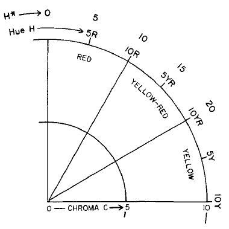

```{r setup, echo=F, warning=F, message=F}
 library(knitr, quietly = TRUE)
opts_chunk$set(message = FALSE,
               warning = FALSE,
               background = '#F7F7F7',
               dpi = 100,
               fig.align = 'center',
               dev = 'png',
               dev.args = list(pointsize = 10),
               cache = FALSE,
               tidy = FALSE)

options(width=100)
```

# _Loafercreek_ - Context

The [Loafercreek](https://casoilresource.lawr.ucdavis.edu/sde/?series=loafercreek) series (_fine-loamy, mixed, superactive, thermic Ultic Haploxeralfs_) is comprised of soils on foothills underlain by nearly-vertically-bedded metavolcanic rocks.

The Loafercreek soils are moderately deep (50 to 100cm) to a paralithic contact. 


The Loafercreek series was established in Butte county (_CA612_) and now is mapped in Calaveras and Tuolumne (_CA630_) as well as portions of Mariposa and Stanislaus Counties.

The metamorphic belt in the Sierra Nevada Foothills is comprised of Mesozoic and Paleozoic age metamorphic rocks. The metavolcanic rocks, dominantly what is called greenstone, are derived from metamorphosed intermediate to mafic igneous rocks. These metamorphosed volcanics are closely associated with sedimentary rocks (marine origin). 

The metavolcanic rocks in this area were recognized to form distinctive "tombstone"-like outcrops by miners during the California Gold Rush. You can see some examples of this in the image below.


Areas of soils _conceptually related_ to _Loafercreek_ have been mapped primarily as [Auburn](https://casoilresource.lawr.ucdavis.edu/sde/?series=auburn) in the Sierra Nevada Foothills. 

Many areas (mapunits) of Auburn soils are outside the range of the family (12th edition taxonomy) of the series as it is currently defined. Auburn soils were historically mapped as _Ruptic-Lithic Xerochrepts_. 

Soil survey manuscript descriptions of map units modeled after the old series concepts shows that their definition spans, at a minimum, shallow to moderately deep depth classes, likely with deeper inclusions. 

The _Loafercreek_ series concept might fit the range in characteristics of the deeper (moderately deep) areas within Auburn mapunits. 

In this demo we will explore the _aqp_ function `profileApply()` for soil-profile-based analyses and workflows. We use a dataset called `loafercreek` from _soilDB_. 

This is a sample data set that roughly corresponds to the "extended" set of pedons (including taxadjuncts, similar soils, etc.) to the series.

***

## Loafercreek's siblings

Loafercreek's siblings are the soils that geographically occupy the same landscapes and parent materials -- often they are components in the same mapunits. 

In some mapunits, if not named, sibling soils are part of a component range due to inclusion of "similar soils" to a different named component. Alternately, they can be implied by "bracketing" of dissimilar components. 

In CA630, Central Sierra Foothills Area, California (Parts of Calaveras & Tuolumne Counties), the shallow metavolcanic soils _with argillic horizons_ (Ultic Haploxeralfs) are predominantly the [Bonanza](https://casoilresource.lawr.ucdavis.edu/sde/?series=bonanza) series, with some areas of [Dunstone](https://casoilresource.lawr.ucdavis.edu/sde/?series=bonanza). Fine particle size class (PSC), moderately deep, soils are similar to the [Argonaut](https://casoilresource.lawr.ucdavis.edu/sde/?series=argonaut) concept. Skeletal PSC soils are [Jasperpeak](https://casoilresource.lawr.ucdavis.edu/sde/?series=jasperpeak) (shallow, Lithic Haploxeralfs) and [Gopheridge](https://casoilresource.lawr.ucdavis.edu/sde/?series=gopheridge) (moderately deep, Ultic Haploxeralfs). Soils with a _deep_ bedrock restriction are called [Motherlode](https://casoilresource.lawr.ucdavis.edu/sde/?series=motherlode) (fine-loamy) or [Gardellones](https://casoilresource.lawr.ucdavis.edu/sde/?series=gardellones) (loamy-skeletal).

```{r, echo=FALSE, fig.width=10, fig.height=6}
library(aqp)
library(soilDB)
x <- fetchOSD(c("Argonaut", "Auburn", "Bonanza",
                  "Exchequer", "Gardellones", "Gopheridge",
                  "Jasperpeak", "Loafercreek", "Motherlode",
                  "Sobrante"))

# terrible hack i am so evil >:)
x@horizons[which(horizons(x)$hzname == "R"),'bottom'] <- 200
x@horizons[which(horizons(x)$hzname == "R"),'soil_color'] <- NA

sharpshootR::SoilTaxonomyDendrogram(x, 
                                    y.offset = 0.35, 
                                    cex.taxon.labels = 1.2,
                                    cex.names=0.8,
                                    cex.id=1.1,
                                    max.depth=200)
```

## This demo

In this series of demos, we are going to use R-based pedon summaries to explore properties of the _Loafercreek_ soils found during the soil survey inventory in _CA630_. 

This demo has three worked "examples" involving the use of `profileApply()` for summarizing pedon data. This, as well as some troubleshooting information and example code (some of which uses `profileApply()`).

*You can use this [R script](loafercreek_nodoc.R) version of the demo document to avoid having to copy and paste all the code. This will allow you to focus on interpreting the output. [This](loafercreek.R) version has all of the text as comments.*

Readers are encouraged to run all of the code in their own IDE/text editor/console. Also, you are encouraged to use `?function.name` to view R manual pages whenever you encounter a `function()` you do not recognize.

You can get the latest development versions of *aqp*, *soilDB* and *sharpshootR* using *remotes* package:

```{r eval=FALSE}
# install remotes if needed
# install.packages("remotes")
remotes::install_github('ncss-tech/aqp', dependencies = FALSE, build = FALSE)
remotes::install_github('ncss-tech/soilDB', dependencies = FALSE, build = FALSE)
remotes::install_github('ncss-tech/sharpshootR', dependencies = FALSE, build = FALSE)
```

## For reference

 * [Spatial Data Science with R - http://rspatial.org/](http://rspatial.org/)

 * [Algorithms for Quantitative Pedology (aqp) home page - http://ncss-tech.github.io/AQP/](http://ncss-tech.github.io/AQP/)
 
 * [soilDB - package for soil database access - http://ncss-tech.github.io/soilDB/](http://ncss-tech.github.io/soilDB/)
  
 * [aqp - manual - http://ncss-tech.github.io/aqp/docs/](http://ncss-tech.github.io/aqp/docs/)

 * [soilDB - manual - http://ncss-tech.github.io/soilDB/docs/](http://ncss-tech.github.io/soilDB/docs/)

# _SoilProfileCollection_

## Loading `loafercreek`

To get soil data out of the database, and into an R object, we typically will use the library _soilDB_. We also need _aqp_. _aqp_ gives us the basic data structure we use to hold pedon data: the _SoilProfileCollection_ object.

```{r, message=FALSE, warning=FALSE}
library(aqp)
library(soilDB)
```

One of the built-in datasets provided by _soilDB_ is `loafercreek`. 

Let's load `loafercreek`.

```{r, message=FALSE, warning=FALSE}
data("loafercreek")
```

## _SoilProfileCollection_

A _SoilProfileCollection_ (SPC) is an S4 object that contains site (`spc@site`) and horizon (`spc@horizon`) slots -- each containing a single _data.frame_. 

 * [Introduction to SoilProfileCollection Objects](http://ncss-tech.github.io/AQP/aqp/aqp-intro.html)
 
The contents (slots) of a SPC should be accessed by using `horizons(spc)`,  `site(spc)`, `coordinates(spc)`, etc. 

For instance:

```{r, eval=FALSE}
# access the clay attribute from the horizons data frame
horizons(spc)$clay

#add new site data by LEFT JOIN on UNIQUE site ID (assumed to be present in both spc and new.site.data)
site(spc) <- new.site.data
```

SPC data (sites, horizons) can also be accessed in ways similar to a base R _data.frame_ via square bracket notation: `spc[your.site.index, your.horizon.index]`. 

In practice, you are usually indexing either a site-level OR a horizon-level attribute. You want to be aware of the length of any index you are using, and ensure you are getting what you expect, due to the flexibility built into the SPC data access methods. 

We use the _data.frame_-like bracket notation to get a few profiles (by specifying a site-index) and plot them.

```{r}
my.sub.set <- loafercreek[3:6, ]
```

```{r}
# number of rows in my.sub.set@site (# of sites or profiles)
nrow(site(my.sub.set))
```

Next we will, make a plot of _just_ the subset.

 * Put User Pedon ID labels on each profile (along left-hand side with `id.style = "side"`) 

 * Make the horizon designation text 50% larger than default (`cex.names = 0.75`).

Note that we start the process by adjusting figure margins with `par()`.

```{r}
# adjust margins, units are inches, bottom, left, top, right; adjust as needed
par(mar=c(0, 0, 0, 1))

# make a SoilProfileCollection plot
plotSPC(my.sub.set, label = 'pedon_id', 
        id.style = "side", cex.names = 0.75,
        x.idx.offset = 0.1)
```

Setting the `x.idx.offset` (e.g. `x.idx.offset = 0.1`) can sometimes help with displaying plots with small numbers of profiles. This is a byproduct of some of the limitations of the base R graphics system.

To get these SPC plots to look "nice" there are many other options for adjusting offsets for plots and axis positions, as well as labels, colors, legends, etc. that can be found under `?plotSPC()`.

Now, we will take a look at the main parts of the `loafercreek` SPC.

__Number of sites in `loafercreek` @site _data.frame___
```{r}
length(loafercreek)
```

__Number of horizons in `loafercreek` @horizons _data.frame___
```{r}
nrow(loafercreek)
```

You can see from the ratio of rows in `loafercreek@horizons` to rows in `loafercreek@site` (`r paste0(nrow(horizons(loafercreek)),":",nrow(site(loafercreek)))`), there is a _many:one_ relationship.

_Many:one_ is very common at lower levels (i.e the NASIS child tables of Site and Component or Pedon Horizon).

This is how we encode much of the information we describe in soil survey (geomorphology, color, structure, rock fragments etc) and encode in soil data structures.

It is convenient to have some of the contents of the child tables "flattened" to site or horizon level attributes. This is so that they are 1:1 with either the number of records in `site(loafercreek)`, or the number of records in `horizons(loafercreek)`.

## Create a SPC using `fetchOSD()`

Here is an example showing a _SoilProfileCollection_ created using _soilDB_ function `fetchOSD()`. 

A list of soil series (`series.names`) that are geographically or conceptually associated with metavolcanic rocks in the Sierra Nevada Foothills is supplied.

The `extended` argument is set to `TRUE` to return a _SoilProfileCollection_ of type location descriptions parsed from the _Official Series Description_ (OSD).

```{r, message=FALSE, warning=FALSE}
library(soilDB)
series.names <- c("Argonaut", "Auburn", "Bonanza",
                  "Exchequer", "Gardellones", "Gopheridge", 
                  "Jasperpeak", "Loafercreek", "Motherlode", 
                  "Sobrante")

osds <- fetchOSD(soils = series.names, extended = TRUE)

# adjust margins, units are inches, bottom, left, top, right; modify as needed
par(mar=c(0, 0, 0, 1))

plotSPC(osds$SPC, max.depth=200)
```

## Create a SPC using `fetchKSSL()`

Deeper soils on metavolcanic Sierra Nevada foothills (_thermic_, _typic xeric_) commonly have a pedogenic clay increase (_argillic horizon_). Due to the quantity of mafic minerals in the parent rock, the soils can weather to be quite red. 

```{r, message=FALSE, echo=FALSE}
k <- fetchKSSL("loafercreek")

hz.match <- '' # match all horizons
```

The KSSL data show a substantial amount of dithionite-citrate extractable (pedogenic) iron for _Loafercreek_ [all taxon kinds; n=`r length(k)` profiles, h=`r sum(!is.na(k$fe_dith))` horizons with non-NA Fe-d]. 

The median Fe-d for _Loafercreek_ KSSL data is `r round(median(k$fe_dith[grepl(k$hzn_desgn, pattern = hz.match)], na.rm = T), 2)`%, with a minimum of `r round(min(k$fe_dith[grepl(k$hzn_desgn, pattern = hz.match)], na.rm = T), 2)`% and maximum of `r round(max(k$fe_dith[grepl(k$hzn_desgn, pattern = hz.match)], na.rm = T), 2)`%, by mass. 

These are somewhat crude statistics, as summarizing across all horizons in the SPC obscures between-pedon variation and/or covariance with depth. Regardless, these values are relatively high.

Check for yourself. Use `soilDB::fetchKSSL()` to make a SPC of the lab pedons correlated to _Loafercreek_. Or, you can get KSSL pedons for any other taxonname, MLRA or rectangular bounding box. What other attributes are available from KSSL?

```{r, eval=FALSE}
library(soilDB)
# use the `series` argument to specify taxonname. or use `mlra` or `bbox`
# ?fetchKSSL for details
k <- fetchKSSL(series = "loafercreek")

# count the number of rows (records) in the `loafercreek@site` data.frame
n.pedons <- length(k)

#calculate some basic univariate summary statistics on _all_ horizons in the SPC
median(k$fe_dith, na.rm = TRUE)
min(k$fe_dith, na.rm = TRUE)
max(k$fe_dith, na.rm = TRUE)

# here you would inspect the data further ...
# other attributes or by horizon designation, perhaps?

```

## Setting up SPC spatial reference

A SPC can be promoted to have an object of type _SpatialPoints_. This is the same as promoting an object like a _data.frame_ to _SpatialPointsDataFrame_.

The spatial slot (`spc@sp`) will contain the information. 

`loafercreek` contains NCSS standard (WGS84 decimal degrees) latitude (`y_std`) and longitude (`x_std`) in `loafercreek@site` table. 

Let's make it _Spatial_!

```{r}
# set spatial coordinates to create a Spatial object
coordinates(loafercreek) <- ~ x_std + y_std
```

Inspect the spatial slot.

```{r}
slot(loafercreek, 'sp')
```

OK, so the spatial points are _in there_... but the coordinate reference system (CRS) is `NA`. 

We know what the CRS is. The data originate from NASIS, where it is standard to use WGS84 decimal degrees. Decimal degrees are the values contained in `x_std` and `y_std` when we `fetchNASIS()`. So, let's set the CRS for `loafercreek`.

```{r}
# when you set the proj4string, be sure it matches the formula 
# and the system/format of the data you sent to coordinates() above
proj4string(loafercreek) <- '+proj=longlat +datum=WGS84'
```

```{r}
slot(loafercreek, 'sp')
```

Looks good. These `SpatialPoints` are safe to `spTransform()` (e.g. to UTM) because their coordinate reference system is now defined.


### Tip: Safe interaction with S4 objects

Note that it is _not_ good practice to use the `@` (slots) to _edit_ data. But they are available for inspection. Generally slots are for internal use only by S4 objects. They have special functions (like `coordinates()` and `proj4string()`) designed to access/alter them.

You can get a separate _SpatialPointsDataFrame_ (with just the site-level data) from an SPC using the below code. We "coerce" the `loafercreek` _SoilProfileCollection_ to _SpatialPointsDataFrame_ using a custom S4 method that is part of the internal definition of the SPC. 


```{r}
# loafercreek is a SoilProfileCollection
class(loafercreek)

# coerce the loafercreek object to SpatialPointsDataFrame
loafercreek.spdf <- as(loafercreek, 'SpatialPointsDataFrame')

# loafercreek.spdf is a SpatialPointsDataFrame WITH JUST THE SITE DATA 
# the S4 method defined in the SPC does this by design
class(loafercreek.spdf)
nrow(loafercreek.spdf)
```

Note that in the coercion call `as()` you should NOT use `site(loafercreek)` as that would return the ordinary _data.frame_ `loafercreek@site` (without the _SpatialPoints_ slot found in `loafercreek@sp`).

### Spatial plot

```{r}
# plot pedon locations as points
plot(loafercreek.spdf, sub = "Loafercreek Pedon Locations", pch = 19, cex = 0.5)

# "add" county level maps from maps package
maps::map(database = 'county', regions = 'CA', add = TRUE)

# add a neatline
box()
```

Note that two pedons from _CA612_ are included (one is the type location), but clearly most of the pedons are clustered further south (in _CA630_).

## Build-your-own SPCs

You can build-your-own _SoilProfileCollection_ by reading site/horizon data from flat files (e.g. `read.csv`) or querying from a database into data.frames.

Here we construct some fake site and horizon data.frames for demonstration. 

You should mimic the format of the `your.site.data` and `your.horizon.data` objects we are creating with R code in your flat files, if you go the flat file route. 

 * Horizon data is related to site data via site ID column (in this example `id`). 

 * For most applications it is expected each unique site ID has a set of non-overlapping top and bottom depths (in this example `top` and `bottom`)

 * Site and horizon IDs can be accessed from an SPC using `profile_id()` and `hzID()`. The column names used for storing those IDs are accessible with `idname()` and `hzidname()`. That means you can name the unique ID and depth variables whatever you want.

```{r}
## make 10 site ids `id` each witin site-level attributes `di` and `mlra`
new.site.data <- data.frame(id = 1:10, di = 10 - 0:9, mlra = "18") 
head(new.site.data)

## or read your data from file
# your.site.data <- read.csv("your.site.data.csv")

## make 10 random horizon datasets, with site id, top and bottom 
## horizon designation and 5 random horizon level attributes (p1, p2...)
your.spc <- do.call('rbind', lapply(new.site.data[['id']], random_profile)) 
head(your.spc)

## or read your data from file. 
# your.spc <- read.csv("your.horizon.data.csv")

#promote horizon data frame (in this case 10 random profiles) to SPC
depths(your.spc) <- id ~ top + bottom

# merge site data into the site slot of the SPC based on common site id `id`
site(your.spc) <- new.site.data

# calculate horizon thickness and ratio of variable p1 to p2
new.horizon.data <- data.frame(id=your.spc$id,
                               hzID=your.spc$hzID,
                               hz_thickness=(your.spc$bottom - your.spc$top), 
                               ratio=(your.spc$p1 / your.spc$p2))

# merge horizon data into the horizon slot of the SPC 
# based on common site id `id` and horizon id `hzID`
horizons(your.spc) <- new.horizon.data
# new.horizon.data contains both unique site and horizon ID, so merge is possible

# check to see if the horizon data merge worked
head(your.spc)

# inspect attribute names storing critical SPC information
idname(your.spc)
hzidname(your.spc)
horizonDepths(your.spc)

head(profile_id(your.spc)) #unique site/profile ids
head(hzID(your.spc)) #unique horizon ids (assigned at time of SPC creation)
```

## Summary

_soilDB_ provides a variety of ways to import soil data into SPCs.

 * [`fetchOSD()`](http://ncss-tech.github.io/AQP/soilDB/soil-series-query-functions.html) for getting profile information from series type locations.
 
 * [`fetchKSSL()`](http://ncss-tech.github.io/AQP/soilDB/KSSL-demo.html) for querying data from a snapshot of the Kellogg Soil Survey Laboratory database. 
 
 * [`fetchNASIS()`](http://ncss-tech.github.io/AQP/soilDB/fetchNASIS-mini-tutorial.html) for accessing NASIS pedons and components via ODBC connection
 
 * [`fetchSDA_component()`](http://ncss-tech.github.io/AQP/soilDB/NASIS-component-data.html) & [`SDA_query()`](http://ncss-tech.github.io/AQP/soilDB/SDA-tutorial.html)  for SSURGO tabular [_or spatial_](http://ncss-tech.github.io/AQP/soilDB/SDA-tutorial-2.html) data via Soil Data Access (SDA).
 
Watch out for future NASIS, SDA and flat file specific modules. 

The packages [_aqp_](http://ncss-tech.github.io/aqp/docs/) and [_sharpshootR_](http://ncss-tech.github.io/sharpshootR/docs/) provide functions for interacting with and summarizing the contents of SPCs.

# Using `profileApply()`

## `profileApply()`

The _aqp_ function `profileApply()` allows us to evaluate a function on each profile in a SPC. 

It emulates the base R `*apply` functionality (`apply`, `lapply`, `mapply` etc.); but instead of an array, list, or matrix, iterating over profiles within a SPC.

_The number of results returned is equal to the number of profiles in the SPC._ 

___`profileApply()` - method in aqp for SoilProfileCollection objects___
```{r, eval=FALSE}
profileApply(object, FUN, simplify=TRUE, ...)
```
__Arguments__

 * `object`	- a _SoilProfileCollection_
 
 * `FUN` - a function to be applied to each profile within the collection
 
 * `simplify` - _logical_, should the result _list_ be simplified to a _vector_? 
 
 * `...` - further arguments passed to `FUN`

## Example: estimateSoilDepth()

Here, we use an _aqp_ function `estimateSoilDepth()` to demonstrate how `profileApply()` works.

`estimateSoilDepth()` uses a REGular EXpression (regex pattern) to match horizon designations of a certain pattern, and returns the top depth of the first horizon matching a given pattern. 

The default settings are designed for bedrock restrictions so the default pattern matches horizon designations Cr, R or Cd (`p = "Cr|R|Cd"`). 

Create a numeric vector `depth.to.contact` to hold the result of calling `estimateSoilDepth()` on each profile in `loafercreek`.

```{r}
depth.to.contact <- profileApply(loafercreek, estimateSoilDepth)
```

### Quantile estimation for soil depth

Lets see how our `depth.to.contact` data look using a density plot.

`density()` provides an estimate of the _probability density function_; or _pdf_ for a single variable. Probability densities are estimated from sample data using a specific kernel and smoothing window. The default kernel is "Gaussian" or_normal_ distribution. See `?density`.

```{r}
#look at a density (continuous frequency) plot; depth on x axis
plot(density(depth.to.contact, na.rm = TRUE))
```

The median (`r median(depth.to.contact)` cm) is the 0.50 quantile of `depth.to.contact`. 

 * _Half of the data are greater_ and _half the data are less_ than the _median_. 

_Quantiles_ are values occurring within the range [_min_=`r min(depth.to.contact, na.rm=T)`, _max_=`r max(depth.to.contact, na.rm=T)`] of a "sample" (in this case the sample is `r sum(!is.na(depth.to.contact))` depths to contact). 

Let's summarize `depth.to.contact` using _quantiles_ with `quantile`.

```{r}
quantile(depth.to.contact, 
         probs = c(0,0.01,0.05,0.25,0.5,0.75,0.95,0.99,1), 
         na.rm = TRUE)
```

A sample quantile "splits" your data at a particular level (specified with `probs`) based on the estimated probability mass density distribution along the range [min, max] of your data (`depth.to.contact`). 

The minimum and maximum of your sample data correspond to the quantiles at probability levels 0 and 1, respectively. When the nominal probability level is expressed as a percentage, quantiles are called _percentiles_.

So, when you say a range is the "5th to 95th percentiles," you are excluding 10 percent of the observed data and describing the range of the "central" 90%. 

_Where is the 5th to 95th percentile range on the graph above? Does it describe the central tendency of the data well?_

 * About 5% of new, random observations might be expected to be greater than the 95th percentile. Likewise for observations _less than_ the 5th. 

You can estimate quantiles at different probability levels by changing the argument `probs`. `probs` takes a numeric vector of probabilities [0, 1] you would like quantiles for. 

There are several methods for calculating quantiles depending on the variable/analysis of interest (see `?quantile` `type` argument) 

[More about quantiles/percentiles](https://ncss-tech.github.io/soil-range-in-characteristics/why-percentiles.html).

### Outliers & oddballs

There is one deep "Loafercreek" in `loafercreek` with bedrock contact at 148 cm. Say, for example, you didn't expect any pedons in your dataset that far outside the "Loafercreek series" depth class. 

We use the `%in%` operator, with a site-level attribute/index specified first, in order to produce a _logical_ vector. We will then index `loafercreek` with that vector to make SPCs based on the "bad" pedon.

```{r}
bad.peiid <- c("542129") 

#SPC with just the "bad" pedon (this one isn't that bad)
deep.one <- loafercreek[site(loafercreek)$peiid %in% bad.peiid, ]
length(deep.one)

#the inverse, loafercreek without the "bad" one
loafernew <-loafercreek[!(site(loafercreek)$peiid %in% bad.peiid), ]
length(loafernew)
```

You can clearly see the "deep" observation in the `loafercreek$bedrckdepth` `density()` plots above. You also may have noticed `148` was way above the 99th percentile when we looked at quantiles. The deep pedon is correlated to _Motherlode_ (see `loafercreek$taxonname`) If you keep the default `estimateSoilDepth()` settings, the depth returned for the deep pedon is `148`. But we could have excluded it. 

If we tweak the `no.contact.*` settings to return `NA` if the contact isn't found within `100` cm (moderately deep), the depth returned is `NA`. Had we used this setting, all deep observations (just one) would be excluded (return `NA`).

```{r}
estimateSoilDepth(deep.one)

estimateSoilDepth(deep.one, no.contact.depth = 100, no.contact.assigned = NA)
```

### Modifying default arguments for new analyses

By changing the default settings of `estimateSoilDepth()` you can calculate many types of "depth-to-_X_ feature". `estimateSoilDepth()` works using text-based matching for any horizon-level _character_ attribute (examples: dry hue, texture class, in lieu texture, effervescence class, cementation class).

Possible modifications to the `estimateSoilDepth()` default pattern to calculate depth to other types of diagnostic features would be duripan `p = 'qm'` or carbonates `p = 'k'`. However, as mentioned, the feature whose depth we are calculating doesn't have to be part of a horizon designation. 

More "similar" sets of soils might be expected to have less variation in the depth to an "important" characteristic. 

Your analysis should always consider that for individual profiles you have the possibility of _X_ event not occurring at any depth. Also, you may have insufficient data to determine whether _X_ event occurred.

Here are some other examples:

  + depth to lithologic discontinuity - `estimateSoilDepth(pedon, p = '^2')`

  + depth to gley (reduced; ~2 chroma dominant color) - `estimateSoilDepth(pedon, p = 'g')`
  
[More about regex patterns](https://www.regular-expressions.info/)

### Checking "stored" versus "calculated"

Using R to encode logical constraints on data ("calculated") will help you to ensure the values populated in the database ("stored") are consistent with one another.

As an example of how you might do this, we will compare the calculated values for depth to contact (which are based on Pedon Horizon designation and depth) with the ones pre-loaded with `loafercreek` dataset (populated in Site Bedrock NASIS child table). 

If the stored and calculated match, they will plot on the 1:1 line. 

```{r}
#plot difference "stored v.s. calculated"
plot(loafercreek$bedrckdepth ~ depth.to.contact, xlim = c(0,200), ylim = c(0,200))

#add a 1:1 line with intercept 0 and slope 1
abline(0, 1)
```

Some plot off the 1:1 line -- these might be worth inspecting in NASIS! We trust the calculation (_this time_). 

Of course, in practice, you need to be careful about things like cementation class of bedrock layers, and possibility of multiple horizons not meeting e.g. densic criteria. These values could be outputted to file to flag NASIS record IDs in need of review and potential revision.

Let's keep the calculated values, and update the site attribute in the SPC, because we will use the bedrock depth values later to check something else. It will be good to know we can rely on those values being consistently determined.

### Creating and editing variables in a _SoilProfileCollection_

The `depth.to.contact` variable we created above is a _numeric_ vector of depths to a bedrock contact, calculated for each profile using `profileApply()` and `estimateSoilDepth()` on `loafercreek`. 

The `loafercreek` dataset already has a variable called `bedrckdepth` in the `loafercreek@site` table. We want to replace it with the new values. The code would be the same if `bedrckdepth` were new.

Access `loafercreek` site attribute `bedrckdepth` using `$` and set the value to `depth.to.contact` with the assignment operator: `<-`.

```{r}
loafercreek$bedrckdepth <- depth.to.contact
```

Since `length(depth.to.contact) == length(loafercreek)` the SPC is smart enough to know we are editing a `loafercreek@site` attribute. 

*Tip:* To _remove_ an attribute from a _data.frame_, use the assignment operator to set it to `NULL` 

To resolve ambiguity about whether you are accessing `loafercreek@site` or `loafercreek@horizons` you need to specify a _site-_ or _horizon-index_ (length equal to number of rows) and/or use `site(loafercreek)` or `horizons(loafercreek)`. 

Unpredictable results or errors may arise if you do not specify which portion of the SPC you are indexing when you reference `loafercreek`.

Furthermore, the _site-_ or _horizon-index_  you use should not contain `NA`

```{r}
# create new variable with clay proportion, calculated from %
loafercreek$new.hz.level.variable <- loafercreek$clay / 100 
```

Since `length(loafercreek$clay) == nrow(loafercreek)` (the number of horizons in the SPC) the SPC is smart enough to know we are editing a horizon attribute called `new.hz.level.variable`. `new.hz.level.variable` does not exist in `loafercreek@horizons`, so it will be created.

## Defining your own functions

In R, you define your own functions using `function()` and the assignment operator `<-`. 

```{r}
your.function.name <- function(...) { 2 + 2 } 
```

A function takes zero or more inputs (`...`) and executes some code (`2 + 2`) and produces some result or output (`4`). 

The curly braces `{ }` denote the body of a function. The input variables (specified in side the parentheses of `function(...)`) are only "in scope" inside the braces. Variables created inside the body of the function when it is executing are destroyed when the function returns.

 * [Functional Programming in R](http://adv-r.had.co.nz/Functional-programming.html)
 
 * [More about variable scope in R](https://www.datamentor.io/r-programming/environment-scope/)

If executing the logic in a function body brings the process to a `return()` statement, the result is returned back to a parent function or interface (e.g. console) from which the function was called. If it reaches `stop()` or `warning()` an error or warning will be returned.

A function typically returns a value with `return()`. It also may:

 * return the result of the _last expression within the function body_ 
 
 * perform various other operations with the data (e.g. make plots to a graphics device)

 * manipulate objects outside scope of the function

The basic format for defining an R function is:

```{r}
# your input `tempF` is a numeric vector in degrees fahrenheit
fahrenheit_to_celsius <- function(temp_F) {
  
  # perform the conversion from input to output
  temp_C <- ((temp_F - 32) * (5 / 9))
  
  # return output, a numeric vector in degrees C
  return(temp_C)
}
```

Let's use it on a vector of three temperatures in degrees Fahrenheit.

```{r}
# a numeric vector in degrees fahrenheit; e.g. Soil Temperature Regime breaks
temp.regime.F <- c(46.4, 59, 71.6)

# call the function we defined, and store the output
temp.regime.C <- fahrenheit_to_celsius(temp.regime.F)

temp.regime.C
```

A bit contrived, but if you understand these mechanics you can write very powerful analyses quickly that can be then applied in batch.

Let's apply functions to soils. This function defined below calculates the profile maximum clay content. It is designed for use with `profileApply()`.

### Example: Calculating Maximum Clay Content

The argument `p` is an _individual pedon_. `profileApply()` iterates over the `loafercreek` profiles one-by-one, passing them to the function `profileMaxClay()` for evaluation.

`profileMaxClay()` applies the function `max` to the attribute `clay` in a profile `p`. 

```{r}
profileMaxClay <- function(p) {
    # access the numeric vector `clay` from the horizons data.frame
    d <- horizons(p)$clay
    
    # if all `d` are NA and na.rm = TRUE, max() makes a zero-length variable
    if(all(is.na(d))) 
      return(NA) # so if a pedon `p` has no clay data... return NA pre-emptively
    
    # calculate the maximum value in `d`, omitting NA
    return(max(d, na.rm = TRUE))
}
```

Let's apply `profileMaxClay()` to all profiles in `loafercreek` and look at the distribution of the results.

We find that our profile maximum clay contents span the  fine-loamy clay contents (18-35%), with quite a few of them being higher than that range (>35% clay).

```{r}
# calculate the max clay content in all profiles
loafercreek$maxclay <- profileApply(loafercreek, profileMaxClay)
```

Let's visualize profile maximum clay with a density plot.

We use a rectangular kernel (smoother) for this demo. Compare the result with `kernel = "gaussian"`.

```{r}
# look at the density plot (estimated probability density function) of maximum clay contents
plot(density(loafercreek$maxclay, na.rm = TRUE, kernel = "rectangular"))

# calculate quantiles
quantile(loafercreek$maxclay, probs = c(0,0.01,0.05,0.25,0.5,0.75,0.95,0.99,1), na.rm = TRUE)
```

Another value that could be of interest is _DEPTH_ to maximum clay content. Feel free to modify `profileMaxClay()` to return that. 

### Generalizing Functions

Or, _better yet_, write a generalized function to return arbitrary horizon level attributes. 

For this example extension to `profileMaxClay()`, the function we just wrote, we add the `attr` argument. `attr` takes a character string (attribute in `horizonNames(loafercreek)`) as an argument.

Instead of just returning the maximum clay content, the value corresponding to the requested attribute `attr` is returned _from the first horizon with maximum clay content_. 

For example: you could return "hzdept" (horizon top depth), "phfield" (field-measured pH), "total_frags_pct" (total frag. vol). We will use it to get the top depth.

```{r}
profileMaxClayAttr <- function(p, attr = "clay") {
    # get the horizon data
    h <- horizons(p)
    
    # get clay content in vector d (you could change this...)
    d <- h$clay
    
    # pre-emptively return NA if all clay are NA
    if(all(is.na(d))) 
      return(NA)
    
    # what horizon(s) have maximum clay content (in profile)
    d.max.idx <- which(d == max(d, na.rm = TRUE))
    
    # there may be multiple horizons with the max clay content... 
    # we just care about the first one (closest to the surface)
    # flattening a (possible) many:one relationship
    d.max.idx.first <- d.max.idx[1]
    
    # return an arbitrary attribute `name` 
    # default returns clay from horizon of max clay
    # you set attr to return attr from horizon of max clay
    return(h[d.max.idx.first, attr])
}
```

This is a simple stub function you can alter and expand as needed. It contains basic `NA` handling, subsetting, example logic etc. Of course, you can change the logic that selects the horizon(s) of interest (i.e not clay content, not the first horizon) and the summary statistic (`max()`) for your own analysis. 

But, for this example, we calculate the max clay for each profile. Then the depth to that specific clay content, again, for each profile.

```{r}
# overwrite with identical values as obtained with profileMaxClay()
# from new generalized function! using default attr='clay'
loafercreek$maxclay <- profileApply(loafercreek, profileMaxClayAttr)

# calculate the DEPTH TO first horizon with max clay content in all profiles
# note we change default attr to return hzdept instead of clay
loafercreek$maxclaydepth <- profileApply(loafercreek, 
                                         profileMaxClayAttr, attr="hzdept")
```

Inspect the depth to maximum clay distribution. It appears less skewed than the clay contents themselves.

```{r}
# look at the density plot (estimated probability density function)
# of minimum depth to maximum clay content
plot(density(loafercreek$maxclaydepth, na.rm = TRUE))

# calculate quantiles
quantile(loafercreek$maxclaydepth, 
         probs = c(0,0.01,0.05,0.25,0.5,0.75,0.95,0.99,1), 
         na.rm = TRUE)
```

__Food for thought:__

_How often does the maximum clay content occur in the particle size control section, or only in a small portion of it?_

See `aqp::estimatePSCS()`.

***

#### Exercise: Functions

_Create a function called `profileMinimumKsat()` to identify potential soil mapunit component limitations due to low hydraulic conductivity._

_Use soilDB and _`fetchNASIS_components()` _or_ `fetchSDA_components()` _to create a SPC, or use your own data if you have Ksat information._

_Calculate the minimum Ksat and the shallowest depth to that minimum Ksat for all components in your SPC (using `profileApply()`)._

_Bonus: add an argument to ignore Ksat values below a user-specified depth before calculating the minimum._

***

## Example: Indicators of landscape stability

We will see if two indicators of landscape stability and pedogenic development (clay content and soil color "redness") are related within `loafercreek` dataset. 

We will use the Hurst redness index concept as defined below (hereafter known as "redness"). Then we will define a "cutoff depth" that is "appropriate" for the soils in our set. This is to simulate a taxonomic or interpretive limit of some sort. The readers are encouraged to consider alternate concepts of redness, or ways they can alter this workflow for their needs.

This workflow applies any numeric criterion applied to horizon data / profiles. There are many possible examples available in U.S. Soil Taxonomy. For this example, we chose a morphologic, rather than a taxonomic, index -- but it was something that would fit nicely with the data (and lack thereof) in `loafercreek` and would not be too computationally complex.

We showed at the beginning of this document (`fetchKSSL()` demo) that there can be quite a bit of "pedogenic" iron in _Loafercreek_ and the soils correlated to it. 

In areas with younger colluvial material on the surface, or, due to variation within the parent rock, the colors may range duller (lower chroma) and yellower. Commonly, the weathered bedrock has 10YR or yellower hues.

### Developing a Hypothesis

Our hypothesis is: soils that are shallower to a "red" redness index will have higher clay content because they have older, more weathered materials near the surface. We won't be measuring the age or specific pedogenic iron content, but we hope to use soil color as a surrogate.

In these relatively old, residual, bedrock-controlled landscapes, several different colluvial "events" (or historic _periods_ of greater hillslope transport activity) may have buried residual materials -- which contain enough iron to weather to be quite red.

In the most active portions of the landscape, little to no true soil material "residuum" may be present. The soil materials may be comprised primarily of colluvium that was deposited on top "scoured" bedrock. Some of that colluvium may have been from eroded argillic horizons, or have been in place long enough to weather

Conversely, in other landscape positions, erosion could have exposed _highly_ weathered materials at the surface.

We hypothesize the variation we see in `loafercreek` is in part due to the complex colluvial history of parts of these landscapes. The natural variation is coupled with unclear or inconsistent indicators of lithologic discontinuities in the field, as well as in the profile descriptions.

### Calculating a Redness Index

We will calculate a classic "redness index" from Hurst (1977) _Visual estimation of iron in saprolite_. We will use _dry soil color_ to apply Hurst's method to our data.

You can read the original paper [here](hurst(1977)-visual_estimation_of_iron_in_saprolite.pdf). 

Basically, each horizon dry hue ($H$) is converted to a numeric equivalent ($H^\star$). This is a linearization of a portion of the Munsell color wheel. 

{width=380,height=379}

To obtain the "redness index" $H^\star$ is multiplied by the ratio of dry value ($L$; lightness) to dry chroma $C$; chroma).

$Redness Index = H^\star \cdot (L / C)$

First, we need to convert the `d_hue` data in `loafercreek` over to these $H^\star$ values. Let's create a look-up table.

```{r}
# create a named numeric vector as a "lookup table"
hue.lookup.table <- seq(5, 22.5, 2.5)
names(hue.lookup.table) <- c('5R','7.5R','10R','2.5YR',
                             '5YR','7.5YR','10YR','2.5Y')
```

Look at the look-up table.

```{r echo=F}
df.lut <- data.frame(names(hue.lookup.table), hue.lookup.table)
names(df.lut) <- c("Dry Hue (H)", "H*")
knitr::kable(df.lut, row.names = FALSE, digits=1,
             caption="Lookup table: Equivalent H and H* Values (after Hurst, 1977)")
```

Redder hues have lower $H^*$ values -- this will lower the $Redness Index$ assigned to a particular Hue-Value-Chroma combination.

```{r}
# determine H* using the lookup table
hstar <- hue.lookup.table[loafercreek$d_hue]

# calculate Hurst (1977) "Redness Index" H*(L/C)
loafercreek$hri <- hstar * loafercreek$d_value / loafercreek$d_chroma
```

The ratio of value to chroma ($L / C$) will help to discern the systematic relationships in value and chroma where hue fails fails on its own. 

Looking at the equation for $Redness Index$, we can see that if value ($L$) and chroma ($C$) are both high _or_ both low, you obtain a $L / C$ ratio near one, so the $H^\star$ (dry hue) dominates the redness index.

At high value, and low chroma, the $Redness Index$ gets _larger_. 

Conversely, at low value and high chroma, the $RednessIndex$ gets _smaller_. 

We will classify our data based on the _top depth_ of the _shallowest_ horizon found with a $Redness Index$ _less than or equal to_ `20` . 

This provisional threshold was chosen for this demonstration after some preliminary inspection of the data, similar to the sections that follow, and review of _Figure 3_ from Hurst (1977) in light of the Loafercreek data.

```{r}
loafercreek$horizon.is.red <- loafercreek$hri <= 20

summary(loafercreek$horizon.is.red)
```

### Depth to Redness

Let's use `profileApply()` to calculate the top depth of the first horizon to meet our redness criteria in each profile of `loafercreek`.

To do the work we define an [_anonymous_](http://adv-r.had.co.nz/Functional-programming.html#anonymous-functions) function that takes the logical vector `horizon.is.red` from each individual profile’s horizon data. 

The function finds which horizon indexes have a `TRUE` value.

From that set of horizons, takes the first (shallowest) one's top depth.

```{r}
loafercreek$depth.to.red <- profileApply(loafercreek, function(p) {
  # access horizon slot of a single profile `p` from loafercreek
  h <- horizons(p)
  
  # calculate indices where horizon.is.red == TRUE, take the first 
  shallowest.match.idx <- which(h$horizon.is.red)[1]
  
  # return top depth of first horizon matching 
  return(h[shallowest.match.idx, 'hzdept'])
})
```

Next we will make a density plot. We will cut off the density plot at the maximum depth (+1) to redness we found in our data.

```{r}
# calculate top depth of deepest horizon that met our redness criteria
density.cutoff <- max(loafercreek$depth.to.red, na.rm=T)+1
density.cutoff
```

```{r}
plot(density(loafercreek$depth.to.red, 
             from = 0, to = density.cutoff, na.rm=T))
```

Here is the subset of pedons that has a red color (a Hurst redness index of 20 or less) within 20 cm depth. __"20-in-20"__

We use the aqp function `subsetProfiles()` and a site-level attribute `s` matched using a character string containing a logical expression. 

```{r}
# subset of profiles with depth.to.red <= 20
sub1 <- subsetProfiles(loafercreek, s = 'depth.to.red <= 20')
```

Profiles can also be subsetted on a horizon-level attribute (`h`). 

Here is how _you could_ do that if you wanted to ignore the depth threshold part of the example analysis (which is a bit arbitrary - even though it appears to capture a "distinct" group of soils based on the `density()` plot)

```{r}
# subset of profiles with any horizon.is.red == TRUE
sub1.alternate <- subsetProfiles(loafercreek, h = 'horizon.is.red == TRUE')
``` 

Let's count number of profiles in `sub1` and `sub1.alternate`

```{r}
# has red color within 20 cm
length(sub1)

# has red color at any depth
length(sub1.alternate)
```

OK. We will continue on with just `sub1` -- since there is a big drop off in density around 20cm -- we want to keep those observations separate for now.

Let's make a plot to visually inspect the group.

```{r}
# adjust margins, units are inches, bottom, left, top, right
# be sure to leave room for legend
par(mar=c(0, 0, 3, 2))

# convert legend variable to factor for coloring
sub1$horizon.is.red <- factor(sub1$horizon.is.red)

# calculate the plotting order
plotting.order <- order(sub1$depth.to.red)

# make a plot, used some exaggerated red and brown colors to display
# horizon class membership for our threshold
plotSPC(sub1, max.depth = 100, print.id = FALSE, 
        plot.order = plotting.order,
        axis.line.offset = -0.5, name = '',
        col.palette = parseMunsell(c('10YR 5/3', '5YR 3/8')),
        width = 0.4, color = 'horizon.is.red')

# we sorted the plot on "depth to red" to add a line to guide our eye
# plot a white line, with black dots along it
lines(1:length(sub1), sub1$depth.to.red[plotting.order], col = "white", lwd = 2)
lines(1:length(sub1), sub1$depth.to.red[plotting.order], lwd = 3, lty = 3)

# add an axis with depth to redness (corresponds to dotted line)
axis(side = 1, at = 1:length(sub1), cex.axis = 0.5,
     labels = sub1$depth.to.red[plotting.order])
mtext(text = 'Depth to Red (cm)', side = 1, line = 2.5)
```

OK. So `sub1` is the pedons that are shallow (<20cm) to red colors. What about the rest of them? 

We will put them in an SPC called `sub2`.

To make `sub2`, we use SPC square bracket notation, the `%in%` operator, and a logical vector for subsetting. 

Since `peiid` (pedon record ID) exists in `loafercreek@horizons` and `loafercreek@site` tables, we have to specify which one we want to use. 

To do that, we use a _site-level index_ -- an index that has same length as the number of sites/profiles in the SPC. 

By accessing `peiid` from `loafercreek@site` with `site()`, you specify which `peiid` you want (and therefore its _length_).

Furthermore, the `peiid` from `loafercreek` is used on the _left-hand side_ of the `%in%` operator to yield a vector of length equal to length of `loafercreek`. If we had put it on the _right-hand side_, the vector would equal length of `sub1` -- which is not what we want.

We use that logical vector to index `loafercreek` to obtain the pedon record IDs that are __NOT IN__ `sub1`. 

```{r}
# create a logical vector of `peiids` in `loafercreek` that are IN sub1, 
# then invert it with NOT (!)
not.in.sub1 <- !(site(loafercreek)$peiid %in% site(sub1)$peiid)

# square bracket SPC subsetting
sub2 <- loafercreek[not.in.sub1,]

# how many in the "remainder" set?
length(sub2)
```

Hmm...

```{r fig.width=10, fig.height=4.5}
par(mar=c(0, 0, 3, 2))

# convert legend variable to factor for coloring
sub2$horizon.is.red <- factor(sub2$horizon.is.red)

# depth cut off at 100cm, hide IDs and make it clear which have data
plotSPC(sub2, max.depth=100, print.id = FALSE, 
        axis.line.offset=-0.5, name = '', 
        width = 0.4, color = 'horizon.is.red',
        col.palette = parseMunsell(c('10YR 5/3', '5YR 3/8')), 
        col.legend.cex=1.25, col.label='Horizon is red?')
```

OK. So, in the two profile plots we can visually see four cases. 

1. some pedons have redness within 20cm depth (many at the surface)

2. some pedons have redness at greater than 20cm depth 

3. some pedons do not have redness at any depth

4. some pedons do not have dry color information in _any_ horizon

Also, affecting the first three cases, is some pedons only have one or a few observations of dry color, and the rest `NA`. i.e. incomplete data.

Perhaps dry colors were only recorded for the surface to rule out an epipedon? 

Incomplete data can be particularly concerning for analyses based on small datasets. You might have noticed by now that there are more moist color observations than dry in `loafercreek`.

Unusual estimates from incomplete cases can disproportionately affect the distribution of the group they are correlated to when treated as if they were "complete."

We will deal with the `NA` after the next section. First we will briefly inspect inspect the first subset `sub1` of "shallow to red" profiles.

### Horizon Breakdown of Redness

If we look at the distribution of our redness index across all horizons in `sub1` with a `density()` plot, we see that the data span both sides of our provisional threshold of `20`... with a peak on the "red" side of the line (smaller redness index = redder). This makes sense since we cut our full dataset at `20` to make `sub1`.

```{r}
# plot estimate of the probability density function for redness index
plot(density(sub1$hri, na.rm=T))

# add a vertical line at HRI=20 (where we put our "break" in the data)
abline(v=20, lty=2, lwd=2, col="RED")
```

We will group redness values by horizon label using the `genhz` (NASIS Comp. Layer ID).

```{r}
# modify the  "genhz" (NASIS Comp. Layer ID) to combine BA and A
# we do this because there is only one BA horizon with dry color data
loafercreek$genhz[loafercreek$genhz == "BA"] <- "A"

# make a list of data frames split by "genhz" (NASIS Comp. Layer ID)
genhz.list <- split(horizons(sub1), f=sub1$genhz)

# calculate some quantiles of Hurst Redness Index for each genhz
# lapply applies an anoymous function to each data frame in genhz.list
qtiles.by.genhz <- do.call('rbind', lapply(genhz.list, function(d) {
  n.obs <- sum(!is.na(d$hri))
  names(n.obs) <- "n.obs"
  return(c(quantile(d$hri, 
                    probs=c(0,0.05,0.25,0.5,0.75,0.95,1), 
                    na.rm=TRUE), n.obs))
}))

#remove NA rows
qtiles.by.genhz  <- qtiles.by.genhz[complete.cases(qtiles.by.genhz),]
```

Let's look at the quantiles of redness results for the generalized soil horizons in `sub1`.

```{r echo=FALSE}
# reorder soil horizons genetically and make a table
knitr::kable(qtiles.by.genhz[c("A", "Bt1", "Bt2", "Bt3", "BCt"),], digits = 0,
             caption="Quantiles of Hurst Redness Index - grouped by NASIS Component Layer ID")
```

Based on the above table, it appears that there are some trends in terms of generalized (correlated) genetic horizons. The lower argillic is redder it has a lower $Redness Index$.

This is a portion of `loafercreek` that had red colors at shallow depths, therefore as you might expect, large proportions of the data are below the redness index threshold of `20` that we set.

### Site-level grouping based on horizons

We want to see if the provisional separation using the 20 cm depth separates distinct morphologies. To do that we will make a new site-level attribute called `red.shallow` to portray pedon class membership with respect to the "redness" depth threshold. 

We do this using the typical `spc$variable.name <- new.value` assignment discussed above in the _SoilProfileCollection_ section. `new.value` is either of length `1` (assigned to all sites) or `length(spc)` for a _site_-level variable. 

```{r}
loafercreek$red.shallow <- loafercreek$depth.to.red <= 20
```

### Dealing with `NA` values

We saw in the profile plots that the first group `sub1` pretty uniformly met the desired criteria. A few pedons had only a _little bit_ of dry hue data, but it _was_ red within 20cm.

However, quite a few pedons in the "remainder" group `sub2` have some issues.

It contains pedons where depth to red is greater than 20cm. Also, it includes some pedons that _have_ dry color data but no _red_ dry color data. Furthermore, there are quite a few pedons with no dry hue data at all (all horizons `NA`).

`r sum(is.na(loafercreek$red.shallow))` out of `r length(loafercreek)` pedons returned `NA` for `red.shallow` in `loafercreek`. That includes the latter two groups (not red and no data). We need to fix that.

Check how many are NA for grouping variable relative to total.

```{r, eval=FALSE}
sum(is.na(loafercreek$red.shallow))

length(loafercreek)
```

We need to carefully consider the values that are `NA` in our data when calculating most summary statistics. It is OK to omit `NA`, or allow it to exist without contributing anything, but you need to know why they are `NA`.

Often times it is fine to `na.rm = TRUE` because:

 * There is good reason the records are `NA` (e.g. bedrock) 
 
 * The pattern of absence of the missing data is "random" and not "systematic" 
 
 * We can't run the function we need to run in the presence of `NA`

It is feasible to programmatically exclude pedons with too much `NA` in the variable of interest so estimates are not skewed by pedons without complete data. However, it is inexcusable if valid observations inadvertently get kicked out of an analysis.

In this analysis, we want to treat the soils that

* _do not have red colors_ (event not observed)

_differently_ from

* _do not have color populated_ (event occurrence "unknowable")

We can easily check which pedons have all `NA` for dry color using `profileApply()` and which of these cases are met. Then we can assign them a new group or put them in one of the existing groups.

Below an anonymous function calls `is.na()` which returns a _logical_ (TRUE/FALSE) vector depending on whether the input element was `NA` or not. It has same length as the input vector (in this case horizon-level variable `horizon.is.red`).

Then it calls the function `all()` which only returns `TRUE` if _all_ of the inputs are `TRUE`. Note: `any()` is similarly useful.

```{r}
all.na  <- profileApply(loafercreek, 
                        function(p) {
                          return(all(is.na(p$horizon.is.red))) 
                        })
```


We want to make it so the only `loafercreek$red.shallow` values that will be `NA` are for the profiles with _no dry color data at all_.

```{r}
# change value of profiles that have NA red.shallow, without all NA color
loafercreek$red.shallow[is.na(loafercreek$red.shallow) & !all.na] <- 2
```

We assign the value `2` because conventionally `FALSE == 0` and `TRUE == 1` (or any value greater than zero). We do this in anticipation of creating a categorical variable (factor) to hold our redness classes. The `2` group will be pedons who have color data to "disprove" their redness.

Now look at the groups we calculated.

```{r}
summary(factor(loafercreek$red.shallow))
```

We want to use as many of the pedon descriptions as we can in this hypothetical classification based on depth to "redness". Now there is less `NA` than we started with, but we still have some. The `NA` values are a __problem__ for a site-level grouping variable, or any index for that matter.

SPCs and SPC-related functions (as do many other R functions) require no `NA` in grouping / index variables or will give warnings. 

This is a valid thing to do, as systematic exclusion of data -- as is often necessary with `NA` is not a statistically sound practice. If there are large numbers of pedons we can't accommodate with a calculation and they return `NA`, it becomes highly questionable whether it is an appropriate analysis to attempt with the data we have. 

Just because a grouping scheme describes the pedons you like, doesn't mean you can apply it reliably to profiles _in general_, or, that it will be broadly applicable to other sets of soil profiles.

***

#### Exercise: Data Completeness Diagnostics

_Create a SPC that is the subset of pedons in `loafercreek` that have_ __one or more__ _`NA` for `clay` in their soil horizons._ _Hint: `?any`; and, are there any horizons you should exclude first?_

***

The remaining `NA` values (and corresponding site/pedon data) need to be omitted when subsetting a SPC based on `red.shallow`. We will leave them in for now and filter them out as needed downstream. 

Inspection of the plot of pedons with our grouping variable equal to `NA` correctly shows only pedons that lack dry hue data at all depths.

```{r}
# adjust margins, units are inches, bottom, left, top, right
par(mar=c(0, 0, 0, 2))

plotSPC(loafercreek[which(is.na(loafercreek$red.shallow)),], 
     color = 'd_hue', max.depth=100, 
     print.id = FALSE, name = '', axis.line.offset=-0.5)
```

Looks good. And, likewise, here is the grouped profile plot showing our "redness" groups. They all have color data to back them up.

```{r fig.width=12, fig.height=5.5}
# adjust margins, units are inches, bottom, left, top, right
# be sure to leave room for legend
par(mar=c(0, 0, 3, 2))
loafercreek$horizon.is.red <- factor(loafercreek$horizon.is.red)

# NOTE: GPPs DO allow NA in the grouping variable; plots as '<missing>'
# ...but a warning is generated
groupedProfilePlot(loafercreek,
                   group.name.cex = 1.5, groups = 'red.shallow', 
                   color = 'horizon.is.red', max.depth = 100, 
                   print.id = FALSE, name = '', width = 0.4, divide.hz = FALSE,
                   col.palette = parseMunsell(c('10YR 5/3', '5YR 3/8')), 
                   col.legend.cex = 1.25, col.label = 'Horizon is red?')
```

So we have FOUR categories... Let's make a new _factor_ to handle these redness subsets. 

The new labels are in parentheses:

 * "less than 20cm to redness" (RED == `1`)
 
 * "more than 20cm to redness" (DEEPRED == `0`)
 
 * "no redness" (NOTRED == `2`)
 
 * all dry color `NA` (NODATA == `NA`).

```{r}
# make some labels
#loafercreek$red.shallow :   1      0         2        NA
redness.levels <-        c("RED","DEEPRED", "NOTRED","NODATA")

# set the value of the NAs to 3
loafercreek$red.shallow[is.na(loafercreek$red.shallow)] <- 3

# create a site-level grouping factor
loafercreek$redness.class <- factor(loafercreek$red.shallow, 
                                    levels = c(1,0,2,3), 
                                    labels = redness.levels)
```

Summarize our new factor.

```{r}
summary(loafercreek$redness.class)
```

```{r fig.width=12, fig.height=5.5}
# adjust margins, units are inches, bottom, left, top, right
# be sure to leave room for legend
par(mar=c(0, 0, 3, 2))

groupedProfilePlot(loafercreek, max.depth=100, 
                   group.name.cex = 1.5, groups = 'redness.class', 
                   color = 'horizon.is.red', print.id = FALSE, 
                   name = '', axis.line.offset=-0.5, 
                   width = 0.4, divide.hz = FALSE,
                   col.palette = parseMunsell(c('10YR 5/3', '5YR 3/8')),
                   col.legend.cex=1.25, col.label='Horizon is red?')
```

### Range in Maximum Clay by Group

In the second example of this demo (under _Defining your own functions_), we calculated profile maximum clay.

We now will make a plot of the `maxclay` probability density distribution for each of our different redness groups:

 * `loafercreek` (All pedons)
 
 * `RED`
 
 * `DEEPRED`
 
 * `NOTRED`
 
 * `NODATA`

#### Density plots

What do you see in the density plot below?

```{r echo=FALSE}
who.idx <- which(loafercreek$redness.class == "RED" | 
                   loafercreek$redness.class == "NOTRED") 
plot(density(loafercreek$maxclay[who.idx], na.rm = TRUE), 
     type="n", xlim = c(0, 60), ylim = c(0, 0.1), 
     main = "Probability density of profile maximum clay content by \"redness\" class", 
     sub = "Maximum Clay %; RED v.s NOTRED")

sub.idx <- c(2,4)
# set up plotting arguments
line.labelz <- c("ALL", levels(loafercreek$redness.class))
line.colorz <- c("BLACK","DARKRED","RED","BLUE","PURPLE")
plot.lty <- c(3,1,1,1,1)

# CREATE DATA FRAME (NO FACTORS TO PRESERVE ORDERING)
plot.params <- data.frame(labels=line.labelz, 
                          line.color=line.colorz, 
                          lty=plot.lty, stringsAsFactors=FALSE)

plot.params <- plot.params[sub.idx,]

# make a base plot with base R apply() :)
res <- apply(plot.params, MARGIN=1, FUN=function(i) {
  idx <- loafercreek$redness.class %in% i[['labels']]
  
  if(all(!idx)) # handle 'ALL' which is not a factor level; it is al levels
    idx <- !idx
  
  lines(density(loafercreek$maxclay[idx], 
                na.rm = TRUE, from=0, to=60, kernel="rectangular"), 
                lty=as.numeric(i[['lty']]), col=i[['line.color']], lwd = 2)
})

legend(x = 45, y = 0.1025, cex = 0.9,
       legend = plot.params$labels, col = plot.params$line.color, 
       lwd = 2, lty = plot.params$lty)
```

Of course, that is just a portion of our data. We have 3 other classes if we include the `NODATA` class (which we must). Here's some code to make a plot like the one above for a lot of groups with base R graphics.

```{r}
# compare groups versus full set. Empty plot.
plot(density(loafercreek$maxclay, na.rm = TRUE), 
     type="n", xlim = c(0, 60), ylim = c(0, 0.1), 
     main = "Probability density of profile\n maxiumum clay content by \"redness\" class", 
     sub = "Maximum Clay %; Subsets versus full `loafercreek` group")

# set up plotting arguments
line.labelz <- c("ALL", levels(loafercreek$redness.class))
line.colorz <- c("BLACK","DARKRED","RED","BLUE","PURPLE")
plot.lty <- c(3,1,1,1,1)

# CREATE DATA FRAME (NO FACTORS TO PRESERVE ORDERING)
plot.params <- data.frame(labels=line.labelz, 
                          line.color=line.colorz, 
                          lty=plot.lty, stringsAsFactors=FALSE)

# make a base plot with base R apply() :)
res <- apply(plot.params, MARGIN=1, FUN=function(c) {
  idx <- loafercreek$redness.class %in% c[['labels']]
  
  if(all(!idx)) # handle 'ALL' which is not a factor level... it is all factor levels
    idx <- !idx
  
  lines(density(loafercreek$maxclay[idx], na.rm = TRUE, from=0, to=60),
        lty=as.numeric(c[['lty']]), col=c[['line.color']], lwd = 2)
})

legend(x = 45, y = 0.1025, cex = 0.9,
       legend = plot.params$labels, col = plot.params$line.color, 
       lwd = 2, lty = plot.params$lty)
```

There is a lot of overlap -- which makes sense -- all of these soils in `loafercreek` more-or-less correlate as "similar soils" to Loafercreek. 

It might make sense when all of these groups are considered together that there is only one, relatively broadly defined, dominant taxon used for these soils.

```{r}
table(toupper(loafercreek$taxonname))

table(toupper(loafercreek$taxonkind))
```

The `RED` group have more variation "broader peak" with more peak probability density in the >35% clay region of the plot than the others. 

Both the `DEEPRED` AND `NOTRED` group have some high clay contents, but they are more isolated, and their peaks appear lower than the `RED` group. The `DEEPRED` max peak is greater than the `NOTRED` max peak. 

But remember, we actually only had about `n = 10` profiles in the `DEEPRED` group, so comparing it to the more data rich groups, or really reading into observed differences too strongly might not be appropriate.

#### Quantiles of Clay by Groups

##### Generalized Horizons (GENHZ)

We will use the NASIS Component Layer ID `loafercreek$genhz` and the redness class `loafercreek$redness.class` we assigned above. 

Note that some horizons in the dataset are not assigned generalized horizons because that is how they were populated in NASIS Component Layer ID when `loafercreek` was created. 

In practice, you need to be certain that you are not excluding important variation through omitting a grouping label. If I were correlating these soils I generally would like to see all horizons correlated to a generalized horizon and would probably not use as much subdivision in the Bt horizons. 

I would rather see infrequently observed horizons (e.g. Oi, Oe, C in `loafercreek`) that may not be justifiable with the existing data than random exclusion. If there are enough of them they may warrant a note in e.g. the OSD or component description.

Using regular expressions to programatically assign labels is one way to make a first pass correlation based on horizon designation. See `generalize.hz()` and the tutorials on the AQP homepage. 

Also, see [this](http://ncss-tech.github.io/stats_for_soil_survey/chapters/2_data/genhz_homework.html) Loafercreek-themed GENHZ demo where more complete `genhz` labels are assigned.

```{r}
# modify the  "genhz" (NASIS Comp. Layer ID) to combine BA and A
# we do this because there is only one BA horizon with dry color data
loafercreek$genhz[loafercreek$genhz == "BA"] <- "A"
loafercreek$genhz[is.na(loafercreek$genhz)] <- "not-assigned"

# create a horizon level redness grouping factor from site
# TODO: make an easier method for doing this in the SPC object
loafercreek$redness <- merge(horizons(loafercreek), 
                            site(loafercreek)[,c('peiid','redness.class')], 
                            all.x = TRUE)$redness.class

# make a list of data frames split by "redness" and "genhz" (NASIS Comp. Layer ID)
red.genhz.list <- split(horizons(loafercreek), 
                        f = list(loafercreek$redness, loafercreek$genhz))
```

##### Calculating quantiles for GENHZ

Now we define an anonymous function to calculate clay quantiles for each unique `genhz`. We also append the number of observations `n.obs` as a column at the end of each row.

```{r}
# calculate some quantiles of clay content for each redness.class*genhz
qtiles.redgenhz <- do.call('rbind', lapply(red.genhz.list, function(d) {
  
  # add number of obervations (named numeric vector) to output
  n.obs <- sum(!is.na(d$clay))
  names(n.obs) <- "n.obs"
  
  # calculate quantiles, concatenate n.obs & return
  return(data.frame(q = t(quantile(d$clay,
                                  probs = c(0,0.05,0.25,0.5,0.75,0.95,1), 
                                  na.rm = TRUE)), 
                    n.obs, 
                    redness = d$redness[1], 
                    genhz = d$genhz[1]))
}))
```

Make pretty tables that will look nice in the .Rmd using `knitr::kable()`.

```{r results='asis'}
# print a list of data frames, split by redness class
library(knitr)

red.clayl <- split(qtiles.redgenhz, f = qtiles.redgenhz$redness)

res <- lapply(red.clayl, function(d) {
  rownames(d) <- d$genhz
  
  print(kable(d[c("A", "Bt1", "Bt2", "Bt3", "BCt", "Cr", "not-assigned"), ], 
              caption = "Selected Quantiles of Clay Content - 
                          grouped by NASIS Component Layer ID & Redness Group"))
})
```

##### Interpretation

Several of the less-red groups have some very high clay contents observed, though mostly at greater depth. It does appear like there are slight, possibly meaningful offsets in the median values for groups -- but their ranges overlap considerably.

There is no reason to expect clay content and redness to always be correlated in the same way everywhere on the landscape. Also, it makes sense the deep red might have their high clay content deeper in the profile.

To continue with this analysis, I would like to fill in the gaps in the generalized horizon labels. Then, to the rest of the profile description data in NASIS from this metavolcanic landscape. Investigating spatial relationships between these groups or other attributes than `clay` might be of interest.

```{r}
summary(loafercreek$redness.class)
```

`loafercreek` is a biased set of the "full sample" of _CA630_ pedons that occur in these landscapes. And those (numerous) pedons are a (hopefully less and less) biased sample of the real world. But _that_ is a story for another day.

***

# Troubleshooting 

___`profileApply()` - method in aqp for SoilProfileCollection objects___
```{r, eval=FALSE}
profileApply(object, FUN, simplify=TRUE, ...)
```

__Arguments__

 * `object`	- a _SoilProfileCollection_
 
 * `FUN` - a function to be applied to each profile within the collection
 
 * `simplify` - _logical_, should the result _list_ be simplified to a _vector_? 
 
 * `...` - further arguments passed to `FUN`

***

## Breaking it down

If you are having trouble with a `profileApply()`-based routine:

 * Make sure the function arguments you are using are appropriate for your analysis. 

 * Try your function (without `profileApply()`) on single profiles where you know the result to make sure it works
 
 * Know the data type you are expecting for the result and make sure you are getting it. 

***

Here we evaluate `estimateSoilDepth()` for one pedon in `loafercreek` (`loafercreek[1]`). 
We know to expect a _numeric_  value (a depth) when is called via `profileApply()`.

Which is exactly what we get. Except the `profileApply()` result has the `peiid` in the `names` attribute. It is a _named numeric_ vector.

```{r}
# create an SPC with just one pedon (try different ones)
just.one <- loafercreek[1]

the.result <- estimateSoilDepth(just.one)
the.result

applied.result <- profileApply(just.one, estimateSoilDepth)
applied.result
```

To prove calling the function manually and via `profileApply()` are equal, use logical comparison:

```{r}
(the.result == applied.result)
```

To access the `names` attribute (containing the SPC unique site ID) of the  `profileApply()` result:

```{r}
names(applied.result)

str(applied.result)
```

Check if a `peiid` from `names` attribute is in a list of other `peiid` values (e.g. from `loafercreek`). 

What site index matches the result `peiid`? What horizon index(es)?

```{r}
# logical vector length of left hand side (1)
# "is left hand side character vector IN right hand side character vector?"
names(applied.result) %in% loafercreek$peiid

# get site index (we took the first one at the beginning)
# NB a vector of length equal to loafercreek number of site/profiles results
which(site(loafercreek)$peiid %in% names(applied.result))

# If we don't specify site(), we get `peiid` from @horizons. 
# So we get several horizon indexes, all matching peiid and belonging to the first site
# NB This may or may NOT be what you expect/want!
which(loafercreek$peiid %in% names(applied.result))
```

The default behavior of `profileApply()` is to `simplify` the result from _list_ to vector. 

[more worked examples? specific examples of error messages? troubleshooting apply-based functions?]

## To `simplify` or _not_ to `simplify`?

If you are using `profileApply()` and trying to return a more complex data type like a _data.frame_, or need _list_ output, you will benefit from setting `simplify = FALSE`. 

Here, we call `profileApply()` without specifying `simplify`. The default  `simplify` argument (`TRUE`) from the function definition of `profileApply()` is used. 

The result, recognized as a set of numbers, is returned as a _named numeric_ vector, which was simplified from the _list_ (typical from `*apply()` functions). This is what you want 9 times out of 10 for univariate results.

```{r}
numeric.vector <- profileApply(loafercreek, estimateSoilDepth)

head(numeric.vector, 3) # named numeric vector, names are peiid
class(numeric.vector)   # numeric
typeof(numeric.vector)  # double precision numeric
```

Note the different data type (_list_) of the "unsimplified" `profileApply()` result.

```{r}
a.list <- profileApply(loafercreek, estimateSoilDepth, simplify = FALSE)

head(a.list, 3)     # a named list, names are peiid

class(a.list)       # list can contain a mix of any data type

typeof(a.list[[1]]) # the first element of this list is numeric (integer)

str(unlist(a.list)) # create a named numeric vector from list (since all are numeric)

str(as.numeric(a.list)) # create an UNnamed numeric vector from list
```

## Wrapper functions

If the function you are trying to `profileApply()` work for a few single well-behaved pedons, your problems may be related to source data -- edge cases, errors, things you didn't plan for.

If it is a function you have designed, add a bit of code to print out the ID so you can know if `profileApply()` is failing on a particular pedon. 

If you did not write the function, or would prefer not to edit it, write a wrapper function to print the ID of each pedon before passing the pedon and other arguments to your problematic function, and call your wrapper function with `profileApply()` instead.

Say, you want to calculate the depth-weighted average of a _numeric_ property over some depth interval [`tdepth`,`bdepth`] for all profiles in a SPC using this function:

```{r}
depth.weighted.average <- function(spc, tdepth, bdepth, attr, ...) {
  #expand `attr` in formula
  custom.formula <- formula(paste0(tdepth,":",bdepth," ~ ", paste0(attr, collapse=" + ")))
  
  # calculate a depth-weighted average using aqp::slice()
  return(mean(slice(spc, custom.formula, just.the.data=TRUE)[[attr]],
              na.rm = TRUE))
}
```

### Dealing with `NA`

We want to write a wrapper function around `depth.weighted.average()` TAILORED for a specific analysis. 

Our goal is to make sure the data we pass to the function are not going to cause errors (all `NA`) _and_ are trustworthy. That is, not a "bunch" of `NA` -- where "a bunch" is a user-defined threshold.

`NA` will be removed _silently_ with `mean(..., na.rm=TRUE)`. Removing (_rm_) `NA` means summary statistics (in this case the mean) will suffer from being derived from a dataset with missing data. 

If _all_ inputs are `NA`, removing `NA` will often cause an error by creating zero-length input vector.

To handle the above cases we define wrapper function `dwt.mean.wrap()` which we will use to handle calls to `depth.weighted.average()`.

```{r}
#dwt.mean.wrap()
# x - a SoilProfileCollection; usually single-profile from profileApply()
# na.threshold - specifies the proportion (by number of records) of NA for warning 
# 
# Pedons with all NA for `attr` return NA (with a message containing peiid)
# Generate a warning if NA is over a threshold (with message containing peiid)

dwt.mean.wrap <- function(x, na.threshold, attr, ...) {
  # create local variable to limit SPC accessor calls
  my.attr <- horizons(x)[[attr]]
  
  # if all records are NA don't try to process the data, flag & return NA
  if(all(is.na(my.attr))) {
    print(paste0("All horizons are `NA` \'", attr, "\' -- ", profile_id(x)))
    return(NA)
  }
  
  # calculate proportion of NA records and check against threshold
  prop.na <- sum(is.na(my.attr)) / length(my.attr)
  if(prop.na > na.threshold) {
    print(paste0("Greater than ", round(na.threshold * 100),
                 "% of horizons are `NA` \'", attr, "\' - upedonid: ", profile_id(x)))
    #we will not omit it, just flag it so we have the ID
  }
  
  # we used x and attr to max the above output, but depth.weighted.average()
  # also gets tdepth and bdepth from call to profileApply(), passed on with  `...`
  return(depth.weighted.average(x, attr, ...))
  # then we return the result
}
```

Now we calculate 25 - 75 cm depth-weighted average clay content for all `loafercreek` pedons. The wrapper excludes pedons with all `NA` and warns about pedons with more than 40% `NA` (based on _number of records_).

```{r}
wrapper.test <- profileApply(loafercreek, 
                             dwt.mean.wrap, 
                             na.threshold = 0.40,
                             tdepth = 25, bdepth = 75,
                             attr = 'clay')

plot(density(wrapper.test, na.rm=TRUE), 
     main = "25-75cm depth-weighted average clay content\nall `loafercreek` pedons")

sum(is.na(wrapper.test))
```

n = `r sum(!is.na(wrapper.test))` in plot; n = `r sum(is.na(wrapper.test))` `NA`. Sums to `r length(loafercreek)`.

So, we added some checks for entirely missing and mostly-missing `clay` data and print out the offending site IDs. The output for pedons with all `NA` matches the number of observations we would expect. Cool.

***

#### Exercise: Wrapper Functions

_Modify `dwt.mean.wrap()` to check the_ ___depth-weighted proportion___ _of `NA` instead of proportion of records `NA`. That is: consider how much thickness of the profile is NA -- not how many horizons._

_How many records are flagged at the 0.4 `na.threshold` using the depth-weighted approach?_

_HINT: use depth to bedrock (`loafercreek$bedrckdepth`) as your total thickness -- exclude the thickness of any non-soil layers_

***

# References

_Hurst, V.J. (1977) Visual estimation of iron in saprolite. Geo Soc Am Bull. 88:174-176._

# Future demos

 + Diagnostic horizon validation (dark surface epipedon, argillic horizon)
 
 + Particle size control section validation
 
 + Texture and rock fragment validation
 
 + Spatial comparisons of pedon observations
 
 + Expanding the `loafercreek` and `gopheridge` datasets: geographically associated soils

```{r}
#diagnostic horizon validation (dark surface, argillic)
```

```{r}
#particle size control section depths and weighted-average calculation
```

```{r}
#horizon-level validations and preparing SPC objects for analysis
```

```{r}
#do spatial example.. can we predict where the red/clayey ones are?
```

```{r}
#bring in the shallow and skeletal and deep data from the Loafercreek mapunits 
```
