USDA-NRCS Soil Survey Data
========================================================
transition: none
width: 1024
height: 800
css: custom.css

D.E. Beaudette
<br>Soil Scientist
<br>USDA-NRCS


<br><br><br><br><br><br><br><br>
<span style="color: white; font-size:65%;">This document is based on:<br>`aqp` (1.15.1), `soilDB` (1.8.14), and `sharpshootR` (1.3.2).</span>


Acknowledgements
==================================


- P. Roudier, Landcare Research, NZ (aqp)
- J.M. Skovlin, USDA-NRCS (aqp, soilDB, sharpshootR)
- S.M. Roecker, USDA-NRCS (aqp, soilDB, sharpshootR)


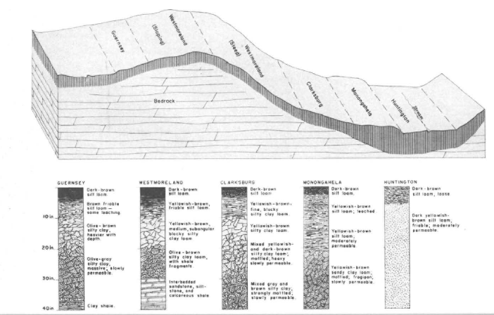

100+ years of hard-earned soil survey methods, soil-landscape models, and data


Data Sources and Discussion (see PDF)
========================================================


Soils Require Specialized Data Structures
========================================================


- soil data are complex, inherently visual
- reproducibility is increasingly important
- focus on the interesting questions, not boilerplate
- a common vocabulary for soil data analysis would be nice


Why R?
========================================================
 
- repeatable, self-documenting work:
 - 2800+ packages on CRAN: 100+ packages on GIS, ecology, and **soils**!
 - package system: algorithms + docs + sample data
 
- advanced data visualisation capabilities

- algorithm development by experts, application by trained users
 - testing by eye: simple graphical "grammar" used to plot data
 - formalized testing: correlation, regression, classification, ordination, ...
 - I/O capabilities: file, URL, SOAP, SQL, ODBC, PDF, PNG, SHP, KML, ...
 - optimizers, matrix operations, custom data structures, ...


aqp Package: Algorithms for Quantitative Pedology
========================================================
class: smaller


- **special data structures:** avoids annoying book-keeping code
- **visualization:** soil profile sketches, transect diagrams, Munsell &#8594;&nbsp; RGB
- **re-sampling:** regular depth-slicing or EA spline (coming soon)
- **aggregation:** summary by depth-slice or arbitrary "slabs"
- **classification:** pair-wise dissimilarity of profiles
- **utility functions:** soil depth, missing data eval., simulation, ...


soilDB Package: Soil Database Interface
=======================================================
class:smaller

  * functions that return tabular data which can be *upgraded* to spatial data:
    + [`fetchKSSL()`](http://ncss-tech.github.io/AQP/soilDB/KSSL-demo.html): KSSL "site" data contain x,y coordinates
    + [`fetchNASIS()`](http://ncss-tech.github.io/AQP/soilDB/fetchNASIS-mini-tutorial.html): NASIS "site" data contain x,y, coordinates
    + [`fetchRaCA()`](http://ncss-tech.github.io/AQP/soilDB/RaCA-demo.html): RaCA central pedon x,y coordinates
    
  * functions that return spatial data:
    + [`seriesExtent()`](http://ncss-tech.github.io/AQP/soilDB/series-extent.html): simplified series extent as polygons
    + [`fetchHenry()`](http://ncss-tech.github.io/AQP/soilDB/Henry-demo.html): sensor / weather station locations as points
    + [`SDA_query()`](http://ncss-tech.github.io/AQP/soilDB/SDA-tutorial-2.html): SSURGO data as points, lines, polygons (via SDA)
    + `mapunit_geom_by_ll_bbox()`: SSURGO data as polygons (via WFS)

  * other functions:
    + [`fetchSCAN()`](http://ncss-tech.github.io/AQP/soilDB/fetchSCAN-demo.html): unified interface to SCAN/SNOTEL
    + `SDA_query_features()`: SSURGO tabular queries by `sp` object
    + [`fetchOSD()`](http://ncss-tech.github.io/AQP/sharpshootR/OSD-dendrogram.html): Official Series Descriptions


sharpshootR Package: Prototypes / Specialized Stuff
========================================================


Details: see the paper and GitHub page
========================================================

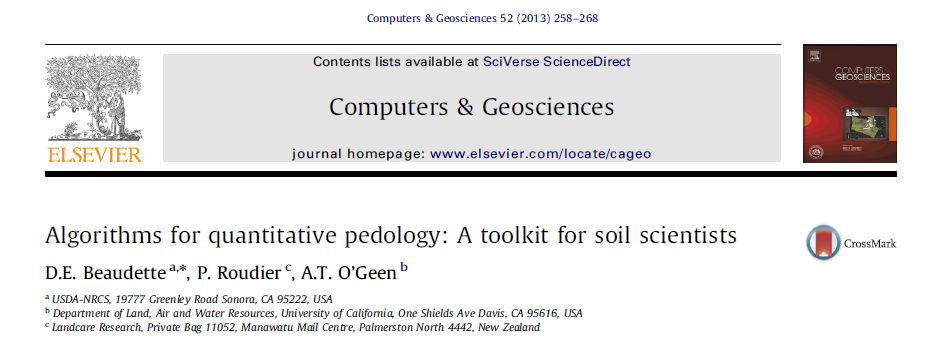
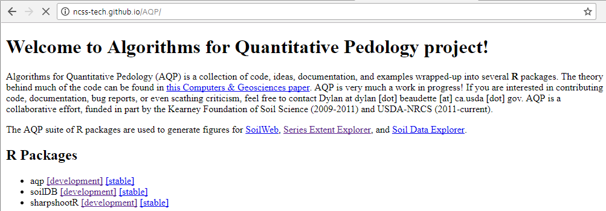


SoilProfileCollection objects
========================================================


```
Formal class 'SoilProfileCollection' [package "aqp"] with 7 slots
  ..@ idcol     : chr "peiid"
  ..@ depthcols : chr [1:2] "hzdept" "hzdepb"
  ..@ metadata  :'data.frame':	1 obs. of  1 variable:
  ..@ horizons  :'data.frame':	365 obs. of  43 variables:
  ..@ site      :'data.frame':	63 obs. of  67 variables:
  ..@ sp        :Formal class 'SpatialPoints' [package "sp"] with 3 slots
  ..@ diagnostic:'data.frame':	205 obs. of  4 variables:
```


SoilProfileCollection Objects
========================================================

Typical pedon/site data:
```
id, top, bottom, name, group
1,  0,   10,     A,    g1
1,  10,  18,     AB,   g1
          ...
2,  12,   22,    E,    g2
2,  22,   45,    Bhs1, g2
```

Converting `data.frame` &#8594; `SoilProfileCollection`:

```r
x <- read.csv(file = ...)
# promote to SoilProfileCollection
depths(x) <- id ~ top + bottom
# move 'site data' into @site
site(x) <- ~group
```

Functions that return `SoilProfileCollection`:

```r
x <- fetchOSD()
x <- fetchKSSL()
x <- fetchPedonPC()
x <- fetchNASIS()
x <- fetchNASIS_component_data()
```

<span class="link-to-details">&#8594;&nbsp;[SoilProfileCollection tutorial](http://ncss-tech.github.io/AQP/aqp/aqp-intro.html)</span>


SoilProfileCollection objects
========================================================
class: small-code

- <span style="font-size: 80%;">object inspection</span>

```r
idname(sp4) # pedon ID name
horizonDepths(sp4) # colum names containing top and bottom depths
depth_units(sp4) # defaults to 'cm'
metadata(sp4) # data.frame with 1 row
profile_id(sp4) # vector of profile IDs
```

- <span style="font-size: 80%;">overloads to common functions</span>

```r
length(sp4) # number of profiles in the collection
nrow(sp4) # number of horizons in the collection
names(sp4) # column names from site and horizon data
min(sp4) # shallowest profile depth in collection
max(sp4) # deepest profile depth in collection
sp4[i, j] # get profile "i", horizon "j"
```

- <span style="font-size: 80%;">getting / setting of components</span>

```r
horizons(sp4) # get / set horizon data
site(sp4)  # get / set site data
diagnostic_hz(sp4) # get / set diagnostic horizons
proj4string(sp4) # get / set CRS
coordinates(sp4) # get / set coordinates
```

- <span style="font-size: 80%;">coercion to `SpatialPointsDataFrame` or `data.frame`</span>

```r
as(sp4, 'SpatialPointsDataFrame')
as(sp4, 'data.frame')
```


Munsell Color Conversion
========================================================
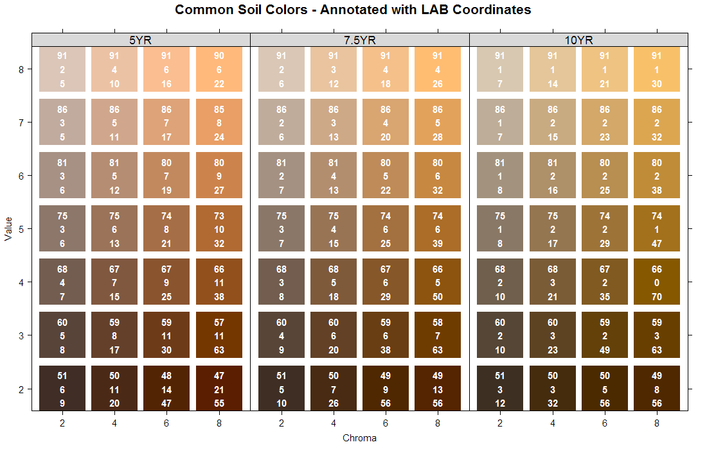


Plotting SoilProfileCollection Objects
========================================================
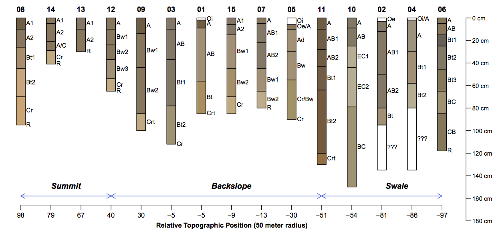


Plotting SoilProfileCollection Objects
========================================================
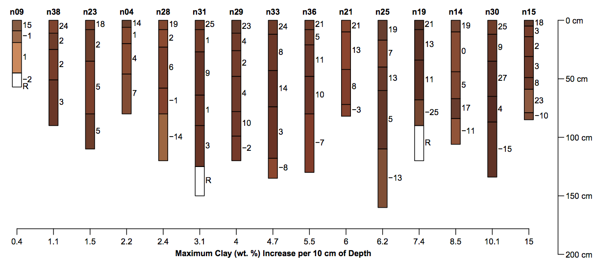


Plotting SoilProfileCollection Objects
========================================================
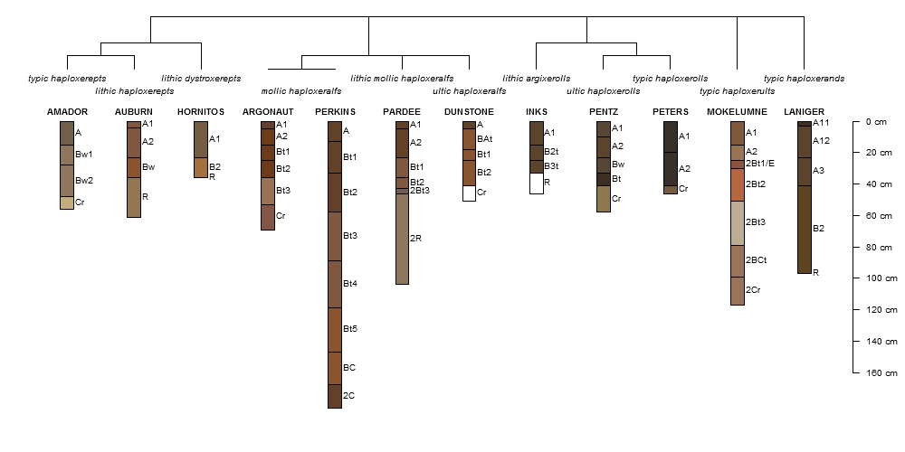


Plotting SoilProfileCollection Objects
========================================================


Plotting SoilProfileCollection Objects
========================================================
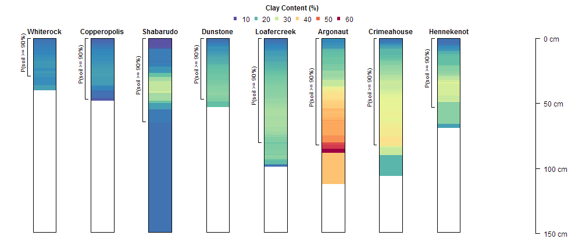


Slice-Wise Aggregation: RIC via quantiles
========================================================
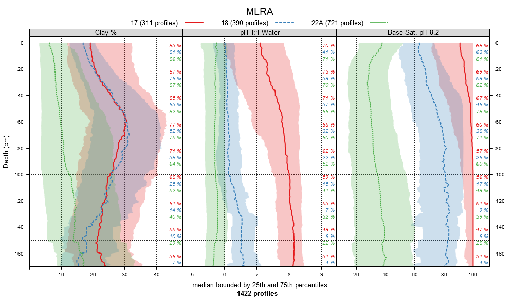

Slice-Wise Aggregation: RIC via quantiles
========================================================


Slice-Wise Aggregation: RIC via quantiles
========================================================
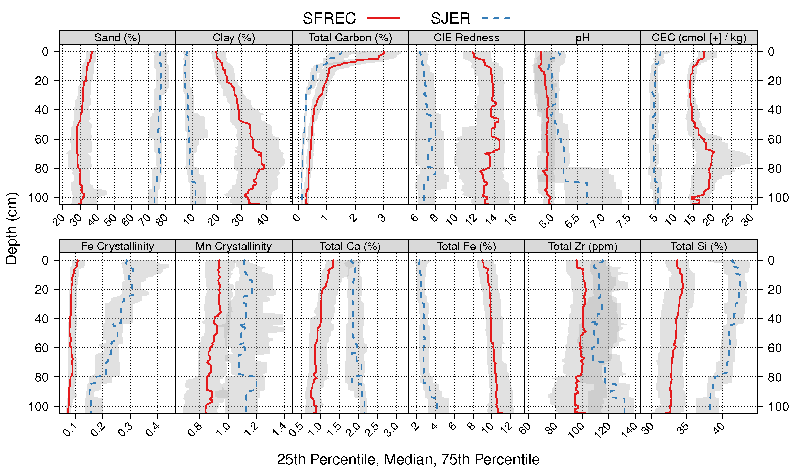

Slice-Wise Aggregation: probabilities
========================================================
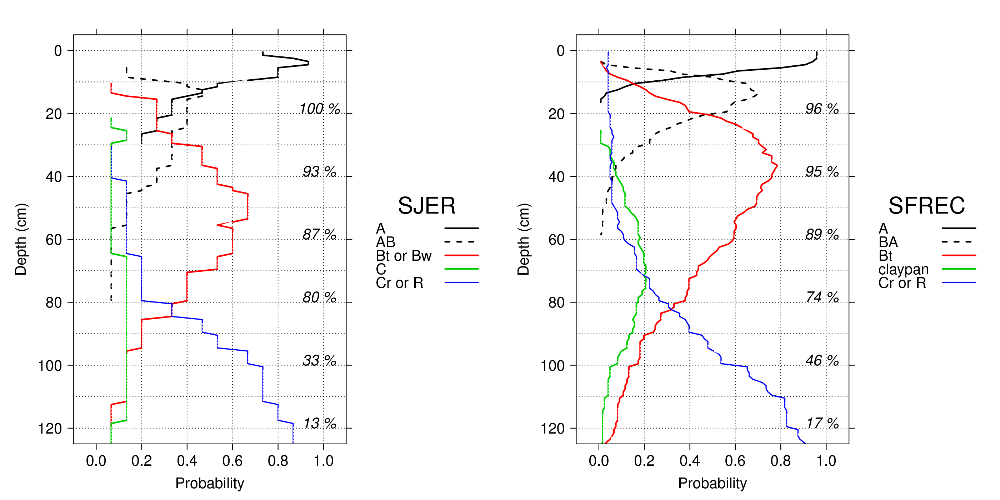

Slice-Wise Aggregation: soil morphology in aggregate
========================================================
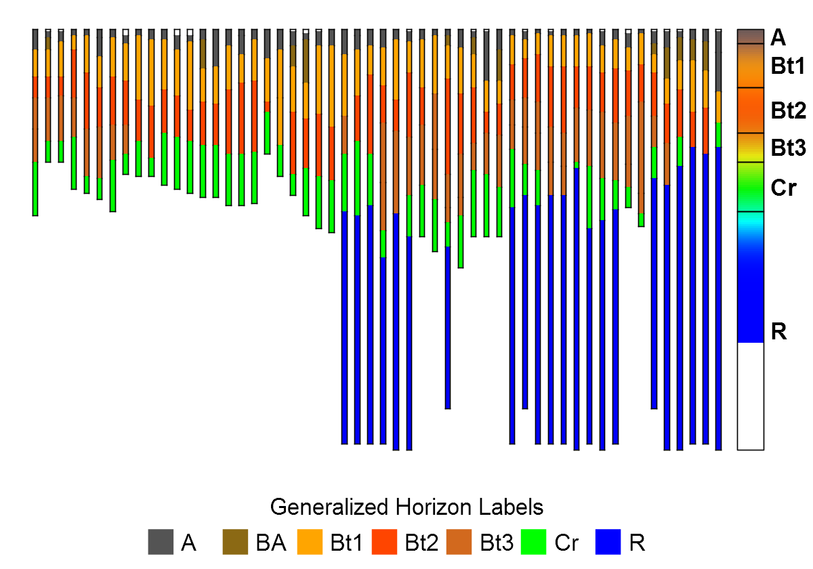


Pair-Wise Dissimilarity
========================================================
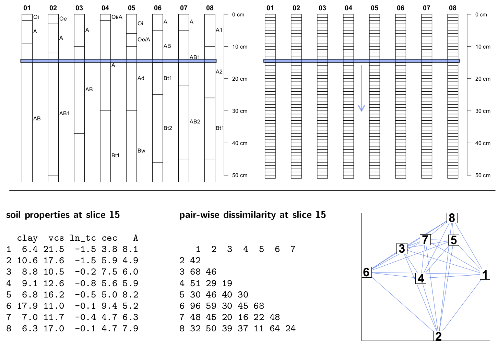


Pair-Wise Dissimilarity
========================================================
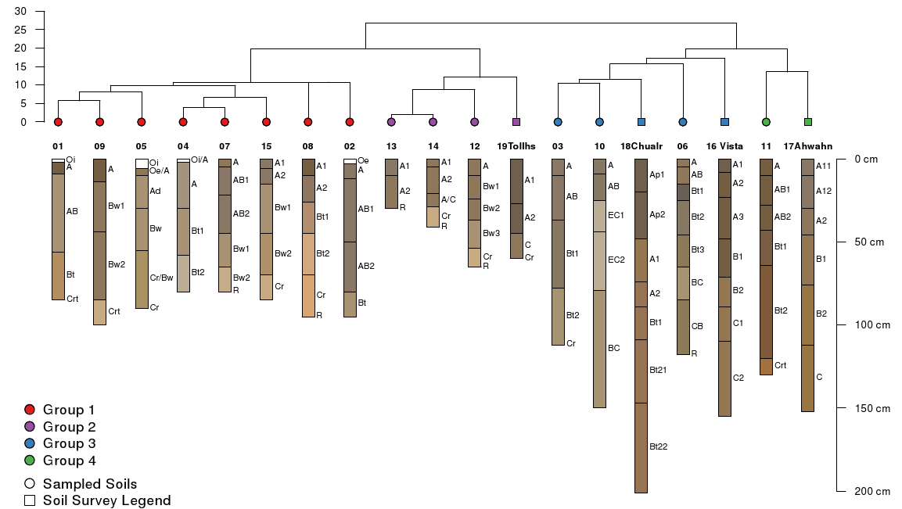


Examples
========================================================


soilDB: OSD Summaries
========================================================
class: small-code
<span class="oneliner">basic morphologic / taxonomic data from OSD and SC databases [<a href="http://casoilresource.lawr.ucdavis.edu/see/">SoilWeb</a>]</span>


```r
# soils of interest
s.list <- c('hornitos', 'argonaut', 'mokelumne', 'dunstone', 'auburn', 'pentz', 'pardee', 'peters', 'amador', 'laniger')

# fetch data from SoilWeb server and return as SoilProfileCollection
s <- fetchOSD(s.list)

# plot
par(mar=c(0,0,0,0))
plot(s, name='hzname', id.style='side', cex.name=0.75, axis.line.offset=-4.5)
```


soilDB: Soil Series Extent
========================================================
class: small-code
<span class="oneliner">simplified series extent maps [<a href="http://casoilresource.lawr.ucdavis.edu/see/">SoilWeb</a>]</span>


```r
amador <- seriesExtent("amador")  # result is a SpatialPolygonsDataFrame
writeOGR(amador, driver = "ESRI Shapefile", ...)  # save to SHP
```


soilDB: KSSL Data
========================================================
class: small-code
<span class="oneliner">characterization and current taxonomic data [<a href="http://casoilresource.lawr.ucdavis.edu/see/">SoilWeb</a>]</span>


```r
musick <- fetchKSSL("musick")  # result is a SoilProfileCollection
```


sharpshootR: Soil Taxonomy Visualization
========================================================
class: small-code
<span class="oneliner">profile sketches organized by taxonomy</span>


```r
# soils of interest
s.list <- c("hornitos", "perkins", "argonaut", "inks", "mokelumne", "dunstone", "auburn", "pentz", "pardee", 
    "peters", "amador", "laniger")

# fetch data from SoilWeb server and return as SoilProfileCollection
s <- fetchOSD(s.list)

# organize and plot according to subgroup level taxonomic data
SoilTaxonomyDendrogram(s, cex.taxon.labels = 0.8)
```


sharpshootR: Component Relationships
========================================================
<span class="oneliner">investigate the relationship between component data from SSURGO / NASIS</span>


```r
# get data from SDA
q <- "SELECT component.mukey, comppct_r, lower(compname) as compname 
FROM legend 
INNER JOIN mapunit ON mapunit.lkey = legend.lkey 
LEFT OUTER JOIN component ON component.mukey = mapunit.mukey 
WHERE legend.areasymbol IN ('CA654') AND compkind IN ('Series', 'Taxadjunct')
ORDER BY mukey, comppct_r DESC"

# run query, process results, and return as data.frame object
res <- SDA_query(q)
```


```r
# compute adjacency matrix
m <- component.adj.matrix(res)
# plot component relationships as network diagram
par(mar = c(0, 0, 2, 0))
plotSoilRelationGraph(m)
title("CA654 Components")
```

<span class="link-to-details">&#8594;&nbsp;[SDA_query() manual page](http://aqp.r-forge.r-project.org/soilDB-html-manual/SDA_query.html)</span>
<br>
<span class="link-to-details">&#8594;&nbsp;[component.adj.matrix() manual page](http://aqp.r-forge.r-project.org/sharpshootR-html-manual/component.adj.matrix.html)</span>
<br>
<span class="link-to-details">&#8594;&nbsp;[plotSoilRelationGraph() manual page](http://aqp.r-forge.r-project.org/sharpshootR-html-manual/plotSoilRelationGraph.html)</span>


sharpshootR: Component Relationships
========================================================
title: none


sharpshootR: Component Relationships
========================================================
<span class="oneliner">generate hillslope position probability matrix by series name</span>


```r
top.10 <- names(sort(table(res$compname), decreasing = TRUE)[1:10])
hp <- hillslope.probability(top.10)
```


```
      compname Toeslope Footslope Backslope Shoulder Summit
1     AHWAHNEE     0.00      0.00      1.00     0.00   0.00
2      AUBERRY     0.00      0.02      0.96     0.01   0.02
3   BLASINGAME     0.00      0.01      0.97     0.00   0.01
4    FALLBROOK     0.00      0.00      1.00     0.00   0.00
5  GRANGEVILLE     0.74      0.24      0.02     0.00   0.00
6      HANFORD     0.64      0.24      0.12     0.00   0.00
7     HESPERIA     0.25      0.45      0.29     0.00   0.00
8  SAN JOAQUIN     0.65      0.05      0.08     0.21   0.01
9       SIERRA     0.00      0.00      0.94     0.05   0.01
10       VISTA     0.00      0.16      0.80     0.02   0.03
```

Potential uses: 
- disaggregation clues
- stratification / weighting for sampling mission
- survey update work / ESD work


OK, So What?
========================================================
class: small-code
<span class="oneliner">how about some examples</span>

- simulating data to feed / test models

```r
sim(SPC, n=10, hz.sd=2)
random_profile(id, n=c(3, 4, 5), min_thick=5, max_thick=30, n_prop=5)
```
- profile sketches ordered by meaningful gradient

```r
plot(SPC, plot.order=new.order)
```
- applying functions by profile

```r
profileApply(SPC, <function>)
```
- "slicing": depth-wise alignment and extraction of data

```r
slice(SPC, 0:50 ~ sand + silt + clay)
```
- aggregating by "slab": group / depth-wise summaries

```r
# assuming no NA
slab(SPC, ~ sand + silt + clay, slab.fun=mean)
slab(SPC, ~ sand + silt + clay, slab.structure=c(0,10), slab.fun=mean)
slab(SPC, group ~ sand + silt + clay, slab.fun=mean)
```


Simulated Data: Horizon Depths and Designations
========================================================
class: small-code


```r
# source data are a single profile description of the Morley series as a data.frame
depths(b) <- id ~ top + bottom
# convert horizon colors into RGB
b$soil_color <- munsell2rgb(b$hue, b$value, b$chroma)
# simulate 15 profiles based on reported horizon thickness standard deviations 
b.sim <- sim(b, n=15, hz.sd=c(2,1,1,2,4,2,2,4))
# set depth units to inches
depth_units(b.sim) <- 'in'
```

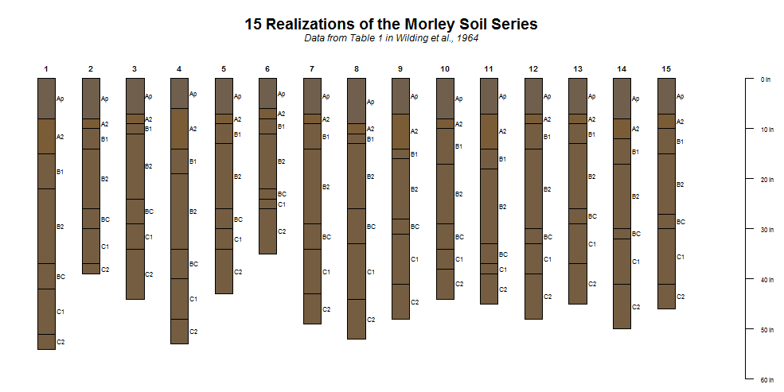


Simulated Data: Physical Properties
========================================================
class: small-code
<span class="oneliner">simulation based on a [random walk](http://en.wikipedia.org/wiki/Random_walk)-- similar to highly stratified soils</span>


```r
# implicit loop via plyr::ldply, result is a data.frame
d <- ldply(1:10, random_profile, n=c(6, 7, 8), n_prop=1, method='random_walk')
# promote to SoilProfileCollection and plot
depths(d) <- id ~ top + bottom
par(mar=c(0,0,3,0))
plot(d, color='p1', axis.line.offset=-4, max.depth=150)
```


Simulated Data: Physical Properties
========================================================
class: small-code
<span class="oneliner">simulation based on the [logistic power peak](http://www.sciencedirect.com/science/article/pii/S0016706111002163) function-- more realistic anisotropy</span>


```r
# implicit loop via plyr::ldply, result is a data.frame
d <- ldply(1:10, random_profile, n=c(6, 7, 8), n_prop=1, method='LPP', 
lpp.a=5, lpp.b=10, lpp.d=5, lpp.e=5, lpp.u=25)
# promote to SoilProfileCollection and plot
depths(d) <- id ~ top + bottom
par(mar=c(0,0,3,0))
plot(d, color='p1', axis.line.offset=-4, max.depth=150)
```


Profile Sketches: Sierra Transects
========================================================
<span class="oneliner">data and concept from [Dahlgren et al.](http://www.sciencedirect.com/science/article/pii/S0016706197000347) and [Rasmussen et al.](https://www.soils.org/publications/sssaj/abstracts/71/1/225)</span>


```r
x.g <- read.csv('dahlgren-granitics.csv', stringsAsFactors=FALSE)
x.a <- read.csv(file='rasmussen-andisitic-lahar.csv', stringsAsFactors=FALSE)

# convert colors
x.g$soil_color <- with(x.g, munsell2rgb(hue, value, chroma))
x.a$soil_color <- with(x.a, munsell2rgb(hue, value, chroma))

# init Soill Profile Collection objects
depths(x.g) <- id ~ top + bottom
site(x.g) <- ~ elev + MAAT + MAP + geo
# init Soill Profile Collection objects
depths(x.a) <- id ~ top + bottom
site(x.a) <- ~ elev + precip + MAP + MAT + veg + Fe_d_to_Fe_t

# index ordering to elevation in meters
g.new.order <- order(x.g$elev)
a.new.order <- order(x.a$elev)

# plot first figure
par(mfcol=c(1,2), mar=c(3,0,0,0))
plot(x.g, name='name', plot.order=g.new.order, cex.name=0.75, axis.line.offset=-4, id.style='side')
axis(1, at=1:length(x.g), labels=x.g$elev[g.new.order], line=-2)
# plot second figure
plot(x.a, name='name', plot.order=a.new.order, cex.name=0.75,  axis.line.offset=-4, id.style='side')
axis(1, at=1:length(x.a), labels=x.a$elev[a.new.order], line=-2)
```

Profile Sketches: Sierra Transects
========================================================
<span class="oneliner">pedogenic "sweet spot" along bio-climatic gradient</span>

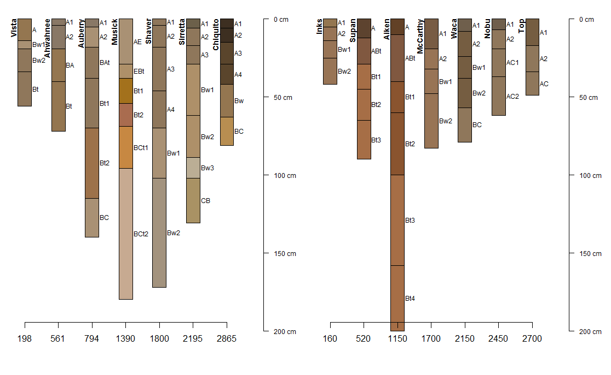


Magnesic Soils of California
========================================================
class: small-code
<span class="oneliner">data From [McGahan et al.](https://www.soils.org/publications/sssaj/abstracts/73/6/2087)</span>


```r
# load sample dataset, comes with aqp package
data(sp4)
# inspect first 4 rows x 12 columns
sp4[1:4, 1:12]
```

```
      id name top bottom   K   Mg  Ca CEC_7 ex_Ca_to_Mg sand silt clay
1 colusa    A   0      3 0.3 25.7 9.0  23.0        0.35   46   33   21
2 colusa  ABt   3      8 0.2 23.7 5.6  21.4        0.23   42   31   27
3 colusa  Bt1   8     30 0.1 23.2 1.9  23.7        0.08   40   28   32
4 colusa  Bt2  30     42 0.1 44.3 0.3  43.0        0.01   27   18   55
```

```r
# upgrade to SoilProfileCollection
depths(sp4) <- id ~ top + bottom

# custom function for computing hz-thick wt. mean, accounting for missing data
wt.mean.ca.mg <- function(i) {
    # use horizon thickness as a weight
    thick <- i$bottom - i$top
    # function is from the Hmisc package
    m <- wtd.mean(i$ex_Ca_to_Mg, weights=thick, na.rm=TRUE)
    return(m)
    }

# apply custom function to each profile, save as "site-level" attribute
sp4$wt.mean.ca.to.mg <- profileApply(sp4, wt.mean.ca.mg)

# generate index ordering from small -> large Ca:Mg
new.order <- order(sp4$wt.mean.ca.to.mg)
```


Magnesic Soils of California
========================================================
class: small-code


```r
# plot the data using our new order based on Ca:Mg
par(mar=c(4,0,3,0))
plot(sp4, name='name', color='ex_Ca_to_Mg', plot.order=new.order, cex.name=0.75, id.style='side', axis.line.offset=-4,)

# add an axis labeled with the sorting criteria
axis(1, at=1:length(sp4), labels=round(sp4$wt.mean.ca.to.mg, 3), cex.axis=1)
mtext(1, line=2.25, text='Horizon Thickness Weighted Mean Ex. Ca:Mg', cex=1)
```


Slicing OSD Data = Map of Soil Color
========================================================
class: small-code


```r
# read in OSD color data as CSV
x <- read.csv('data/osd-colors-original.csv.gz')
```

```
Ap,0,20,10YR,4,4,10YR,3,4,CECIL
Bt1,20,66,10R,4,8,10R,3,7,CECIL
Bt2,66,107,10R,4,8,10R,3,7,CECIL
BC,107,127,2.5YR,4,8,2.5YR,3,7,CECIL
C,127,203,2.5YR,4,8,2.5YR,3,7,CECIL
```


```r
# re-order by series, then depth
x <- x[order(x$series, x$top), ]

# convert Munsell to RGB
x.rgb <- with(x, munsell2rgb(matrix_wet_color_hue, 
                             matrix_wet_color_value, 
                             matrix_wet_color_chroma, 
                             return_triplets=TRUE))

# init SoilProfileCollection object
depths(g) <- series ~ top + bottom

# slice at specific depths, keeping only  r, g, b
# ignore bad horizonation with strict=FALSE
g.slices <- slice(g, c(5, 10, 15, 25) ~ r + g + b, just.the.data=TRUE, strict=FALSE)

# save depth slices as CSV files, import into GIS and make map
write.csv(g.slices[g.slices$top == 5, c('series', 'r', 'g', 'b')], ...)
write.csv(g.slices[g.slices$top == 10, c('series', 'r', 'g', 'b')], ...)
write.csv(g.slices[g.slices$top == 15, c('series', 'r', 'g', 'b')], ...)
write.csv(g.slices[g.slices$top == 25, c('series', 'r', 'g', 'b')], ...)
```


Slicing OSD Data = Map of Soil Color [5 cm]
========================================================


Slicing OSD Data = Map of Soil Color [10 cm]
========================================================
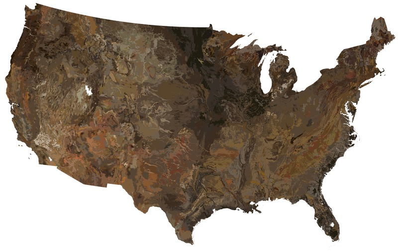

Slicing OSD Data = Map of Soil Color [15 cm]
========================================================
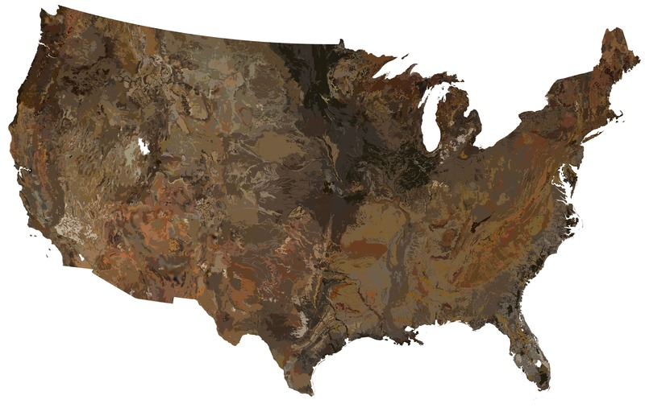

Slicing OSD Data = Map of Soil Color [25 cm]
========================================================
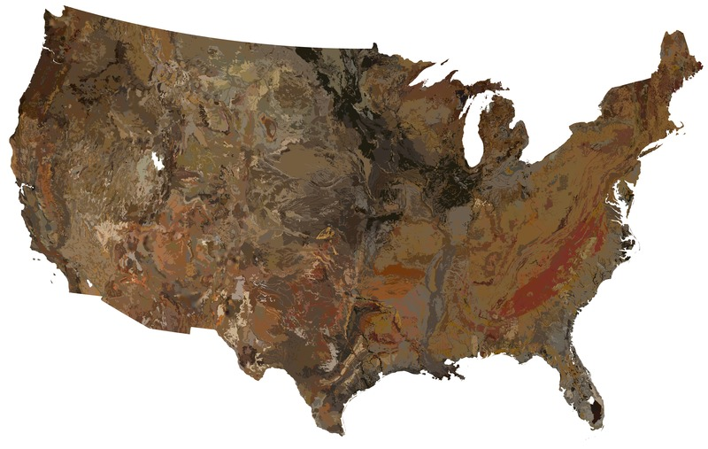


Summarize Clay vs Depth by Geology
========================================================
class: small-code


```r
pedons <- fetchNASIS()
# ... details on generalization of geologic classes ommitted ...
# aggregate by major geologic type, default slab.fun = hdquantile
a <- slab(pedons, generalized_bedrock ~ clay)

# plot with lattice graphics
xyplot(top ~ p.q50 | generalized_bedrock, upper=a$p.q75, lower=a$p.q25, data=a, ylim=c(180,-5), ylab='Depth (cm)', xlab='Clay Content (%)', strip=strip.custom(bg=grey(0.85)), as.table=TRUE, panel=panel.depth_function, prepanel=prepanel.depth_function, scales=list(y=list(tick.number=7, alternating=3), x=list(alternating=1)), subset=variable == 'clay', layout=c(6,1), cf=a$contributing_fraction, sync.colors=TRUE, alpha=0.25)
```

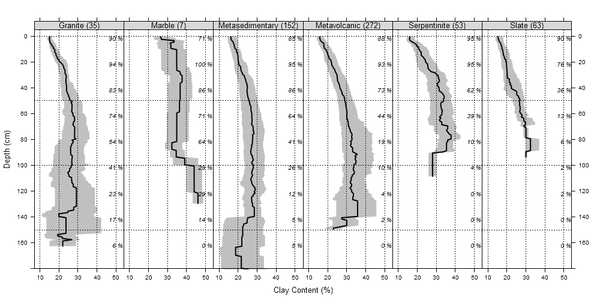


Concluding remarks
========================================================


- simple conversion from common data sources to SoilProfileCollection
- SoilProfileCollection objects are powerful
- innovative constructs: `slice()`, `slab()`, `SPC[i,j]`
- pair-wise dissimilarity: `profile_compare()`
- visual comparisons and non-parametric summaries


<br>
<center>
Thank You!
<hr>
http://ncss-tech.github.io/AQP/
</center>


