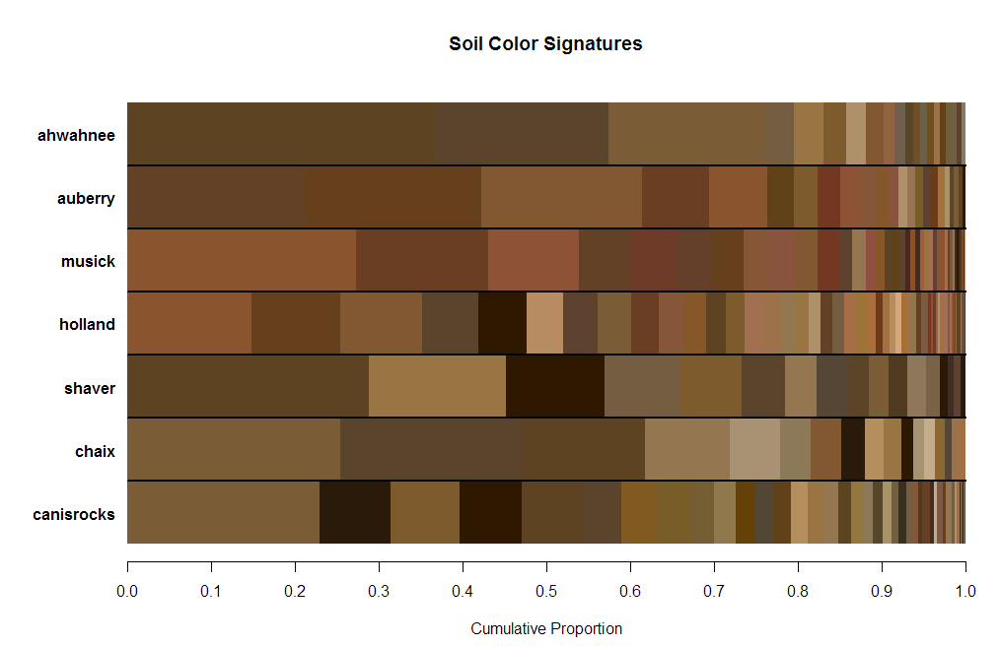
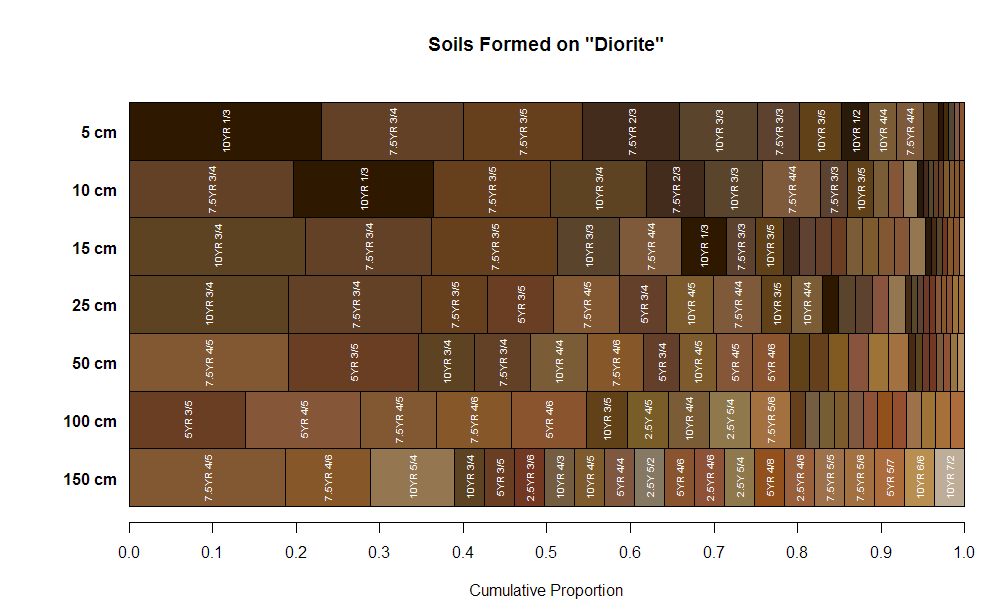
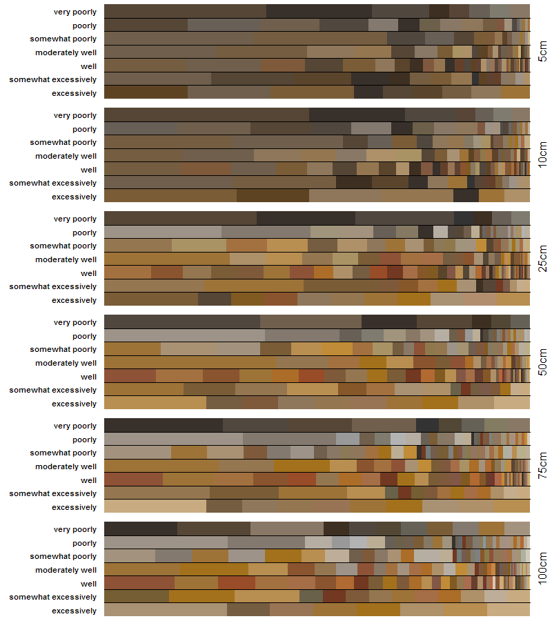

```{r setup, echo=FALSE, results='hide', message=FALSE, warning=FALSE}
# options for knitr
library(knitr, quietly = TRUE)
opts_chunk$set(message=FALSE, warning=FALSE, background='#F7F7F7', dpi=100, fig.align='center', dev='png', dev.args=list(pointsize=10, type='cairo', antialias='subpixel'), tidy=TRUE)

knit_hooks$set(htmlcap = function(before, options, envir) {
  if(!before) {
    paste('<p class="caption" style="font-size:85%; font-style: italic; font-weight: bold;">',options$htmlcap,"</p><hr>",sep="")
    }
    })

# options for R session
options(width=100, stringsAsFactors=FALSE)
```


Some ideas on summarizing soil color
====================================
D.E. Beaudette
<br>
`r format(Sys.time(), "%Y-%m-%d")`
<br>
This document is based on `aqp` version `r utils::packageDescription("aqp", field="Version")` and `sharpshootR` version `r utils::packageDescription("sharpshootR", field="Version")`.


## Introduction

This tutorial outlines a simple method for summarizing soil color from a collection of soil profiles using the `aqp` and `sharpshootR` packages for **R**. Suppose you have a collection of soil profiles and would like to compare the relative frequencies of soil color among different horizons, depths, hillslope positions, or bedrock. How would you determine the most frequent color or a reasonable range in colors for a given group? One solution to this problem is presented in the figure below. In this case, relative proportions of soil color are arranged by genetic horizon. Larger "color bars" are the most frequently described colors, both in terms of number of observed horizons and the thickness of those horizons. The small numbers in parenthesis denote the number of horizons associated with any given color. See examples below for more ideas. The manual page for `aggregateColor` and `aggregateColorPlot` contain additional details. 

```{r agg-color-data-0, fig.width=10, fig.height=6, echo=FALSE}
library(aqp)
library(sharpshootR)
library(soilDB)

data(sp1, package='aqp')

# upgrade to SoilProfileCollection and convert Munsell colors
sp1$soil_color <- with(sp1, munsell2rgb(hue, value, chroma))
depths(sp1) <- id ~ top + bottom
site(sp1) <- ~ group

# generalize horizon names
n <- c('O', 'A', 'B', 'C')
p <- c('O', 'A', 'B', 'C')
sp1$genhz <- generalize.hz(sp1$name, n, p)

par(mar=c(4.5,1.5,0,0))
aggregateColorPlot(aggregateColor(sp1, 'genhz'), label.cex = 1, print.n.hz = TRUE)
```


## Setup R Envionment
If you have never used the [aqp](http://ncss-tech.github.io/AQP/aqp/aqp-intro.html) or sharpshootR packages before, you will likely need to install them. This only needs to be done once.
```{r install-packages, eval=FALSE}
# stable version from CRAN and all dependencies
install.packages('aqp', dep=TRUE) 
install.packages('soilDB', dep=TRUE)
install.packages('sharpshootR', dep=TRUE)
```


Now that you have all of the R packages that this document depends on, it would be a good idea to load them. R packages must be **installed** anytime you change versions of R (e.g. after an upgrade), and **loaded** anytime you want to access functions from within those packages.

```{r load-packages}
library(soilDB)
library(aqp)
library(sharpshootR)
library(cluster)
```


## Sample Data
While the methods outlined in this document can be applied to any collection of pedons, it is convenient to work with a standardized set of data. You can follow along with the analysis by copying code from the following blocks and running it in your **R** session. The sample data used in this document is based on 30 soil profiles that have been correlated to the [Loafercreek](https://soilseries.sc.egov.usda.gov/OSD_Docs/L/LOAFERCREEK.html) soil series from the Sierra Nevada Foothill Region of California. Note that the internal structure of the `loafercreek` data is identical to the structure returned by [`fetchNASIS()` from the soilDB package](http://ncss-tech.github.io/AQP/soilDB/soilDB-Intro.html). All horizon-level values are pulled from the pedon horizon table of the pedons being analyzed.

```{r load-data, fig.width=12, fig.height=5, htmlcap='Sample data, pedons correlated to the Loafercreek soil series. Original data were loaded from NASIS.'}
# load sample data from the soilDB package
data(loafercreek, package = 'soilDB')
# graphical check
par(mar=c(0,0,0,0))
plot(loafercreek, name='', print.id=FALSE, cex.names=0.8, axis.line.offset=-4, max.depth=100)
```


## Examples

These examples can be readily adapted to your own data. Note that you may need to adjust object (change *loafercreek* to the name of your `SoilProfileCollection` object) and column (*genhz*, etc.) names. Data loaded from NASIS via `fetchNASIS` can be used without modification (except for object name) in these examples.

Typically color summaries are grouped by some kind of "horizon-level" attribute: depth slice, horizon designation, [generalized horizon label](http://ncss-tech.github.io/AQP/aqp/gen-hz-assignment.html), or within a diagnostic feature. However, it is possible to group colors by a "site-level" attribute such as bedrock kind, taxonname, or hillslope position. Note that grouping colors by a site-level attribute will pool colors from all depths.

### Depth Slices
```{r agg-color-data-1, fig.width=10, fig.height=6, htmlcap=''}
# slice color data at select depths
s <- slice(loafercreek, c(5, 10, 15, 25, 50, 75) ~ soil_color, strict = FALSE)

# make horizon labels based on slice depth
s$slice <- paste0(s$hzdept, ' cm')
s$slice <- factor(s$slice, levels=guessGenHzLevels(s, 'slice')$levels)

par(mar=c(4.5,2.5,4.5,0))
aggregateColorPlot(aggregateColor(s, 'slice'), label.cex=0.65, main='Loafercreek Dry Colors\nDepth Slices', print.n.hz = TRUE)
```

### Generalized Horizon Labels
```{r agg-color-data-2, fig.width=10, fig.height=6, htmlcap=''}
# generalize horizon names using REGEX rules
n <- c('Oi', 'A', 'BA','Bt1','Bt2','Bt3','Cr','R')
p <- c('O', '^A$|Ad|Ap|AB','BA$|Bw', 'Bt1$|^B$','^Bt$|^Bt2$','^Bt3|^Bt4|CBt$|BCt$|2Bt|2CB$|^C$','Cr','R')
loafercreek$genhz <- generalize.hz(loafercreek$hzname, n, p)

# remove non-matching generalized horizon names
loafercreek$genhz[loafercreek$genhz == 'not-used'] <- NA
loafercreek$genhz <- factor(loafercreek$genhz)

aggregateColorPlot(aggregateColor(loafercreek, 'genhz'), main='Loafercreek Series Dry Colors\nGeneralized Horizon Labels', print.n.hz = TRUE, label.cex = 0.8)
```


### Site-Level Data
```{r agg-color-data-3, fig.width=10, fig.height=6, htmlcap=''}
par(mar=c(4.5,4,4.5,0))
aggregateColorPlot(aggregateColor(loafercreek, 'hillslope_pos'), main='Loafercreek Series Dry Colors\nHillslope Position')
par(mar=c(4.5,5,4.5,0))
aggregateColorPlot(aggregateColor(loafercreek, 'bedrock_kind'), main='Loafercreek Series Dry Colors\nBedrock Kind')
```


## Additional Examples

Note that when using data from NASIS, you must first establish a selected set of site and pedon data.


### Color Signatures by Cluster

In this example, we are generating color signatures for groups of horizons defined by k-medoids clustering of clay content, CEC, and natural log transform of total carbon.

```{r, fig.width=10, fig.height=6, htmlcap=''}
# use a sample dataset from aqp
data(sp3)
depths(sp3) <- id ~ top + bottom

# define function for repeated k-medoids fitting
pam1 <- function(x,k) list(cluster = pam(x, k, cluster.only=TRUE, stand=TRUE))
d <- horizons(sp3)[, c('clay', 'cec', 'ln_tc')]

# emipirically determine optimal number of clusters
g <- clusGap(d, FUN=pam1, K.max=10)
plot(g)

# cluster data
sp3.clara <- clara(d, k=6, stand=TRUE)
plot(silhouette(sp3.clara))

# check clustering vector on profile sketches
sp3$genhz <- sp3.clara$clustering
plot(sp3, name='genhz')

# color signatures by cluster of horizon
aggregateColorPlot(aggregateColor(sp3, 'genhz'))
```


### Soil Color Signatures



```{r agg-color-additional-examples-1, eval=FALSE}
# get data from NASIS or similar source
f <- fetchNASIS(rmHzErrors = TRUE)

# an ordered set of series names
soils <- c('ahwahnee', 'auberry', 'musick', 'holland', 'shaver', 'chaix', 'canisrocks')

# extract these soils and normalize taxonname
f.sub <- f[grep(paste0(soils, collapse = '|'), f$taxonname, ignore.case = TRUE), ]
for(x in soils) {
  f.sub$taxonname[grep(x, f.sub$taxonname, ignore.case = TRUE)] <- x
}
# reset levels to order specified above
f.sub$taxonname <- factor(f.sub$taxonname, levels=soils)

par(mar=c(4.5,5,4.5,0))
aggregateColorPlot(aggregateColor(f.sub, 'taxonname'), label.cex=0.65, main='Soil Color Signatures', print.n.hz = TRUE, rect.border = NA, print.label = FALSE, horizontal.borders = TRUE)
```


### Many Soils Associated with Common Bedrock



```{r agg-color-additional-examples-2, eval=FALSE}
# geology + depth slices
f.sub <- f[grep('diorite', f$bedrock_kind, ignore.case = TRUE), ]
f.sub <- slice(f.sub, c(5, 10, 15, 25, 50, 100, 150) ~ soil_color)

# make fake label
f.sub$slice <- paste0(f.sub$hzdept, ' cm')
f.sub$slice <- factor(f.sub$slice, levels=guessGenHzLevels(f.sub, 'slice')$levels)

aggregateColorPlot(aggregateColor(f.sub, 'slice'), label.cex=0.65, main='Soils Formed on "Diorite"')
```


### OSD Colors from MLRAs 13, 133A, 137, 130B, 148
*will post code soon*



## How Does it Work?

Color "bar" proportions are calculated using a combination of horizon thickness and number of observations, normalized to sum to 1 within each group. Within each group weights are computed:

$$ w_i = \sqrt{\sum{d_i}} * n_i $$

where $w_i$ is the weight or width of color bar $i$, $d_i$ is the thickness of all horizon data associated with color $i$, and $n$ is the number of horizons in which color $i$ has been described. Thicker "bars" suggest more frequent and larger (total) thickness of soil material with any given color.

The following block of code demonstrates how the `aggregateColor` works and the type of data that are returned.

```{r method-explanation}
# load some example data
data(sp1, package='aqp')

# upgrade to SoilProfileCollection and convert Munsell colors
sp1$soil_color <- with(sp1, munsell2rgb(hue, value, chroma))
depths(sp1) <- id ~ top + bottom
site(sp1) <- ~ group

# generalize horizon names
n <- c('O', 'A', 'B', 'C')
p <- c('O', 'A', 'B', 'C')
sp1$genhz <- generalize.hz(sp1$name, n, p)

# inspect the results
a <- aggregateColor(sp1, 'genhz')
print(a)
```

