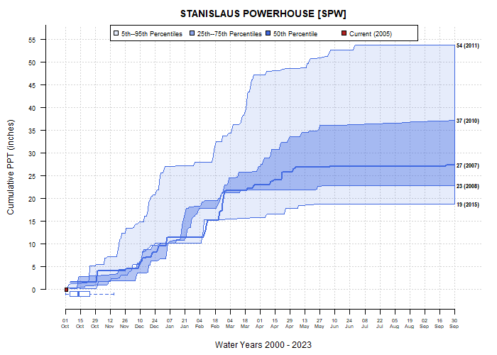

```{r setup, echo=FALSE, results='hide', warning=FALSE}
# setup
library(knitr, quietly=TRUE)
library(kableExtra, quietly=TRUE)
opts_chunk$set(message=FALSE, warning=FALSE, background='#F7F7F7', fig.align='center', fig.retina=2, dev='svglite', tidy=FALSE, verbose=FALSE)
options(width=100, stringsAsFactors=FALSE, cache=TRUE)
```

```{r}
library(sharpshootR)
library(daymetr)
library(soilDB)
```


# Background
Cumulative PPT over the course of an idealized water year (October 1 through September 30). Measurements are selected from water years with annual PPT close to the 5th, 25th, 50th, 75th, and 95th percentiles of annual PPT (over all water years). Key elements:

* red line is the current water year's cumulative PPT trajectory
* red date and value are current date and cumulative PPT
* red box-whisker are 5-25-50-75-95th percentiles of cumulative PPT on current day of water year
* blue traces are cumulative PPT records corresponding to 5th, 25th, 50th, 75th, and 95th percentiles of historical (end of water-year) cumulative PPT
* blue box-whisker indicates 5-25-50-75-95th percentiles of starting water-day where cumulative PPT > 0.1 (units)

## TODO

* relate to these excellent maps: https://cw3e.ucsd.edu/odds-of-normal-water-year-precipitation/
* compare annual distributions: 1st derivatives of cumulative precipitation


# Various Data Sources

## CDEC
```{r fig.height=6, fig.width=10}
# define station of interest
s <- 'SPW'
# get metadata
s.info <- CDEC_StationInfo(s)
# format title for cumulative PPT
title.text <- sprintf("%s [%s]", s.info$site.meta$Name, s)

# get data
x <- CDECquery(id = s, sensor = 45, interval = 'D', start = '2000-01-01', end = '2030-01-01')

# bad data:
# station_id dur_code sensor_num sensor_type value flag  units   datetime year month water_year water_day
# 7419        SPW        D         45     PPT INC 15.65      INCHES 2020-04-23 2020 April       2020       206

# filter bad record
x <- x[x$value < 10, ]

# plot
par(mar = c(4.5, 4.5, 2.5, 1.5))
PCP_plot(x, ylab = 'Cumulative PPT (inches)', main = title.text, this.year = 2023)
```


## DAYMET
Using daily precipitation data near Sonora, CA (-120.3822, 37.9829), from [DAYMET](https://daymet.ornl.gov/) point-query API.
```{r fig.height=6, fig.width=10}
# convenience function
getDaymet <- function(x, y, start_yr, end_yr) {
  
  # daymet point query
  d <- download_daymet("daymet",
                       lat = y,
                       lon = x,
                       start = start_yr,
                       end = end_yr,
                       internal = TRUE
  )
  
  # keep only the data
  d <- d$data
  
  # format datetime
  d$datetime <- as.Date(sprintf('%s %s', d$year, d$yday), format="%Y %j")
  
  # extract water year and water day
  w <- waterDayYear(d$datetime)
  
  # add back to original data, row-order is preserved
  d$water_year <- w$wy
  d$water_day <- w$wd
  
  # extract PPT and convert to inches
  d$value <- d$prcp..mm.day. / 25.4
  
  return(d)
}

# get the data
x <- getDaymet(x=-120.3822, y=37.9829, start_yr=1981, end_yr=2017)

# examples
par(mar=c(4.5, 4.5, 2.5, 1.5))
PCP_plot(x, ylab='Cumulative PPT (in)', main='DAYMET', this.year = 2017)
PCP_plot(x, ylab='Cumulative PPT (in)', main='DAYMET', this.year = 2017, this.day=50)
PCP_plot(x, ylab='Cumulative PPT (in)', main='DAYMET', this.year = 1999, this.day = 100)
```

## SCAN/SNOTEL
Daily climate data from the [Rogers Farm #1 SCAN station](https://wcc.sc.egov.usda.gov/nwcc/site?sitenum=2001); site number **2001**.
```{r results='hide', fig.height=6, fig.width=10, eval=FALSE}
# range can extend beyond actual records
x <- fetchSCAN(site.code = c(2001), year = 1990:2022, timeseries = 'Daily')

# extract instantaneous precipitation, units are inches 
x <- x$PRCP
# copy date into column expected by PCP_plot
x$datetime <- x$Date

par(mar=c(4.5, 4.5, 2.5, 1.5))
PCP_plot(x, ylab = 'Cumulative PPT (in)', main = 'SCAN Station 2001', this.year = 2022, this.day = 300)
```

## Animations

```{r results='hide'}
library(gifski)

s <- 'SPW'
s.info <- CDEC_StationInfo(s)
title.text <- sprintf("%s [%s]", s.info$site.meta$Name, s)

# get data
x <- CDECquery(id = s, sensor = 45, interval = 'D', start = '2000-01-01', end = '2030-01-01')

# filter bad record
x <- x[x$value < 10, ]

save_gif(
  {
    for(i in 1:365) {
      # plot
      par(mar=c(4.5, 4.5, 2.5, 1.5))
      PCP_plot(x, ylab='Cumulative PPT (inches)', main=title.text, this.year = 2005, this.day = i)
    }
  },
  gif_file = "PCP_plot-SPW-animation.gif",
  width = 700,
  height = 500,
  delay = 0.05,
  loop = TRUE
)

```



----------------------------
This document is based on `sharpshootR` version `r utils::packageDescription("sharpshootR", field="Version")`.


