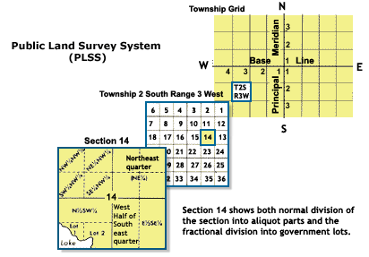
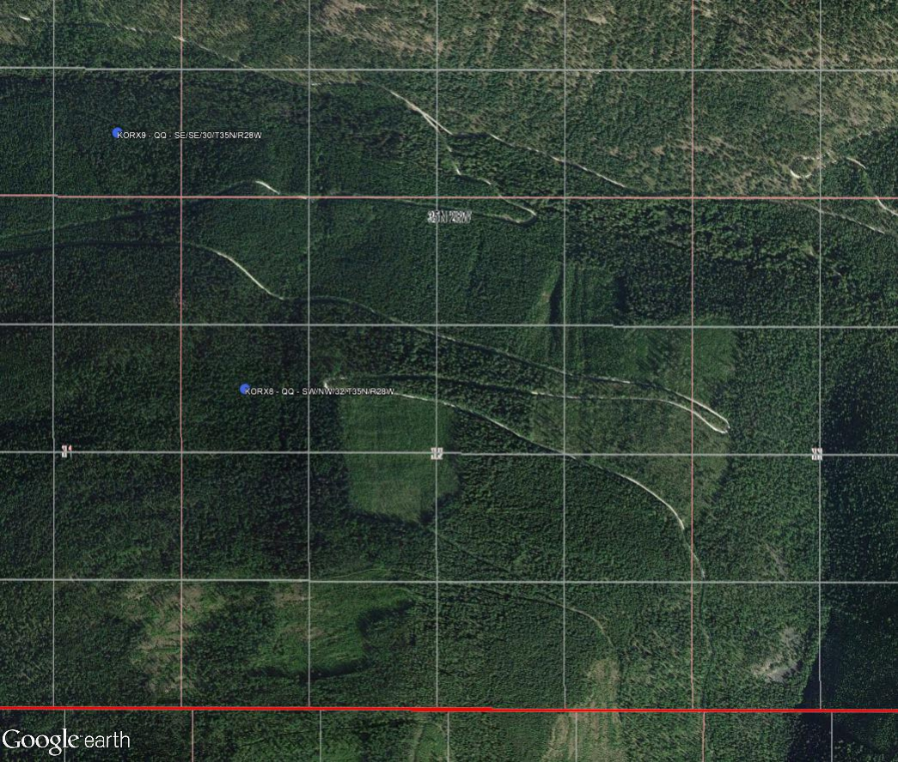

```{r setup, echo=FALSE, results='hide', warning=FALSE}
# setup
library(knitr, quietly=TRUE)
opts_chunk$set(message=FALSE, warning=FALSE, background='#F7F7F7', fig.align='center', fig.retina=2, dev='png', tidy=FALSE, verbose=FALSE)
options(width=100, stringsAsFactors=FALSE)
```

## Introduction
This tutorial demonstrates how to use functions in the [sharpshootR](https://github.com/ncss-tech/sharpshootR) package to derive centroids for PLSS location descriptions. Stay tuned for updates and more detailed examples.

## Background
Before the days of GPS technology the system used for locating sampling sites was the [Public Lands Survey System (PLSS)](https://en.wikipedia.org/wiki/Public_Land_Survey_System) description method.  Locating the data was accomplished using several different methods.  Sometimes the data was marked on a topographic map or pin-pricked on aerial photographs and the PLSS was typically derived for these locations.  Other times it was not marked on maps at all and was only given a PLSS location description.  PLSS locations can be taken down to various levels of accuracy, however, a common level of accuracy in the datasets seems to be description down to the quarter-quarter section level.  

```{r echo=FALSE, out.width='100%'}

```
Source: Public Domain, https://commons.wikimedia.org/w/index.php?curid=2741216

A very informative story map can be found here describing organization of the PLSS system: https://esrilandinternal.maps.arcgis.com/apps/MapJournal/index.html?appid=8c595a36971349aba1cb4d9ef12892c0


### Installation
With a recent version of R (>= 2.15), it is possible to get all of the packages that this tutorial depends on via:
```{r eval=FALSE}
# run these commands in the R console
.p <- c('sharpshootR', 'stringi', 'xtable', 'elevatr', 'sf', 'terra')
install.packages(.p)
```

You will also need the latest version of `sharpshootR`:
```{r eval=FALSE}
install.packages('devtools', dep=TRUE)
devtools::install_github("ncss-tech/sharpshootR", dependencies=FALSE, upgrade_dependencies=FALSE)
```

## Building a comma-delimited text file of PLSS data
Given that you have no spatial information other than the PLSS description, the first step is to build an organized file of the information. This is an example of the data and the format that I have constructed.  The functions below will know what to do with a format that follows this example. Building such a file can be a tedious task, but bringing legacy pedons into the spatial world is very important and well worth a focused effort.

```{r, echo=FALSE}
library(xtable)

# build some data
d <- data.frame( 
  id = c('KORX7', 'KORX8', 'KORX9', 'KORX10', 'KOFO3AC', 'KOCA4'), 
  qq = c('SW', 'SW', 'SE', NA, 'NE', 'NW'), 
  q = c('NE', 'NW', 'SE', 'SE', 'SW', 'SW'),
  s = c(17, 32, 30, 25, 11, 27), 
  t = c('T36N', 'T35N', 'T35N', 'T35N', 'T32N', 'T24N'),
  r = c('R29W', 'R28W', 'R28W', 'R28W', 'R26W', 'R29W'),
  type = c('SN', 'SN', 'SN', 'SN', 'UP', 'UP')
)

# show format
kable(d)
```

## Deriving centroids from PLSS information
First we load our data file and prepare the data for further use.  For example this particular dataset had some slope aspect values that were classed and some that were in numeric format.  We will assign the mid-points for the classed data and then convert the format to numeric for further use.  Circular degree aspect values are difficult to use, so we will convert them to radians and then do a cosine transformation.  Slope values also need to be converted from percent slope to slope degrees.

```{r}
# load required packages
library(sharpshootR)
library(stringi)
library(xtable)

# use data included in the package to check for meridians by state
idx <- grep('MT', plssMeridians$state)
plssMeridians[idx, ]

# add a meridian column
d$m <- 'MT20'

# show data
kable(d)
```


## Formatting PLSS Codes
Several functions have been added to the sharpshootR package to help with formatting PLSS information so that it can be digested by the BLM web service.  The most common case encountered is where the section was surveyed and divided into quarter and quarter-quarter sections (SN).  Occasionally in mountainous areas there are sections which were not surveyed to the quarter section.  These areas are called protracted blocks (PB) or unprotracted blocks (UP).  It is important to know the correct format to use for each sectional area.  

The `formatPLSS()` function has a 'type' option which can be used to define the type of formatting required.  Set the `type='PB'` to format codes for protracted blocks and `type='UP`' to generate PLSS codes for unprotracted blocks.  Note that the default for the function is set to `type='SN'`. An example of how to generate the PLSS ID codes (plssid) for protracted blocks is found below.

The `PLSS2LL()` function relies on the GetTRS web service which is part of the functionality provided by the 
[BLM PLSS web services](https://gis.blm.gov/arcgis/rest/services/Cadastral/BLM_Natl_PLSS_CadNSDI/MapServer/exts/CadastralSpecialServices/GetTRS).
This function will return the XY lattitude and longitude coordinates for a given formatted plssid code. If the coordinates are not returned you may need to truncate the plssid code down to just the section (removing the QQ or Q pieces) - see an example of this process below.

Note: The function will return coordinates for most regular PLSS cases, however, depending on the area there can be widespread divergence from regular sectional PLSS grids.  Knowing the regularity of the sectional grid for your area of interest is important.  One way to get an idea of this is to load the following .kmz file and view it in Google Earth:

https://gis.blm.gov/arcgis/rest/services/Cadastral/BLM_Natl_PLSS_CadNSDI/MapServer/kml/mapImage.kmz

```{r, echo=TRUE, results='show', warning=FALSE}
# format PLSS ID codes
d$plssid <-formatPLSS(d)

# fetch lat/long coordinates
d2 <- PLSS2LL(d)

# view table with plssid codes
kable(d)
kable(d2)
```


TODO: most of this isn't required any longer, as `formatPLSS()` now uses `type` column from `d`.
```{r, eval=FALSE, echo=TRUE, results='show', warning=FALSE}
# reformat PLSS for protracted ('PB') or unprotracted blocks ('UP')
idx <- which(d$type=='UP')
d$plssid[idx] <- formatPLSS(d[idx, ], type="UP")

# run PLSS2LL() to fetch coordinates again for unprotracted ('UP') blocks
d2 <- PLSS2LL(d)

# check for other records that did not return coordinates
idx <- which(is.na(d2$lat))
kable(d[idx, ])

# truncate the plssid back to the section level for these records by removing the last 2 characters
d$plssid[idx] <- stri_sub(d$plssid[idx], 1, stri_length(d$plssid[idx])-2)
d$plssid[idx]

# run PLSS2LL() one more time to return the coordinates for the now truncated plssid's
# NOTE: the section centroid will be returned, even though this site and the other UP sites may have Q or QQ level information
d2 <- PLSS2LL(d)

# bind the coordinates back to the dataframe
d <- cbind(d, d2)

# set a labeling flag by assigning a location quality to points with QQ, Q, and S
d$flag <- ifelse(!is.na(d$qq), 'QQ', ifelse((is.na(d$qq) & !is.na(d$q)), 'Q', ifelse((is.na(d$qq) & is.na(d$q)), 'S', '')))

# show data - note the format change in the plssid column for the 'UP' site
kable(d)

```

## Visually display centroid locations
Generate a KML file and view the resulting centroid locations for the data in Google Earth.  It can be helpful to generate a label column for each placemark in the KML that will identify the site ID and the level of PLSS information used to derive the corresponding centroid locations.

```{r eval=FALSE}

# initialize SPDF
coordinates(d) <- ~ lon + lat
proj4string(d) <- '+proj=longlat +datum=NAD83'

# write KML file with label and PLSS description info
kml_file_path <- 'PLSS_location_centroids.kml'
kml_open(file.name=kml_file_path, folder.name='Sites_centroids', overwrite=TRUE)
kml_layer.SpatialPoints(d, title='Sites_centroids', colour='royalblue', labels=paste(d$id, d$flag, paste(d$qq, d$q, d$s, d$t, d$r, sep='/'), sep=' - '), shape="http://maps.google.com/mapfiles/kml/pal2/icon18.png")
kml_close(kml_file_path)

```

```{r echo=FALSE, out.width='100%'}

```

## Taking it further
Most soil survey data has additional site-level information such as slope percent, aspect (degrees or classes), and elevation for each site.  How do we use this information to take a centroid location and determine where in that section are the most likely locations of a site? For more information check out the next tutorial - Deriving most-likely locations from centroids using additional site data.


----------------------------
This document is based on `sharpshootR` version `r utils::packageDescription("sharpshootR", field="Version")`.
