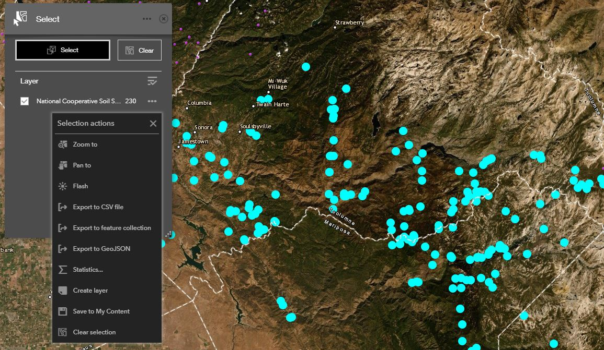

```{r setup, echo=FALSE, results='hide', warning=FALSE}
# setup
library(knitr, quietly=TRUE)
opts_chunk$set(message=FALSE, warning=FALSE, background='#F7F7F7', fig.align='center', fig.retina=2, dev='png', tidy=FALSE, verbose=FALSE)
options(width=100, stringsAsFactors=FALSE)
```


## The Map

There is a new, map-based interface to our [NCSS Soil Characterization data](https://nrcs.maps.arcgis.com/apps/webappviewer/index.html?id=956154f98fc94edeaa2dbad99bb224af). Selections made on the map can be downloaded and used as a template for querying the full set of characterization data in R. The following instructions assume a basic understanding of the NCSS database structure and familiarity with R.

## Make a Selection


The saved CSV file will look something like this (first few columns and rows included for clarity):

| OBJECTID|Series         |User.Pedon.ID  | Pedon.Key|Soil.Classification                                                 |
|--------:|:--------------|:--------------|---------:|:-------------------------------------------------------------------|
|     5008|Shinke         |S1972CA077009  |      5980|Loamy, mixed, euic, thermic Terric Haplosaprists                    |
|    14606|Snd            |90CA043005     |     17829|Coarse-loamy, mixed Dystric Xerochrepts                             |
|    14607|(unnamed)      |90CA043010copy |     17830|Coarse-loamy, mixed, mesic Typic Haploxeroll                        |
|    14608|Stream Terrace |90CA043011     |     17831|Coarse-loamy, mixed Typic Xerochrepts                               |
|    14609|Snd            |90CA043012     |     17832|Coarse-loamy, mixed Cumulic Haploxerolls                            |
|    14610|Snd            |90CA043013     |     17833|Coarse-loamy over sandy or sandy-skeletal, mixed Histic Haplaquolls |


## Requesting Additional Data via `soilDB::fetchKSSL`

The following code example assumes that the selected data have been saved to `features.csv` (e.g. CSV format), in the current working directory. Adjust as needed.
```{r eval=FALSE}
# SoilProfileCollection class/methods
library(aqp)

# fetchKSSL() and related
library(soilDB)

# convenience of progress bar within lapply()
library(pbapply)

# load queried features
x <- read.csv('features.csv', stringsAsFactors = FALSE)

# inspect: 230 pedons
str(x)

# iterate over pedon keys and request data
# this is done in serial, so kind of slow
# use furrr for parallel requests
z <- pblapply(x$Pedon.Key, function(i) {
  # query by pedon key
  # ignore messages
  res <- suppressMessages(fetchKSSL(pedon_key = i))
  return(res)
})

# result is a list of SPC
# combine into a single SPC
z <- aqp::union(z)

# graphical check on 30 random profiles in the collection
# adjust if there are fewer
par(mar=c(0,0,3,2))
plot(sample(z, 30), color='clay', label='taxonname')
```


----------------------------
This document is based on `aqp` version `r utils::packageDescription("aqp", field="Version")` and `soilDB` version `r utils::packageDescription("soilDB", field="Version")`.

