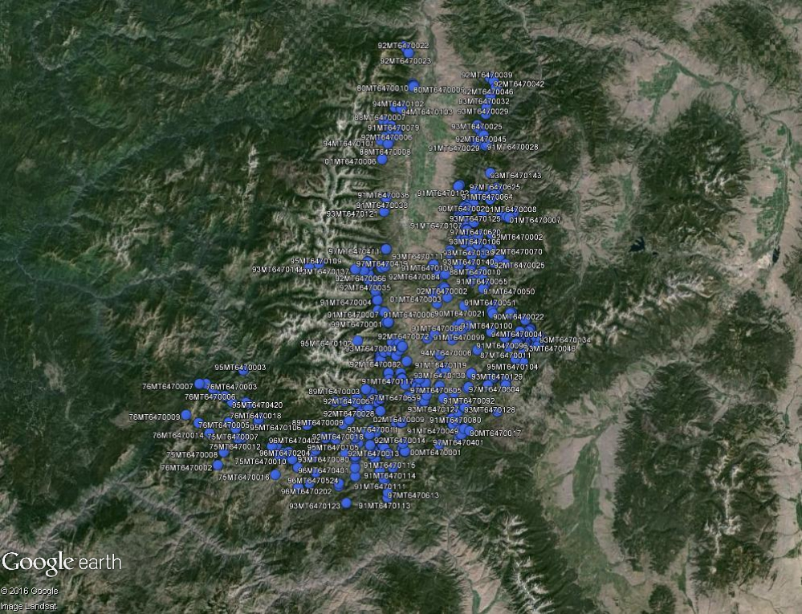
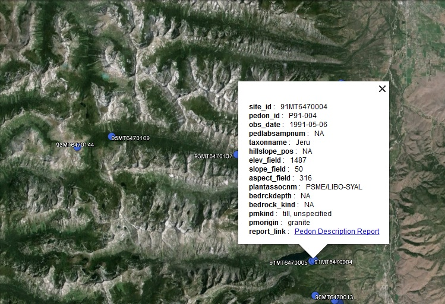

```{r setup, echo=FALSE, results='hide', warning=FALSE}
# setup
library(knitr, quietly=TRUE)
opts_chunk$set(message=FALSE, warning=FALSE, background='#F7F7F7', fig.align='center', fig.retina=2, dev='png', tidy=FALSE, verbose=FALSE)
options(width=100, stringsAsFactors=FALSE)
```


This document demonstrates how to use the [soilDB](http://ncss-tech.github.io/AQP/soilDB/soilDB-Intro.html) package to export pedon locations from a local NASIS database and then use the [plotKML](https://cran.r-project.org/web/packages/plotKML/plotKML.pdf) package to generate KML files for viewing in Google Earth.  

### Setup Local NASIS DB
 1. load selected set with pedons and sites of interest
 2. select site-level attributes of interest to use as point labels
 5. modify output directory accordingly


### Install R Packages
With a recent version of R, it should be possible to get all of the packages that this tutorial depends on with the following commands. Note that you only need to do this once.
```{r install-deps, eval=FALSE}
# run these commands in the R console
install.packages('soilDB', dep=TRUE) # stable version from CRAN + dependencies
install.packages('rgdal', dep=TRUE)
install.packages('sp', dep=TRUE)
install.packages('plotKML', dep=TRUE)
```

### Load Pedons and Generate KML files
Copy and paste the following code into a new R script document. Step through the lines of code (e.g. run each line starting from the top) by moving the cursor to the top line and then press ctrl + enter repeatedly.
```{r example1, eval=FALSE}
require(soilDB)
require(rgdal)
require(plotKML)

# check working directory path and set output location
getwd()
setwd('C:/temp/')

# load pedon data from selected set in NASIS
f <- fetchNASIS()

# some pedon data may be missing coordinates in NASIS
# filter to keep only those pedons with coordinates
good.idx <- which(!is.na(f$x_std) & !is.na(f$y_std))
f <- f[good.idx, ]

# initialize coordinates from WGS84 decimal degrees
coordinates(f) <- ~ x_std + y_std
# assign the appropriate projection string
proj4string(f) <- '+proj=longlat +datum=WGS84'

# extract only site-level data
s <- as(f, 'SpatialPointsDataFrame')

# graphically check by plotting them in R
par(mar=c(1,1,1,1))
plot(s)

# subset to columns from the site data that may useful as labels
s <- s[, c('site_id', 'pedon_id', 'obs_date', 'pedlabsampnum', 'taxonname', 'hillslopeprof', 'elev_field', 'slope_field', 'aspect_field', 'plantassocnm', 'bedrckdepth', 'bedrckkind', 'pmkind', 'pmorigin')]

# generate a basic KML file of site locations with site_id specified as the placemark labels
# set KML file path
kml_file_path <- 'C:/temp/R_sites.kml'
kml_open(file.name=kml_file_path, folder.name='Sites', overwrite=TRUE)
kml_layer.SpatialPoints(s, title='Sites', colour='royalblue', labels=site_id, shape="http://maps.google.com/mapfiles/kml/pal2/icon18.png")
kml_close(kml_file_path)

# could also be scripted this way using the plotKML() which automatically wraps the above functions
# notice that in this version, the paste function is used to concatenate the site_id and taxonname for labels
plotKML(s, colour_scale=rep('royalblue', 2), points_names=paste(s$site_id, s$taxonname, sep=", "), folder.name="Sites", file.name="R_sites.kml")
```

### Screenshot from Google Earth



### Building timestamps into Pedon data KML files using site observation date information
The following example uses the site observation date/time field to animate a KML file using the timeslider option in Google Earth.  This can be useful if you are interested in viewing the chronologic order in which pedons were sampled for an area.

```{r example2, eval=FALSE}
# set the timespan begin and end parameters and use paste to concatenate site_id with taxonname fields as the labels
plotKML(s, colour_scale=rep('royalblue', 2), points_names=paste(s$site_id, s$taxonname, sep=", "), folder.name="Sites_date-time", file.name='R_sites_with_date-time.kml', TimeSpan.begin=format(s$obs_date, "%Y-%m-%d"), TimeSpan.end=format(s$obs_date, "%Y-%m-%d"))
```
### Embedding a link to NASIS pedon description report into KML files
The script below builds a URL to a web-based NASIS pedon description report for each site and then embeds the link within each placemark balloon in the resulting KML file.  This demonstrates some of the potential of what could be embedded within kml files. Notice that the other attributes in the subset of site-level data above also appear within the placemark balloon.

```{r example3, eval=FALSE}
# build URL to NASIS Web Pedon Description Report and add this as a column to our site data
s$report_link <- paste(']]><![CDATA[<a href="https://nasis.sc.egov.usda.gov/NasisReportsWebSite/limsreport.aspx?report_name=Pedon_Site_Description_usepedonid&pedon_id=', s$pedon_id, '">Pedon Description Report</a>]]><![CDATA[', sep='')

kml_file_path <- 'C:/temp/R_sites_with_report_link.kml'
kml_open(file.name=kml_file_path, folder.name='Sites_with_URL', overwrite=TRUE)
kml_layer.SpatialPoints(s, title='Sites_with_URL', colour='royalblue', balloon=s$report_link, labels=site_id, shape="http://maps.google.com/mapfiles/kml/pal2/icon18.png")
kml_close(kml_file_path)
```

### Screenshot of placemark balloon with embedded NASIS web report link


----------------------------
This document is based on `aqp` version `r utils::packageDescription("aqp", field="Version")` and `soilDB` version `r utils::packageDescription("soilDB", field="Version")`.

