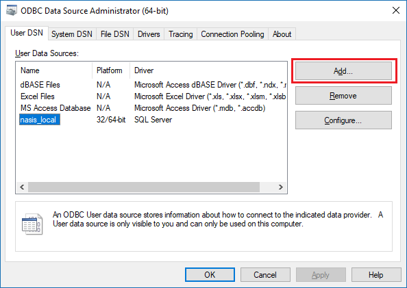
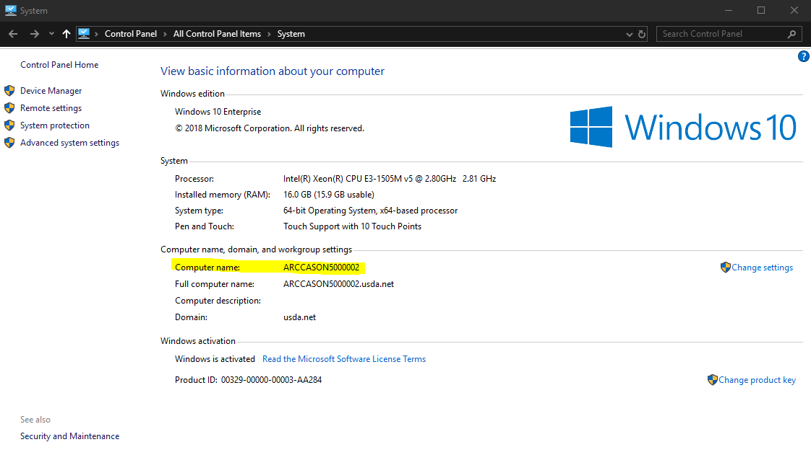
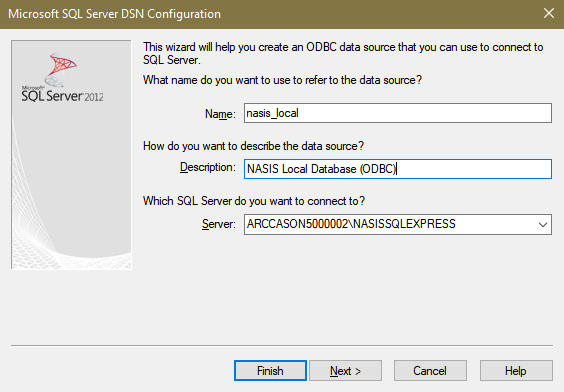
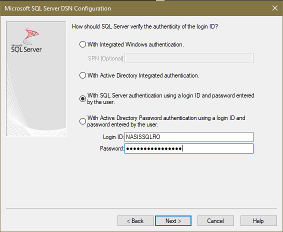
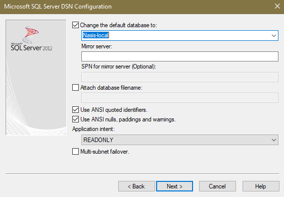

## Introduction
This document describes how to setup an ODBC link between **R** and the local NASIS database. See [Chapter 2](http://ncss-tech.github.io/stats_for_soil_survey/chapters/2_data/2a_tabular_data.html) from the Statistics for Soil Scientists training for a demonstration.

## Open the ODBC Data Source Administrator
1. Go to the Start Menu and search for 'ODBC'. See [this page](http://msdn.microsoft.com/en-us/library/ms188691.aspx) if you get lost. Select the 64bit ODBC application if you are using Windows 10. It should look like this:


 
2. With the "User DSN" tab selected, create a new data source by clicking on the "Add..." button. 
  + Select the "SQL Server" driver. (64bit if prompted for a choice)
  
  

  
  + Name the data source `nasis_local`, the data source description is optional.
  
  + The NASIS SQL server name is in the format `XXXXXX\NASISSQLEXPRESS`, where `XXXXXX` is the ["computer name" of your local machine](http://windows.microsoft.com/en-us/windows7/find-your-computer-name) and `NASISSQLEXPRESS` denotes the local NASIS SQL Express server.
  
  + Your computer name is often on the asset tag sticker on the outside of your computer. 
  
  + On Windows 10, you can view your computer name by opening the _Control Panel_ and selecting "System" _OR_ by searching "This PC" in the _Start Menu_, right-clicking it, and selecting "Properties" . You need the value found under "Computer name:" (highlighted below).
    

  
  + Your computer name will look something like: `ARCCASON500002` -- where state, office and number will vary from computer to computer. _Be very careful when typing it in!_ This is a common source of error in setting up ODBC connection.
  
  + So, in summary, you will have something like _Server:_ `ARCCASON500002\NASISSQLEXPRESS` entered on the form pictured below.

When finished click "Next".



3. Choose the second option: "SQL Server authentication..." <br>**don't try and re-type these, just copy/paste**
  + login: `NASISSQLRO` 
  + Windows 7 password: `nasisRe@d0n1y`
  + Windows 10 password: `nasisRe@d0n1y365`



4. On the next screen, select "Nasis-local" as the default data base.



5. Click "Next" and then "Finish" the finalize the connection.

6. Close the ODBC control panel by clicking on 'OK'


## Optionally Install Required Packages
You will need to install the `RODBC` and `soilDB` packages if not present. You can check by trying to load either of these packages at the console. Or, install using the commands below if you are unsure.

```{r install-packages, eval=FALSE}
# stable version from CRAN + dependencies
install.packages("RODBC", dep=TRUE)

# stable version from CRAN + dependencies
install.packages("aqp", dep=TRUE)

# stable version from CRAN + dependencies
install.packages("https://cran.r-project.org/src/contrib/Archive/soilDB/soilDB_2.4.1.tar.gz", repos=NULL)

# latest version off GitHub
remotes::install_github("ncss-tech/aqp", dependencies=FALSE, upgrade=FALSE, build=FALSE)
remotes::install_github("ncss-tech/soilDB", dependencies=FALSE, upgrade=FALSE, build=FALSE)
```


## An example R session
After installing the above packages, add some *sites+pedons* or *components* into the selected set and try loading them into your R session.
```{r example, eval=FALSE}
# load required libraries
library(aqp)
library(soilDB)

# fetch all pedons from the selected set in local NASIS database
x <- fetchNASIS(from='pedons')

# make sketches of the first 10 pedons
par(mar=c(0,0,0,0))
plot(x[1:pmin(length(x), 10), ], name='hzname', label='taxonname')
```

Good job, that wasn't so hard. Now is a good time to check out [some of the tutorials on the AQP website](http://ncss-tech.github.io/AQP/). Details on loading NASIS data into R can be found in [this tutorial](http://ncss-tech.github.io/AQP/soilDB/fetchNASIS-mini-tutorial.html).


