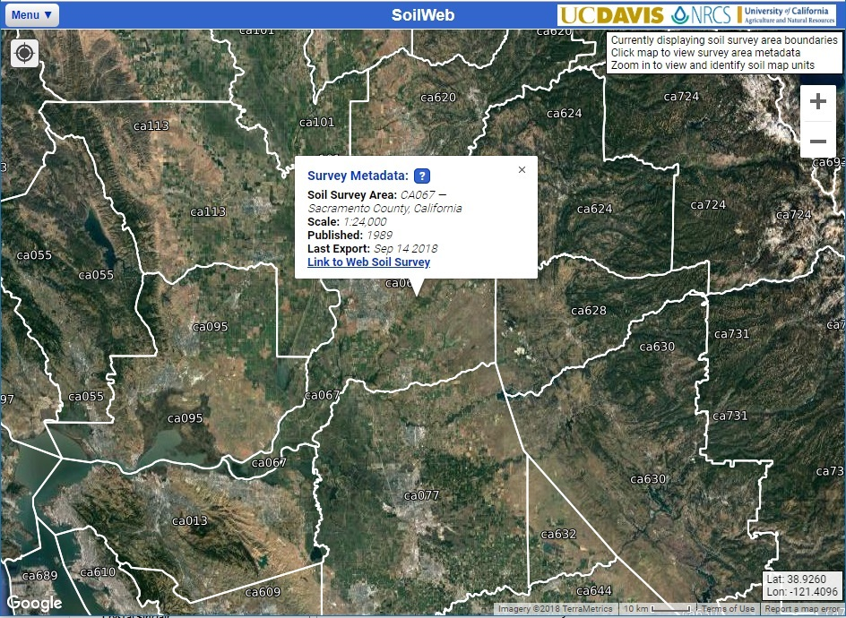

## 2018-10-22

### News

SoilWeb was synchronized with the latest SSURGO, KSSL, and OSD-derived data October 10, 2018. Work is underway on new versions of the iOS and Android smartphone apps which should be available early 2019. Until that time, the standard interface can be used on any mobile device with an internet connection. It will seamlessly adapt to smaller screens and can even use the built-in GPS for querying soils data.

Soil survey area (SSA) boundaries are now displayed at scales too coarse for the detailed soil survey lines (SSURGO). The SSA boundaries are useful for locating printed manuscripts, determining survey vintage, and generating links to pre-made area of interest (AOI) in Web Soil Survey (WSS).

### Usage Stats

[SoilWeb](http://casoilresource.lawr.ucdavis.edu/soilweb) was developed in collaboration between the University of California-Davis Soil Resource Lab and NRCS. The various SoilWeb applications had about 269,000 visits in FY2018 (an increase of 33%). The main SoilWeb interface received about 155,000 visits (averaging about 2,000 queries per day), Soil Data Explorer (SDE) 67,000 visits, and Series Extent Explorer 51,000 visits. The Google Earth interface to SoilWeb continues to receive over 5,000 of requests per day.

### Links

   * [Standard / Mobile Interface](https://casoilresource.lawr.ucdavis.edu/gmap/)
   * [Series Extent Explorer](https://casoilresource.lawr.ucdavis.edu/see/)
   * [Access USDA-NRCS soil survey data from R](http://ncss-tech.github.io/AQP/)
   * [Experimental OSD full text search](https://casoilresource.lawr.ucdavis.edu/osd-search/)

