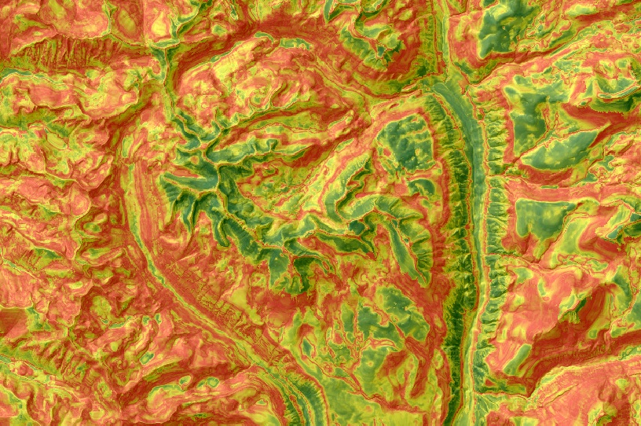

  
```{r setup, echo=FALSE, results='hide', warning=FALSE}
library(knitr, quietly=TRUE)
library(kableExtra, quietly=TRUE)
opts_chunk$set(message=FALSE, warning=FALSE, background='#F7F7F7', fig.retina=2, dev='png', tidy=FALSE, verbose=FALSE, fig.align='center', echo=FALSE)
options(width=100, stringsAsFactors=FALSE)
```

```{r data-prep-and-function}
library(igraph)
library(latticeExtra)
library(plyr)
library(reshape2)
library(wesanderson)
library(grid)
library(aqp)

# functions specific to this document
source('local-functions.R')

```

```{r simulate-data}
s <- list()
n <- 1000

alpha.1 <- c(4,10,5,15,16)
s[['Case 1']] <- simulatePredictions(n=n, alpha=alpha.1)

alpha.2 <- c(3,4,5,6,12)
s[['Case 2']] <- simulatePredictions(n=n, alpha=alpha.2)

alpha.3 <- c(2,2,2,2,40)
s[['Case 3']] <- simulatePredictions(n=n, alpha=alpha.3)
```

```{r make-figures}
## class probabilities
ss <- ldply(s, function(i) i$predictions.long)
names(ss)[1] <- 'example'
ss$example <- factor(ss$example)

cols <- brewer.pal(9, 'Set1')
tps <- list(superpose.line=list(col=cols, lwd=1, alpha=0.85))

p.1 <- densityplot( ~ value | example, groups=variable, data=ss, as.table=TRUE, layout=c(3,1),
pch=NA, xlim=c(-0.1, 1.1), scales=list(alternating=3, x=list(tick.number=5)), xlab='Class Probability',
strip=strip.custom(bg=grey(0.85)), auto.key=list(columns=5, lines=TRUE, points=FALSE),
par.settings=tps, panel=function(...) {
  gs <- seq(0,1, by=0.1)
  panel.abline(v=gs, lty=3, col='grey')
  panel.densityplot(...)
})


## distribution of stats
ss <- ldply(s, function(i) i$stats.long)
names(ss)[1] <- 'example'
ss$example <- factor(ss$example)


# uncertainty metrics
cols <- wes_palette("Zissou")[c(1, 5)]
tps <- list(superpose.line=list(col=cols, lwd=2, alpha=0.85))

p.2 <- densityplot( ~ data | example, groups=which, data=ss, as.table=TRUE, layout=c(3,1), pch=NA, auto.key=list(columns=2, lines=TRUE, points=FALSE), strip=strip.custom(bg=grey(0.85)), scales=list(alternating=3, y=list(rot=0), x=list(tick.number=5)), xlab='', par.settings=tps, panel=function(...) {
  gs <- seq(0, 2.5, by=0.25)
  panel.abline(v=gs, lty=3, col='grey')
  panel.densityplot(...)
})


## scatter plot of H vs. CI
ss <- ldply(s, function(i) i$stats)
names(ss)[1] <- 'example'
ss$example <- factor(ss$example)

# xlim=c(-0.1, 1.1), ylim=c(-0.1, 1.1),

# how do these two compare in general?
p.3 <- xyplot(Shannon.H ~ CI | example, data=ss, auto.key = list(columns=3, lines=FALSE, points=TRUE), as.table=TRUE, layout=c(3,1),
scales=list(alternating=1),  xlab='Confusion Index', ylab='Shannon H',
strip=strip.custom(bg=grey(0.85)), par.settings=list(plot.symbol=list(col='royalblue', pch=16, cex=0.85, alpha=0.25)), 
panel=function(x, y, subscripts=subscripts, ...) {
  panel.grid(-1, -1, lty=3, col='grey')
  l <- lm(y ~ x)
  med.H <- round(median(y), 2)
  med.CI <- round(median(x), 2)
  iqr.H <- round(IQR(y), 2)
  iqr.CI <- round(IQR(x), 2)
  cor.xy <- round(cor(x, y, method = 'spearman'), 2)
  ann <- paste0('H: ', med.H, ' (', iqr.H, ')\n', 
                'CI: ', med.CI, ' (', iqr.CI, ')\n',
                'cor: ', cor.xy)
  
  panel.points(ss$CI, ss$Shannon.H, col=grey(0.85), alpha=0.1)
  panel.xyplot(x, y, subscripts=subscripts, ...)
  panel.abline(l, col='black', lwd=1.5, ...)
  panel.abline(0, 1, lty=2)
  grid.text(ann, x = unit(0.05, 'npc'), unit(0.95, 'npc'), just = c('left', 'top'), gp = gpar(cex=0.75, font=2))
})

# p.4 <- xyplot(Shannon.H ~ Normalized.H | example, data=ss, auto.key = list(columns=3, lines=FALSE, points=TRUE), as.table=TRUE, layout=c(3,1),
# scales=list(alternating=1),  xlab='Normalized Shannon H', ylab='Shannon H',
# strip=strip.custom(bg=grey(0.85)), par.settings=list(plot.symbol=list(col='royalblue', pch=16, cex=0.85, alpha=0.25)), 
# panel=function(x, y, subscripts=subscripts, ...) {
#   panel.grid(-1, -1, lty=3, col='grey')
#   l <- lm(y ~ x)
#   med.H <- round(median(y), 2)
#   med.CI <- round(median(x), 2)
#   iqr.H <- round(IQR(y), 2)
#   iqr.CI <- round(IQR(x), 2)
#   cor.xy <- round(cor(x, y, method = 'spearman'), 2)
#   ann <- paste0('H: ', med.H, ' (', iqr.H, ')\n', 
#                 'CI: ', med.CI, ' (', iqr.CI, ')\n',
#                 'cor: ', cor.xy)
#   
#   panel.points(ss$Normalized.H, ss$Shannon.H, col=grey(0.85), alpha=0.1)
#   panel.xyplot(x, y, subscripts=subscripts, ...)
#   panel.abline(l, col='black', lwd=1.5, ...)
#   # panel.abline(0, 1, lty=2)
#   grid.text(ann, x = unit(0.05, 'npc'), unit(0.95, 'npc'), just = c('left', 'top'), gp = gpar(cex=0.75, font=2))
# })
# 
# stats.cor <- ddply(ss, 'example', .fun=plyr::summarize, 
#                    H.med=median(Shannon.H), CI.med=median(CI),
#                    H.iqr=IQR(Shannon.H), CI.iqr=IQR(CI),
#                    cor=cor(CI, Shannon.H, method = 'spearman')
#                    )

```

------------------------------
This document is based on `aqp` version `r utils::packageDescription("aqp", field="Version")`.
------------------------------


# Background

This document is an attempt at addressing some of the issues related to accuracy and uncertainty that I have brought up over discussion of raster (soil class) mapping standards. As such, the following is a combination of soap box moments, demonstrations of methods, todo items for my future self, and references. Honestly, before going any further be sure to read the recent paper by @Rossiter2017.

## Status Quo
The "Digital Soil Mapping" chapter (5) from the latest Soil Survey Manual describes (suggests?) two commonly used metrics for the description of accuracy and uncertainty: overall accuracy / percent correctly classified (PCC) and the confusion index (CI) of @Burrough1997. These methods are widely used and implementation is simple.

Given the complex nature of class mapping results (e.g. stack of class probabilities) and inherent (likely quantifiable) similarity of soil classes, I think that we should explore options for a more robust suite of accuracy and uncertainty metrics. Furthermore, it is my opinion that any evaluation of probabilistic predictions should be integrated over *all* classes. 


## Theses

  * The $\tau$ statistic of [@Rossiter2017] is a more reliable and nuanced representation of accuracy vs. PCC.

  * The $\tau$ statistic can be *upgraded* with additional *knowledge* given the availability of 1) prior understanding of class proportions, and/or, 2) meaningful parameterization of pair-wise class distances.
  
  * There can be consensus on formulation of *approximate* pair-wise distances, within a given modeling domain. Pair-wise distances may not necessarily be the same across modeling domains or projects.
  
  * Brier scores are option for an even more nuanced representation of accuracy as they integrate all predicted probabilities.

  * The confusion index of @Burrough1997 is an *unstable* metric when the number of predicted classes is large and when the most likely classes are associated with low probabilities.
   
  * Shannon entropy (log base 2) is a more reliable representation of uncertainty than the confusion index, especially when the number of possible classes varies by project. The importance of a universally reliable representation of uncertainty is even more important when several methods are used concurrently.
  
  * There *should be* a way to integrate pair-wise distances into the Shannon entropy (or related method) and Brier scores; maybe we will discover those here.
  

  
  


## Soap Box Time
Our current QC/QA process is based on many forms of evaluation, accumulates some degree of subjectivity and relies heavily on qualitative forms of information (field experience, institutional knowledge, etc.).  On the opposite side of the spectrum, the validation of raster mapping is often claimed to be free of subjective interference and entirely quantitative. Those are "good things" that we should always strive for, however, the simplicity of calculating a "percent correctly classified" can interfere with a more nuanced evaluation of accuracy. As I mentioned on the phone (and implicitly volunteered for) a validation "score" might be more meaningful than any single validation metrics. 

One such score might include:

  * agreement between predicted probabilities and observed class (e.g. Brier scores)
  * agreement between the most likely class and observed class, accounting for class similarities (e.g. weighted $\tau$)
  * distribution of class-wise Shannon entropy values
  * calibration vs. predicted vs. validation proportion of classes
  * some kind of metric that integrates spatial connectivity of predictions / observations, for example: cross-tabulate calibration / prediction / validation classes with geomorphon classes

I strongly believe that we need a robust suite of metrics primarily for internal discussion and evaluation of raster mapping products; even more so when complex modeling frameworks such as randomForest or neural nets are used.

Accuracy and uncertainty metrics are primarily vehicles for understanding, re-calibrating (as needed), and communicating statistical models as part of the development and QA/QC process.


## Anonymous Commentary


   
   * To me Brier scores are to rate a probabilistic forecaster making many binary probabilistic predictions. So for a map you would have each pixel with a prediction and its probability, you could indeed compute the per-point Brier score and sum them.  But that does not give any credit to "incorrect" but similar classes that might have had a slightly lower probability.  Yes you can do a multinomial Brier score.  But again no credit for taxonomic similarity.
   
   *  I think of mapping in upstate NY where it's quite difficult to reliably separate Fragiudepts and Hapludeptss with densic subsoils but not a true Fragipan. The land use is not so different (although Fragiudults have more tree throw). Similar is separating Arnot-Lordstown-Mardin-Bath (Dystrudepts, lots of coarse fragments, cool climate, differene thickness to bedrock) on upland tills with irregular bedrock depth. Here there is definitely a use sequence from shallow->deep but otherwise identical properties.  This was my main motivation in the 'adjusted accuracy' paper. So the issue is not so much a Brier score like:

   (Fragidepts 0.7, Hapludepts 0.3) -> actual Fragidults -> Brier score (.3)^2 = .09; actual Hapludults -> Brier score (.7)^2 = .49.  These are not such different outcomes in practice. Now, if the 2nd predicted class were really different (say, Glossiborolls) then this would make some sense.
   
   * In your example you use the weighted Shannon of Kempen. OK, this standardizes to 0...1 but does not reveal the case where the classifier made more or fewer predictions. By using log2 not logn the index keeps increasing with the number of equal predictions, this seems correct:


# Concept Demonstration via Simulated Data

Consider a supervised classification that generates predictions for 5 possible soil classes. Suites of predicted probabilities fall into 3 general cases:

   * "Case 1": classes **D** and **E** are nearly tied for the most likely class, but their respective probabilities are generally < 0.5
   * "Case 2": class **E** is almost always the most likely class, but classes **B**, **C**, and **D** are tied for second place
   * "Case 3": class **E** is always the most likely class, all other classes have probabilities < 0.2

```{r, fig.width=10, fig.height=4, fig.cap='Probability distributions of predictions.'}
# examples of three cases
print(p.1)
```

Even though these are simulated data, the three cases above demonstrate common modeling scenarios where classification uncertainty ranges from very low ("Case 3") in some areas to quite high ("Case 1") in others. These three cases could easily be associated with real situations:

  * "Case 1": predictions for soil classes represent a hillslope complex that isn't quite disentangled by the model
  * "Case 2": predictions for soil classes represent limited success in partitioning between a single water shedding (**E**) vs. multiple water collecting positions (**A**-**D**)
  * "Case 3": predictions for soil classes represent a successful partitioning between Holocene age deposits (**E**) vs. older alluvial terraces (**A**-**D**)


# Accuracy

## Confusion Matrix

```{r results='asis'}
pp <- llply(s, crossTabProbs)
for(i in names(pp)) {
  print(kable_styling(kable(pp[[i]], format='html', caption = i), full_width = FALSE))
}
```


## Brier Scores


Brier scores [@Brier1950, @Harrell2001] quantify agreement between observed classes and predicted probabilities:
$$ B = \frac{1}{n} \sum_{i=1}^{n}{ ( p_{i} - y_{i} )^{2}  }  $$
where $B$ is an index of agreement between predicted probabilities, $\mathbf{p}$, and class labels, $\mathbf{y}$. Larger values suggest less agreement between probabilities and observed class labels.

Follow-up:

   * https://en.wikipedia.org/wiki/Brier_score
   * https://stats.stackexchange.com/questions/112250/understanding-the-rank-probability-score
   * http://empslocal.ex.ac.uk/people/staff/dbs202/publications/2008/stephenson-brier.pdf
   * http://iopscience.iop.org/article/10.1088/1748-9326/7/4/044019


What about a weighted version of this score, based on a re-statement of the distance matrix?


## Tau and Weighted Tau (class-similarity)

[@Rossiter2017] implemented in `aqp::tauw()`. This paper contains some discussion on a weighted version of Shannon Entropy using the subset of similarities between predicted classes and the *actual* class.

```{r eval=FALSE}
## from tauw manual page.

# example confusion matrix
# rows: allocation (user's counts)
# columns: reference (producer's counts)
crossclass <- matrix(data=c(2,1,0,5,0,0,
                            1,74,2,1,3,6,
                            0,5,8,6,1,3,
                            6,1,3,91,0,0,
                            0,4,0,0,0,4,
                            0,6,2,2,4,38),
                     nrow=6, byrow=TRUE)
row.names(crossclass) <- c("OP", "SA", "UA", "UC", "AV", "AC")
colnames(crossclass) <- row.names(crossclass)

# build the weights matrix
# how much credit for a mis-allocation
weights <- matrix(data=c(1.00,0.05,0.05,0.15,0.05,0.15,
                         0.05,1.00,0.05,0.05,0.05,0.35,
                         0.05,0.05,1.00,0.20,0.15,0.15,
                         0.15,0.05,0.25,1.00,0.10,0.25,
                         0.05,0.10,0.15,0.10,1.00,0.15,
                         0.20,0.30,0.10,0.25,0.20,1.00),
                  nrow=6, byrow=TRUE)

# unweighted accuracy
summaryTauW(nnaive <- tauW(crossclass))

# unweighted tau with equal priors, equivalent to Foody (1992) modified Kappa
tauW(crossclass)$tau

# unweighted tau with user's = producer's marginals, equivalent to original kappa
(priors <-  apply(crossclass, 2, sum)/sum(crossclass))
tauW(crossclass, P=priors)$tau

# weighted accuracy; tau with equal priors
summaryTauW(weighted <- tauW(crossclass, W=weights))

# weighted accuracy; tau with user's = producer's marginals
summaryTauW(tauW(crossclass, W=weights, P=priors))

```


   * Yes, tau is the way to go -- you need to be very clear on the prior probabilities. That depends on the mapping method. In LDA we can set the priors, then we'd use these in tau. But for an automatic DSM procedure the priors are all equal (Foody's modified kappa). If judging a manual mapper, the priors can be their overall probabilities for an area.  E.g., in one county we have a pretty good idea that it is half Vertisols, so the mapper is prejudiced (in the good sense) about this.
   
   * The weighting is quite tricky since obviously it can be used to manipulate results. I really like the 'error loss' method if there is some numerical value put on each difference -- as I did with the NC site index. In CA you have the Storie index, you could use that difference for mis-mappings of series.  Numerical taxonomy measures could also be used but you'd need to agree on which properties to use. If the purpose of the map is e.g. to estimate C stocks, then the difference between the mean C stocks  between classes from NASIS might be used. Coming up with a transparent and accepted weighting can be tricky.


## Comparison
```{r}
pp <- ldply(s, performance)
names(pp)[1] <- 'example'

kable_styling(kable(pp, row.names = FALSE, digits = 2, format='html'), full_width = FALSE)
```


# Uncertainty


## Shanon Entropy

$$ H = -\sum_{i=1}^{n}{p_{i} * log_{2}(p_{i})}  $$

where $H$ is an index of uncertainty associated with predicted probabilities, $\mathbf{p}$, of encountering classes $i$ through $n$. Smaller values imply less entropy (more information). Given equal class probabilities, H will increas as the number of classes increases.


@Kempen2009 described a normalized version of Shannon entropy that is constrained to values between 0 and 1:

$$ H = -\sum_{i=1}^{n}{p_{i} * log_{n}(p_{i})}  $$
where $H$ is an index of uncertainty associated with predicted probabilities, $\mathbf{p}$, of encountering classes $i$ through $n$. This representation may be conveniently contained within the range of $[0,1]$, however, it cannot be used to compare uncertainty from models using different numbers of classes.

It is my recommendation that the $log_{2}$ version of Shannon H be used as our *primary* metric of uncertainty for predictive soil class mapping.


## Confusion Index

Following [@Burrough1997]:

$$ \mathit{CI} = [1 - (\mu_{max} - \mu_{max-1})] $$
where $\mathit{CI}$ is an index of confusion between the first most likely, $\mu_{max}$, and second most likely, $\mu_{max-1}$, class probabilities.


## Comparison

```{r, fig.width=7, fig.height=4}
# H as a function of n
n.seq <- 2:100
H <- sapply(n.seq, function(i) shannonEntropy(rep(1/i, times=i), b = 2))
d <- data.frame(n=n.seq, H=H)

cols <- wes_palette("Zissou")[c(1, 5)]

xyplot(H ~ n, data=d, xlab='Number of Classes', ylab='Shannon Entropy', scales=list(x=list(tick.number=10)), col=cols[1], lwd=2,  main='Theoretical Limits\nEqual Class Probability', panel=function(...) {
  panel.xyplot(..., type=c('l', 'g'))
  panel.abline(h=1, col=cols[2], lty=2)
  panel.text(x=80, y=1.2, 'Confusion Index', font=2, cex=0.8)
})
```


```{r fig.width=7, fig.height=4.5}
n.seq <- 2:26
l <- lapply(n.seq, function(i) simulatePredictions(1, alpha=c(rep(1, times=i))))

stats <- ldply(l, function(i) i$stats)
stats <- data.frame(n=n.seq, stats)

cols <- wes_palette("Zissou")[c(1,5)]

xyplot(Shannon.H + CI ~ n, data=stats, main='Simulated Limits\nApprox. Equal Probabilities', xlab='Number of Classes', ylab='Uncertainty Metric', scales=list(x=list(tick.number=10)), type=c('b', 'g'), ylim=c(0, 5), par.settings=list(superpose.symbol=list(col=cols, pch=16, cex=1), superpose.line=list(col=cols, lwd=2)), auto.key=list(columns=2, lines=TRUE, points=FALSE))
```


Examples from the simulated data:

```{r}
ex <- ldply(s, extractExample, n=1)
names(ex)[1] <- 'example'
ex$actual <- NULL
ex$Normalized.H <- NULL

add_header_above(kable_styling(kable(ex, row.names = FALSE, digits = 2, format='html'), full_width = FALSE), header=c(" " = 1, "Class Probabilities" = 5, "Uncertainty" = 2))
```


### Three Common Suites of Class Probabilities
Consider a probabilistic soil class model, that generates predictions for 5 possible classes. Suites of predicted probabilities fall into 3 general cases:

```{r}
ex <- ldply(s, extractExample, n=1)
names(ex)[1] <- 'example'
ex$actual <- NULL

# kable_styling(kable(ex, row.names = FALSE, digits = 2, format='html'), full_width = FALSE)
```


```{r, fig.width=10, fig.height=4, fig.cap='Probability distributions of model predictions, 1000 simulations.'}
# examples of three cases
print(p.1)
```


```{r, fig.width=10, fig.height=4, fig.cap='Distribution of H and CI values computed from simulated predictions.'}
# uncertainty metrics
print(p.2)
```

```{r fig.width=10, fig.height=5, fig.cap='Relationship between H and CI values. Annotations are medians (IQR) and Spearman rank correlation.'}
print(p.3)

# kable_styling(kable(stats.cor, row.names = FALSE, digits = 2, format='html'), full_width = FALSE)
```


# Real Examples: Sequoia Kings Canyon (CA792)

Confusion Index


Shannon H


Still working on this.
```{r}
# load cached data
load('SEKI-example-data.Rda')


#### the following required because of prior scaling of Pr to {0,100}
#### and randomForest generates 0sw

## 0-inflation only affects marginal Pr distribution investigation
## looking at the entire distribution is strongly influenced by 0-inflation

# rescale to probabilities
x <- x / 100.0
# add a very small fudge factor to remove 0
x[which(x==0)] <- 1e-15

####
####


class.labels <- toupper(letters[1:ncol(x)])

dimnames(x)[[2]] <- class.labels
d <- as.data.frame(x)
d$id <- rownames(d)

# uncertainty
H <- apply(x, 1, shannonEntropy, b=2)
H.norm <- apply(x, 1, shannonEntropy, b=length(class.labels))
CI <- apply(x, 1, confusionIndex)

# prep for plotting
m <- melt(d, id.vars = c('id'), measure.vars = class.labels)
g <- make.groups(H, CI)
```

```{r fig.width=6, fig.height=4}
hist(x[x > 0.001], main='Predicted Probabilities, All Classes', xlab='Probabilities > 0.001', las=1)

hist(apply(x, 1, max), main='Max Probability per Pixel', xlab='', las=1)
```

```{r fig.width=6, fig.height=6}
cols <- wes_palette("Zissou")[c(1,5)]
tps <- list(superpose.symbol=list(col=cols, pch=16, cex=0.85, alpha=0.125))
trellis.par.set(tps)

sK <- simpleKey(text=c('Median Probability per Pixel', 'Max Probability per Pixel'), points=TRUE, columns=2)
sK$points$alpha <- 1

d <- data.frame(H=H, CI=CI, p.med=apply(x, 1, median), p.max=apply(x, 1, max))

xyplot(H ~ p.med + p.max, data=d, xlab='Probability', ylab='Shannon H', par.settings=tps, key=sK, type=c('g', 'p'))

xyplot(CI ~ p.med + p.max, data=d, xlab='Probability', ylab='Confusion Index', par.settings=tps, key=sK, type=c('g', 'p'))
```

```{r fig.width=6, fig.height=4}
bwplot(variable ~ value, data=m, subset= value > 0.001, ylab='Class', xlab='Predicted Probabilities > 0.001')
```

```{r fig.width=6, fig.height=4}
cols <- brewer.pal(9, 'Set1')
tps <- list(superpose.symbol=list(col=cols, lwd=1, alpha=0.85))

densityplot( ~ value , groups=variable, data=m, subset= value > 0.001,
                    plot.points=FALSE, xlim=c(-0.1, 1.1), scales=list(alternating=3, x=list(tick.number=5)), xlab='Class Probability',
                    strip=strip.custom(bg=grey(0.85)), auto.key=list(columns=4, lines=TRUE, points=FALSE),
                    par.settings=tps, panel=function(...) {
                      gs <- seq(0,1, by=0.1)
                      panel.abline(v=gs, lty=3, col='grey')
                      panel.densityplot(...)
                    })

```

```{r fig.width=6, fig.height=4}
# uncertainty metrics
cols <- wes_palette("Zissou")[c(1,5)]
tps <- list(superpose.line=list(col=cols, lwd=2, alpha=0.85), superpose.symbol=list(col=cols, lwd=2, alpha=0.85))

densityplot( ~ data, groups=which, data=g, as.table=TRUE, plot.points=FALSE, auto.key=list(columns=2, lines=TRUE, points=FALSE), strip=strip.custom(bg=grey(0.85)), scales=list(alternating=3, y=list(rot=0), x=list(tick.number=5)), xlab='', par.settings=tps, panel=function(...) {
  panel.grid(-1, -1, lty=3, col='grey')
  panel.densityplot(...)
})
```

```{r fig.width=6, fig.height=6}
xyplot(H ~ CI, asp=1, scales=list(alternating=1), xlab='Confusion Index', ylab='Shannon H',
       strip=strip.custom(bg=grey(0.85)), par.settings=list(plot.symbol=list(col='royalblue', pch=16, cex=0.85, alpha=0.25)), 
       panel=function(x, y, subscripts=subscripts, ...) {
         panel.grid(-1, -1, lty=3, col='grey')
         med.H <- round(median(y), 2)
         med.CI <- round(median(x), 2)
         iqr.H <- round(IQR(y), 2)
         iqr.CI <- round(IQR(x), 2)
         cor.xy <- round(cor(x, y, method = 'spearman'), 2)
         ann <- paste0('H: ', med.H, ' (', iqr.H, ')\n', 
                       'CI: ', med.CI, ' (', iqr.CI, ')\n',
                       'cor: ', cor.xy)
         panel.xyplot(x, y, subscripts=subscripts, ...)
         panel.abline(0, 1, lty=2)
         grid.text(ann, x = unit(0.05, 'npc'), unit(0.95, 'npc'), just = c('left', 'top'), gp = gpar(cex=0.75, font=2))
       })

```


```{echo=FALSE}
                     crags/talus basins/cirques glacial v. floors glacial v. walls mtn. slopes, low RO mtn. slopes, high RO plateaus riparian class.error
crags/talus                  151             22                 0                5                   0                    9       13        0       0.245
basins/cirques                31             96                 5                9                   3                   17        9       30       0.520
glacial v. floors              0             12               156               10                   3                    2        3       14       0.220
glacial v. walls               7             12                18              121                  11                   28        0        3       0.395
mtn. slopes, low RO            0              3                 6               12                 139                   23       12        5       0.305
mtn. slopes, high RO          16             18                 5               40                  42                   67        9        3       0.665
plateaus                      14              4                 2                3                   6                    8      145       18       0.275
riparian                       0             22                 9                4                   4                    2       11      148       0.260
```


# Follow-Up / Sanity-Check
## Drawing from Dirichlet distribution:

  * interpretation of alpha isn't that simple:
    + http://projects.csail.mit.edu/church/w/images/thumb/7/73/Dirichlet.png/400px-Dirichlet.png
    + https://stats.stackexchange.com/questions/244917/what-exactly-is-the-alpha-in-the-dirichlet-distribution/244946#244946
    + https://www.hakkalabs.co/articles/the-dirichlet-distribution
    + http://blog.bogatron.net/blog/2014/02/02/visualizing-dirichlet-distributions/


## Weighted Shannon Entropy

A simple extension (weighted entropy score) of the standard version is described in [this paper](https://www.ncbi.nlm.nih.gov/pmc/articles/PMC4029130/):

$$ \mathit{WES} = -\sum_{i=1}^{n}{w_{i} * p_{i} * log_{n}(p_{i})}  $$
where $w_{i}$ is the weight associated with $p_{i}$. This isn't quite applicable as the weights (we are interested in) are based on pair-wise distances between classes. More promising ideas:

   * [mutual information](https://en.wikipedia.org/wiki/Mutual_information)
   * [pointwise mutual information](https://en.wikipedia.org/wiki/Pointwise_mutual_information) 
   * [zebu package vignette](http://cdn.rawgit.com/oliviermfmartin/zebu/master/inst/doc/zebu.html)
   * [joint entropy](https://en.wikipedia.org/wiki/Joint_entropy)

Pairwise mutual information seems like a convenient extension of Shannon H that would easily accommodate pairwise distances.


# Resources

 * http://biostat.mc.vanderbilt.edu/wiki/Main/RmS

# References
 


