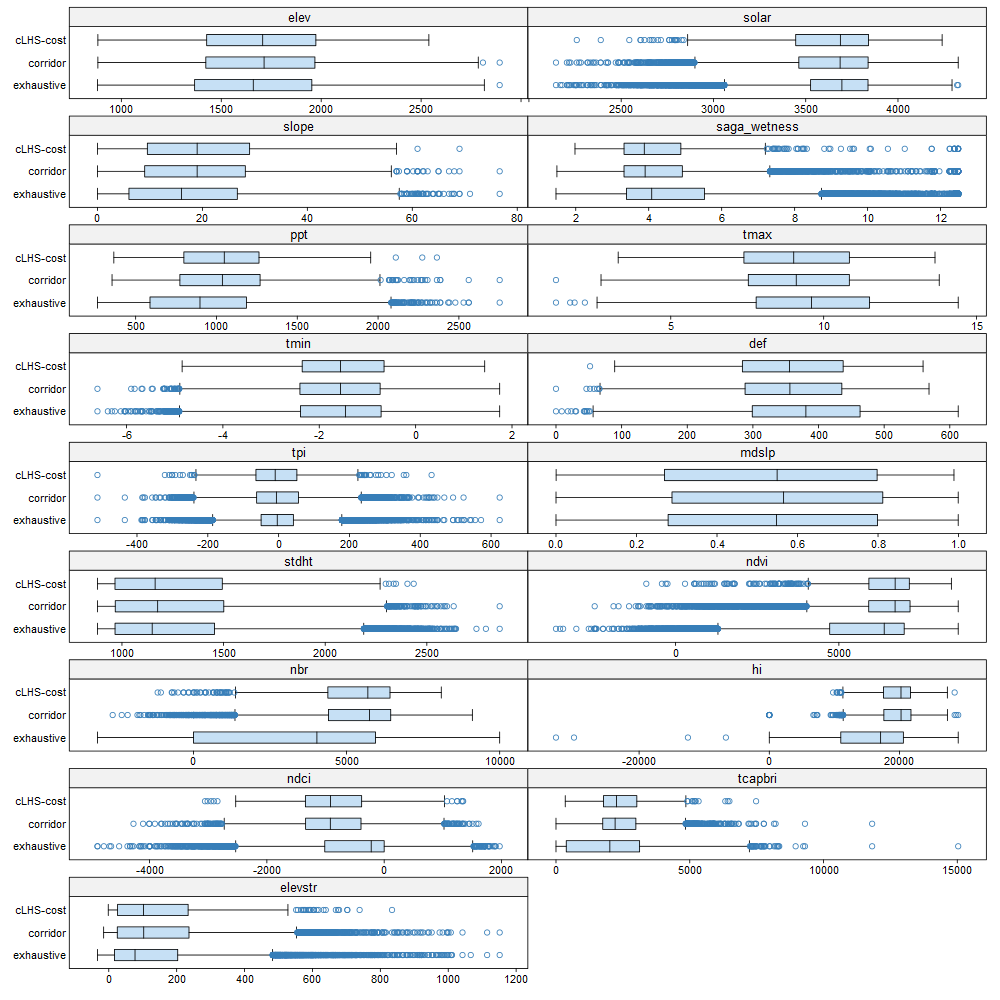
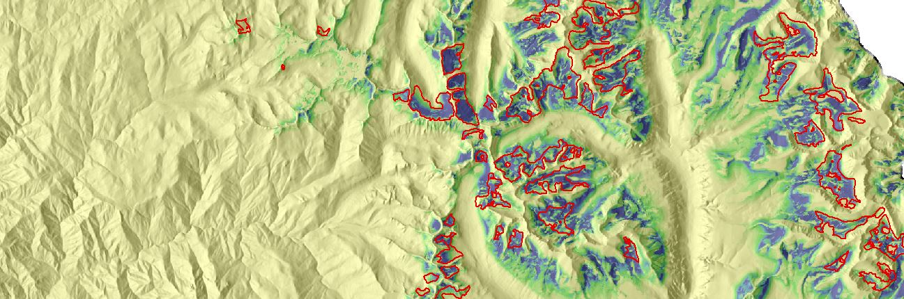
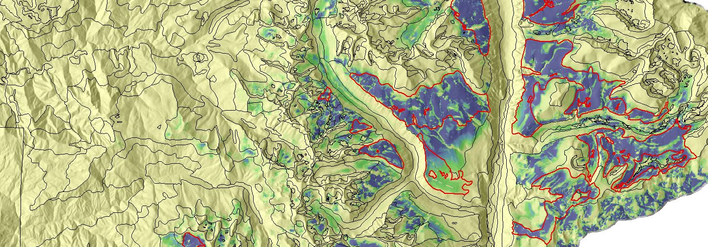
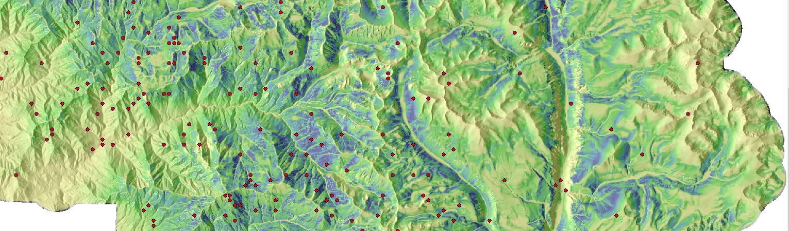
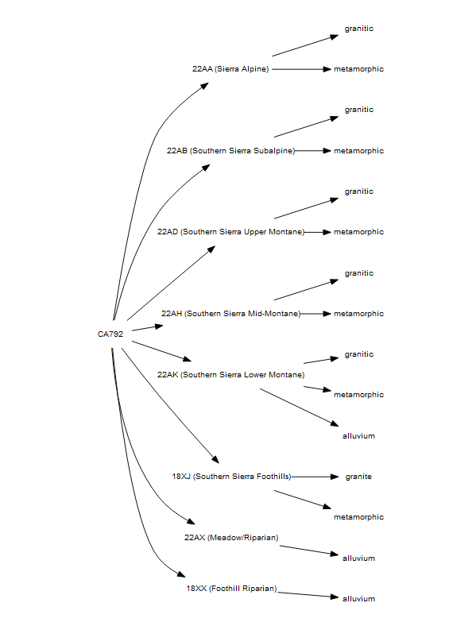
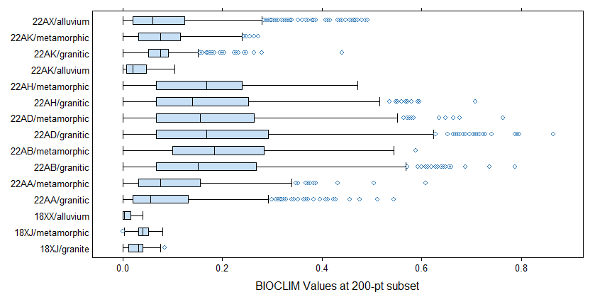

  
```{r setup, echo=FALSE, results='hide', warning=FALSE}
library(knitr, quietly=TRUE)
library(kableExtra, quietly=TRUE)
opts_chunk$set(message=FALSE, warning=FALSE, background='#F7F7F7', fig.retina=2, dev='png', tidy=FALSE, verbose=FALSE, fig.align='center', echo=FALSE)
options(width=100, stringsAsFactors=FALSE)
```

# Background

I would like to draw an important distinction between (what I perceive as) a false dichotomy of sampling philosophies:

   1. Traditional, free-survey methods that are ideally based on both theoretical training and years of apprenticeship in the field. This is commonly dismissed by some in the DSM or geostats community as wholly unreliable and "biased". It also happens to be a highly efficient (although tacit) stratification over relevant soil-forming factors, or at least our best approximation via proxy. Logistical constraints are built-into this method.
  2. Sampling site selection via purely numerical, "unbiased" methods such as cLHS which seek an efficient subset of distributional benchmarks in data-space. Operational constraints can be incorporated, as long as they can be adequately defined via standard GIS methods. YMMV. Acceptance of the resulting samples weighs heavily on the assumptions that the entire range of covatiates are worth visiting, and each distributional benchmark associated with each covariate is equally informative. It has to be noted that each subsequent realization of cLHS samples will be very different from the previous.

We aren't working in the realm of designed experiments, so the need for "IID" samples is relaxed and the free-sampling approach is not invalid. However, we are (now) working in the realm of regression / supervised classification where full coverage of data-space is critical for any extrapolation. Therefore, I see plenty of room for a progressively-evaluated, hybrid approach that draws from both ends of the spectrum:

<pre>
Pure statistical sampling
"I know nothing about the area, the soils, or pedogenesis in general".
|
|
|
vs.
|
|
|
Pure subjective selection based on (possibly imperfect) tacit knowledge
"I have mapped in areas like this, have strong theoretical background, and confident in my selection".
</pre>

My suggestions on the matter:

   1. cLHS is used on a subset of covariates that are either known, or highly likely to be realistic proxies for the regionally important soil-forming processes.
   2. Many cLHS realizations (e.g. >100) are used to create cLHS selection density maps; both for logistical planning but also as a measure of stability.
   3. Logistical constraints (e.g. planning back-country travel, safety, etc.) should always take priority over attempting to visit each cLHS-suggested point.
   4. A mixture of cLHS and free-survey points should be fully acceptable for calibration data, and, the proportion of each may have to be decided in the field by the project leader.
   5. cLHS points, as long as readily accessible, would be a fine candidate for verification data as there would be no looming questions about "bias".
   6. Marginal distributions of the most important covariates should be iteratively checked after each field campaign. Statistical methods for sampling site selection are especially useful at this stage, where the task shifts to in-filing data gaps.


The following commentary is from a previous email, related to a draft cLHS / sampling document "Idaho 703 FY2019 cLHS.docx". This was part of an email thread from 6/6/2019.

## rehash of previous commentary for background
This document is a fine summary of cLHS and subsequent efforts that many of us are now using in our day to day work, as part of what I like to call "flattening of high-dimensional spaces". I do wonder if the statistical acrobatics outlined in the document exceed the potential value of what is returned. It seems important to spend some of that time investigating:

   * ranking of covariates based on prior experience, if available
   * continuous evaluation of marginal distributions of exhaustive vs. cLHS samples, see attached

I'd like to suggest that folks interested in cLHS and related methods carve-out some time to work through the specifics of the document, especially the unwritten assumptions of each step. cLHS is a powerful tool for generating (one of an infinite set of) samples from high-dimensional space (e.g. the stack of covariates). However, the stability of cLHS points between runs and the value of the results is predicated on three very important considerations:

   * the stability of cLHS decreases rapidly as the number of covariates increase ("the curse of dimensionality")
   * the implicit assumption that all covariates are equally valuable
   * cLHS points have equal weight in terms of characterizing the high-dimensional space

Otherwise, cLHS is a fine tool for the job. We use it in the 'West all of the time:

   * soil temperature sensor site selection
   * creating subsets for model calibration vs. validation
   * site selection ideas within map unit delineations, used as an alternative to a traverse


# More Material

Some follow-up thoughts on the matter after talking with Jay and re-reading the ID703 document.

   1. Keeping the number of covariates as low as possible seems like a good idea, both in terms of difficulty in flattening high-dimensional space, and, potential for assigning some kind of connotative label to groups of cLHS points. This may or may not be possible, however, we need some way of ranking / grouping cLHS points.
   2. Along those lines, clustering of cLHS points into a reasonable number of clusters (similar to the ID703 document) could be used to perform accounting as to how many observations within in group of cLHS (or related) points had been visited. Extending this one step further, along the lines of something Stephen Roecker suggested: predict those clusters at each pixel within the modeling domain as sampling regions vs. points. For example, each sampling region would require X number of observations. This is efficiently performed via:
      a. generate cLHS points
      b. extract raster stack values
      c. cluster via favorite method (PAM is quite efficient)
      d. extrapolate cluster concepts via supervised classification of cluster labels
   3. Multiple groups of cLHS samples: e.g. tailored to specific suites of landforms or sub-regions within the modeling domain. For example, 3 groups: 1) rugged mountains, 2) dissected hills and foothills, and 3) flood plains. This make sense conceptually: how reasonable is it to "ask for" 100 sites that efficiently covers the entire distribution of covariates over all three sub-regions?
   4. Collection of short notes on why/why not cLHS points were actually used, with a short description as to why. Based on my experience and conversations with Jay, point locations are often in transitional zones representative of nothing. The location may be an efficient (simultaneous) distributional landmark, but not relevant at the scale of a map unit or even component.


# Examples

## Marginal Distributiions



## Multivariate Distribution


## Similarity: BIOCLIM

 * expert interpretation of cLHS points, in the office:
    a. does this point seem representative of anything
    b. is it in an odd place
    c. access considerations
    d. would navigating to this point take me past several other "interesting" sampling locations
   
 * index of local variance: does a representative buffer around each cLHS point contain a larger total variance (on average) than similar points that have been selected as representative of larger landscape features
 * multivariate similarity surface analysis: after initial experimentation, the BIOCLIM approach seems more stable than MESS. Unfortunately, neither of these methods work with nominal / ordinal data. Gower's distance is one possible alternative, but computation time may be prohibitive.
 * comparisons of similarity surfaces generated from three approaches:
    a. samples collected within MU delineations
    b. purposive sampling points
    c. cLHS sampling points

More and more, it seems like cLHS is an effective strategy for sampling suggestions within a thoughtfully constrained domain: landform elements, lithologic units, hillslope sequence—i.e. below the level at which an experienced soil scientist is able to stratify the landscape. Or, used to decimate an otherwise exhaustive sampling (e.g. 1 sample / acre from all MU delineations) of a covariate stack into the most compact, but still efficient, subset for model calibration.


--------------------------------

Note: these images use different color scales.












.png)




# Resources

 * http://biostat.mc.vanderbilt.edu/wiki/Main/RmS

# References
 


