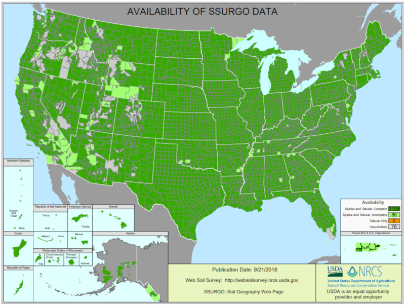
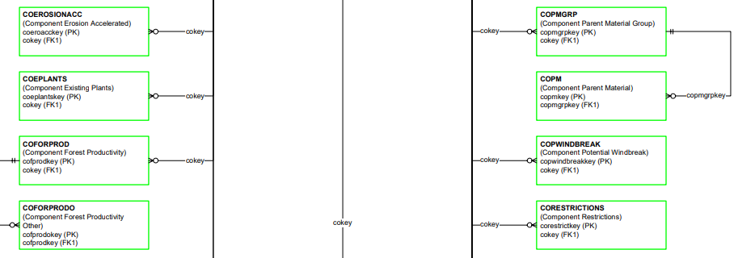
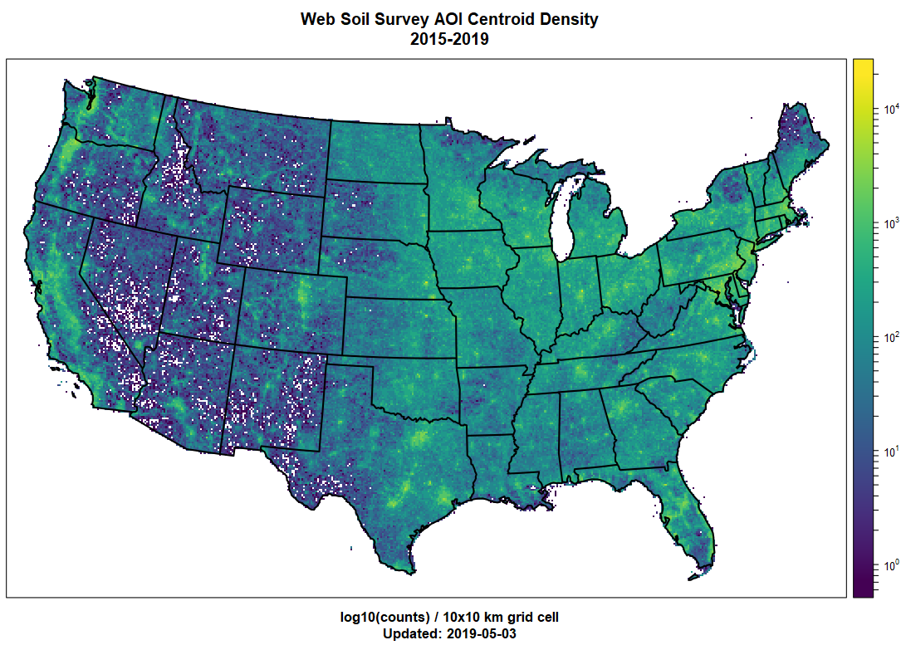
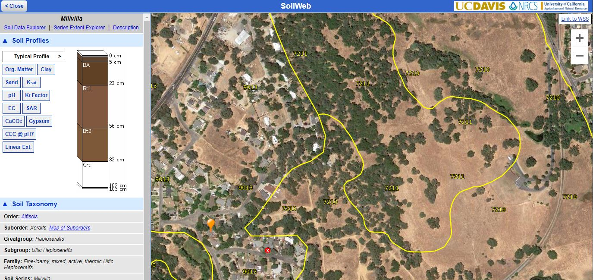

  

  
## Overview

**[Excerpt from main SSURGO page](https://www.nrcs.usda.gov/wps/portal/nrcs/detail/soils/survey/geo/?cid=nrcs142p2_053627)**

The SSURGO database contains information about soil as collected by the National Cooperative Soil Survey over the course of a century. The information can be displayed in tables or as maps and is available for most areas in the United States and the Territories, Commonwealths, and Island Nations served by the USDA-NRCS. The information was gathered by walking over the land and observing the soil. Many soil samples were analyzed in laboratories. The maps outline areas called map units. The map units describe soils and other components that have unique properties, interpretations, and productivity. The information was collected at scales ranging from 1:12,000 to 1:63,360. More details were gathered at a scale of 1:12,000 than at a scale of 1:63,360. The mapping is intended for natural resource planning and management by landowners, townships, and counties. Some knowledge of soils data and map scale is necessary to avoid misunderstandings.

[Additional information on the lineage of soil surveys, scales, and relationship to STATSGO](https://www.nrcs.usda.gov/wps/portal/nrcs/detail/soils/survey/geo/?cid=nrcs142p2_053626).

Archived soil survey manuscripts are [indexed by state](http://www.nrcs.usda.gov/wps/portal/nrcs/soilsurvey/soils/survey/state/).

### Reference Material

   * [National Soil Survey Handbook](https://www.nrcs.usda.gov/wps/portal/nrcs/detail/soils/scientists/?cid=nrcs142p2_054242)
   * *[Introduction to Soils](wss-introduction-to-soils.pdf)* from Web Soil Survey
   * [Web Soil Survey Glossary](Glossary.pdf)

### Structure of the Data

SSURGO is complex by design: soils, landscapes, mangement decisions, and the general-purpose nature of the soil survey require a database that can accomodate a wide range of needs. Any use of SSURGO require careful [study of table structure, linkages, and column definitiions](https://www.nrcs.usda.gov/wps/portal/nrcs/detail/soils/survey/geo/?cid=nrcs142p2_053631). Contact a local [NRCS employee](https://www.nrcs.usda.gov/wps/portal/nrcs/main/national/contact/) if you have specific questions.

### Usage Statistics
SSURGO is one of the most extensively used USDA datasets: with 7,000 to 10,000 unique requests (via Web Soil Survey) per day.

## Getting the Data

[Web Soil Survey](https://websoilsurvey.sc.egov.usda.gov/App/HomePage.htm) is the pimary delivery mechanism for SSURGO data. Data can be downloaded by user-defined "area of interest (AOI)", or as soil survey areas. Have a look at our ["Getting Started"](https://websoilsurvey.nrcs.usda.gov/app/GettingStarted.htm) page for additional details. Specific data elements have been [organized for quick lookup in this PDF](https://websoilsurvey.sc.egov.usda.gov/App/Resources/HomePage/Soil_Explorer_Tab.pdf).

[gSSURGO](https://www.nrcs.usda.gov/wps/portal/nrcs/detail/soils/survey/geo/?cid=nrcs142p2_053628) is an alternative packaging of SSURGO, built as state or CONUS composites. These files are very large and geared towards advanced users with access to ESRI software.

SSURGO archives can be downloaded from R, using the [FedData](http://ropensci.github.io/FedData/) package.

### Soil Data Access (SDA)

[SDA](https://sdmdataaccess.nrcs.usda.gov/) is a suite of [web-services (API)](https://sdmdataaccess.nrcs.usda.gov/WebServiceHelp.aspx) for accessing SSURGO spatial and tabular data. SDA provides low-level access to SSURGO and STATSGO via queries written in [T-SQL](https://technet.microsoft.com/en-us/library/bb264565(v=sql.90).aspx). WFS and WMS services are also provided.

The [soilDB](http://ncss-tech.github.io/AQP/soilDB/SDA-tutorial.html) package for R provides a convenient interface to SDA.

Test page for the [REST/POST interface to SDA](https://sdmdataaccess.sc.egov.usda.gov/test/testpost.html).

### SoilWeb: UC Davis / NRCS Collaboration

[SoilWeb](https://casoilresource.lawr.ucdavis.edu/soilweb-apps) is an interface to the SSURGO, KSSL, SC, Block Diagram, and OSD databases, updated with each (fiscal year) SSURGO release.

   * [Google Maps interface to SoilWeb, functions on desktop and mobile platforms](http://casoilresource.lawr.ucdavis.edu/gmap/)
   
   * [Streaming KMZ layer for Google Earth: STATSGO, SSURGO, KSSL, OSD data with links](http://casoilresource.lawr.ucdavis.edu/soil_web/kml/SoilWeb.kmz)
   
   * [Soil series extent mapping and comparison tool, with links to SDE and SoilWeb Gmaps](http://casoilresource.lawr.ucdavis.edu/see/)
   
   * [Soil properties gridded at 800m resolution, based on the current SSURGO snapshot with holes filled using STATSGO](http://casoilresource.lawr.ucdavis.edu/soil-properties/)

#### Series Data Explorer (SDE)
This website is accessible via SEE (see above), or can be used by appending a soil series name to the end of the URL. SDE integrates KSSL, SSURGO, block diagrams, OSD, and SC databases.

Examples:

  * [Amador Series](http://casoilresource.lawr.ucdavis.edu/sde/?series=amador)
  * [San Joaquin Series](https://casoilresource.lawr.ucdavis.edu/sde/?series=san%20joaquin)
  * [Pierre Series](https://casoilresource.lawr.ucdavis.edu/sde/?series=pierre)
  * [Cecil Series](https://casoilresource.lawr.ucdavis.edu/sde/?series=cecil)

#### SeriesTree
This tool is accessible via SDE (see above), or can be used by appending a soil series name to the end of the URL. SeriesTree builds a hierarchy of all soil series that share a common subgroup level taxa with the series named on the URL. The hierarchy is build from family level criteria.

  * [Amador Series](http://soilmap2-1.lawr.ucdavis.edu/seriesTree/index.php?series=amador)
  * [San Joaquin Series](http://soilmap2-1.lawr.ucdavis.edu/seriesTree/index.php?series=san%20joaquin)
  * [Pierre Series](http://soilmap2-1.lawr.ucdavis.edu/seriesTree/index.php?series=pierre)
  * [Cecil Series](http://soilmap2-1.lawr.ucdavis.edu/seriesTree/index.php?series=cecil)

## Related Links

   * http://ncss-tech.github.io/AQP/
   * https://github.com/ncss-tech/soilDB
   * https://github.com/ncss-tech/aqp

## Further Reading
A cursory background in the following topics will greatly increase your ability to use soil survey data.

   * map scale and basic cartographic terminology
   * what is soil?
   * pH and its role in soil processes
   * water holding capacity
   * soil texture
   * the soil water balance
   * cation exchange capacity

   
   

